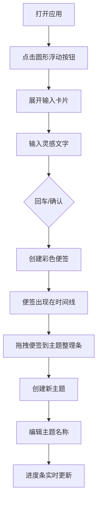

## 1. 产品概述

微型灵感闪现与碎片整理沙盒是一款面向创意工作者和知识管理者的轻量级Web应用，用于快速捕捉碎片化灵感并将其整理为结构化的知识卡片。

- 核心价值：随时随地捕捉闪现的灵感，通过直观的拖拽交互将碎片整理为有组织的知识体系
- 目标用户：作家、设计师、程序员、学生及所有需要记录和整理创意的人群

## 2. 核心功能

### 2.1 功能模块
1. **灵感输入模块**：圆形浮动按钮 → 展开输入卡片 → 创建便签
2. **便签管理模块**：可拖拽彩色便签、删除便签、主题归类
3. **整理区域模块**：时间线视图、主题整理条、主题卡片内缩略展示
4. **进度统计模块**：顶部进度条、数字徽章显示整理进度

### 2.2 页面详情
| 页面名称 | 模块名称 | 功能描述 |
|-----------|-------------|---------------------|
| 主页 | 进度条区域 | 展示整理进度的渐变进度条，显示已整理/总数的数字徽章 |
| 主页 | 灵感输入区 | 圆形浮动按钮，点击展开输入卡片，支持回车或确认创建便签 |
| 主页 | 便签展示区 | 可自由拖拽的彩色便签，悬停显示删除按钮 |
| 主页 | 时间线区域 | 按时间线左对齐展示便签，每个便签带小圆点和时间线连接 |
| 主页 | 主题整理条 | 底部全宽收纳区，拖拽便签至此创建新主题，可编辑主题名称 |
| 主页 | 主题卡片区域 | 展示已创建主题，主题内便签缩略展示 |

## 3. 核心流程

用户打开应用 → 点击左下角圆形按钮 → 展开输入卡片 → 输入灵感文字 → 回车或点击确认创建便签 → 便签出现在时间线中 → 拖拽便签到主题整理条创建新主题 → 编辑主题名称 → 查看顶部进度条实时更新

## 4. 用户界面设计

### 4.1 设计风格
- **主色调**：强调色 #667eea（渐变起始）、#764ba2（渐变结束）
- **辅助色**：#74B9FF（时间线圆点）、#00B894、#00CEC9（进度条渐变）
- **背景色**：#F5F6FA（页面背景）、#F8F9FA（主题整理条半透明）
- **文字色**：#2D3436（深色主文字）、#B2BEC3（时间线细线）
- **便签配色**：#FFEAA7、#DFE6E9 等8种柔软配色
- **按钮/卡片**：圆角设计，平滑过渡动画（0.2s ease-in-out）
- **字体**：简洁现代的无衬线字体

### 4.2 页面设计概览
| 页面名称 | 模块名称 | UI元素 |
|-----------|-------------|-------------|
| 主页 | 进度条区域 | 全宽6px高度渐变进度条、24px直径圆形数字徽章 |
| 主页 | 灵感输入区 | 64px直径圆形渐变按钮、展开动画0.3s scale弹性效果、深色#2D3436输入卡片底部 |
| 主页 | 便签展示区 | 160x120px圆角12px彩色便签、细微投影、悬停0.2s渐入删除图标、拖拽放大1.05倍加深投影 |
| 主页 | 时间线区域 | 左对齐布局、#74B9FF小圆点、#B2BEC3细线连接 |
| 主页 | 主题整理条 | 全宽80px高度、半透明#F8F9FA、圆角20px |
| 主页 | 主题卡片区域 | 可编辑主题名称（点击弹出240px输入框、聚焦边框#667eea）、便签缩略80x60px文字截断 |

### 4.3 响应式
- 桌面优先设计，768px以下断点适配
- 768px以下：时间线变为纵向布局，主题整理条变为堆叠式布局
- 触摸操作优化，确保移动端拖拽流畅

### 4.4 动画与交互
- 输入卡片展开：0.3s scale 0→1，带轻微弹性效果
- 所有卡片/按钮过渡：0.2s ease-in-out
- 便签拖拽：放大1.05倍、增加投影深度，保持60fps
- 删除图标悬停：0.2s渐入效果
