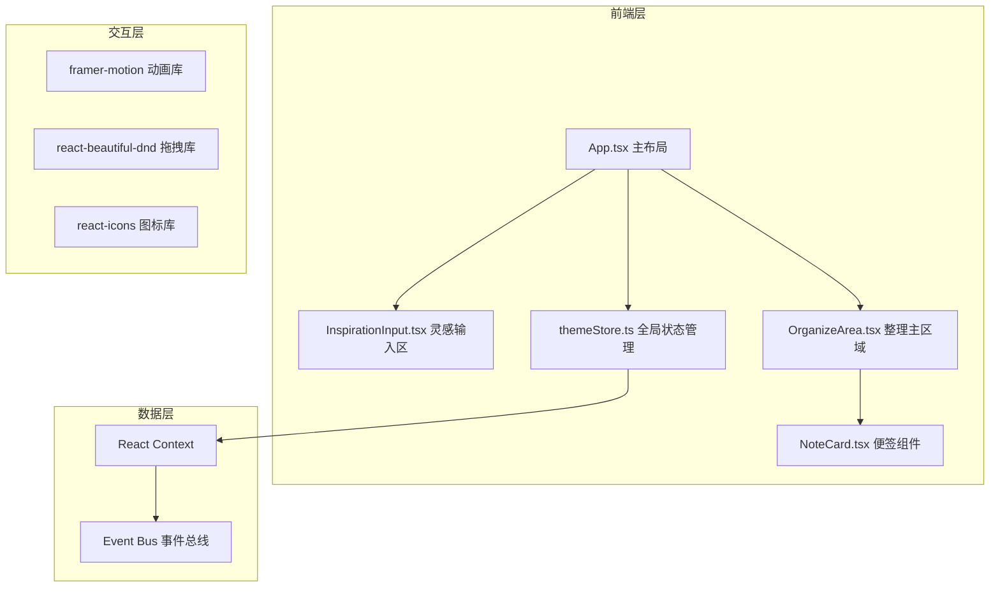
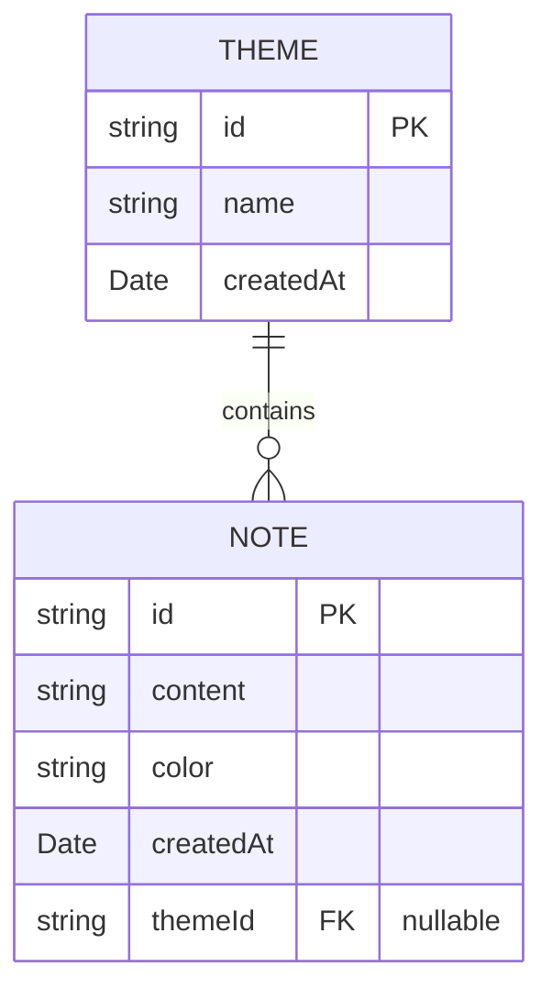

## 1. 架构设计



## 2. 技术描述
- **前端框架**: React 18 + TypeScript (strict模式)
- **构建工具**: Vite
- **状态管理**: React Context（全局便签与主题数据管理）
- **动画库**: framer-motion（实现平滑过渡与弹性动画）
- **拖拽库**: react-beautiful-dnd（高性能拖拽排序，60fps目标）
- **图标库**: react-icons
- **样式方案**: 内联styled-jsx方式与CSS变量结合，直接在组件内定义样式

## 3. 文件结构
```
d:\Pro\tasks\auto116\
├── package.json
├── index.html
├── vite.config.ts
├── tsconfig.json
└── src/
    ├── App.tsx              # 主布局，集成所有模块
    ├── InspirationInput.tsx # 灵感输入区，包含输入卡片展开/收起、创建便签逻辑
    ├── NoteCard.tsx         # 单个便签组件，负责拖拽、删除
    ├── OrganizeArea.tsx     # 右侧整理区，时间线、主题整理条
    └── themeStore.ts        # 主题与便签数据管理，React Context + 事件发布
```

## 4. 数据模型

### 4.1 数据模型定义



### 4.2 TypeScript 类型定义
```typescript
interface Note {
  id: string;
  content: string;
  color: string;
  createdAt: Date;
  themeId?: string;
}

interface Theme {
  id: string;
  name: string;
  createdAt: Date;
}

interface ThemeStoreState {
  notes: Note[];
  themes: Theme[];
  addNote: (content: string) => void;
  deleteNote: (id: string) => void;
  addTheme: (name: string, noteId: string) => void;
  renameTheme: (themeId: string, name: string) => void;
  assignNoteToTheme: (noteId: string, themeId: string | undefined) => void;
}
```

## 5. 核心交互实现

### 5.1 拖拽实现
- 使用 `react-beautiful-dnd` 的 `DragDropContext`、`Droppable`、`Draggable`
- 时间线区域和主题整理条分别作为独立的 Droppable 区域
- 拖拽过程中使用 framer-motion 处理视觉反馈（放大1.05倍、加深阴影）
- 拖拽结束后更新状态管理中的便签归属

### 5.2 动画实现
- 输入卡片展开：framer-motion `animate` 属性，scale 0→1，type: "spring" 实现弹性
- 便签出现/消失：mount/unmount 动画
- 悬停过渡：CSS transition 0.2s ease-in-out
- 删除图标渐入：opacity 0→1，0.2s

### 5.3 响应式实现
- CSS media query 断点：768px
- 768px以上：时间线左对齐横向排列，主题整理条横向全宽
- 768px以下：时间线纵向排列，主题整理条垂直堆叠
