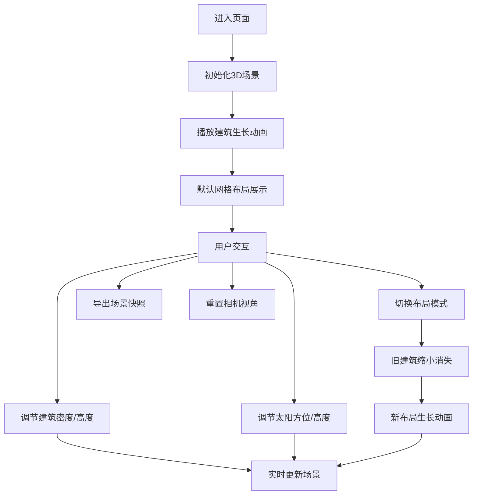

## 1. 产品概述

微型城市天际线生长模拟与日照阴影分析工具，用户可通过参数调节建筑密度、高度和布局方式，实时观察城市天际线生长过程并分析日照阴影覆盖情况。

- **核心价值**：提供直观的3D可视化工具，帮助用户理解城市形态与日照阴影的关系
- **目标用户**：城市规划爱好者、建筑学生、设计师及教育场景使用者
- **产品定位**：轻量级、交互性强的浏览器端3D模拟工具

## 2. 核心功能

### 2.1 用户角色
| 角色 | 注册方式 | 核心权限 |
|------|----------|----------|
| 普通用户 | 无需注册，直接使用 | 全部功能：参数调节、布局切换、动画播放、导出快照 |

### 2.2 功能模块
1. **3D场景展示**：全屏Three.js场景，包含建筑群、地面网格、日照阴影
2. **建筑生长动画**：建筑逐排从地面升起，带有缓动效果和地基指示
3. **日照阴影模拟**：实时计算太阳方位，PCF软阴影效果
4. **布局模式切换**：网格布局、随机布局、环形布局三种模式
5. **参数控制面板**：建筑密度、建筑高度、太阳方位角、高度角滑块
6. **工具按钮**：导出快照PNG、重置视角

### 2.3 页面详情
| 页面名称 | 模块名称 | 功能描述 |
|---------|----------|----------|
| 主页面 | 3D场景区 | 全屏渲染城市建筑群与日照阴影，支持轨道控制器交互 |
| 主页面 | 控制面板 | 左上角折叠式毛玻璃面板，包含所有参数调节和功能按钮 |
| 主页面 | 布局切换器 | 3x3网格图标按钮，切换三种城市布局模式 |
| 主页面 | 导出与重置 | 底部操作区，提供快照导出和视角重置功能 |

## 3. 核心流程

用户进入页面后，默认展示网格布局的城市生长动画。用户可通过左上角控制面板调节建筑参数和太阳位置，实时观察阴影变化，也可切换布局模式查看不同城市形态的日照效果，最后可导出当前场景快照。

## 4. 用户界面设计

### 4.1 设计风格
- **主色调**：深紫蓝渐变（#667eea → #764ba2），深色背景（#1A1A2E）
- **辅助色**：浅灰（#D3D3D3）、深灰（#4A4A4A）、半透明白（#FFFFFF1A）
- **按钮风格**：线性渐变背景，圆角设计，悬停微动效
- **滑块风格**：半透明轨道，紫色滑块手柄
- **面板风格**：毛玻璃效果（backdrop-filter: blur），半透明深色背景，圆角16px
- **字体**：现代无衬线字体，字号14px为主，白色文字

### 4.2 页面设计概览
| 页面名称 | 模块名称 | UI元素 |
|---------|----------|--------|
| 主页面 | 3D场景 | 全屏渲染，深色天空，网格地面，渐变色建筑，软阴影 |
| 主页面 | 控制面板 | 左上角折叠面板，太阳+建筑图标，悬停展开，毛玻璃效果 |
| 主页面 | 滑块控件 | 建筑密度（10-50）、建筑最大高度（5-20）、太阳方位角（0-360）、太阳高度角（15-75） |
| 主页面 | 布局切换 | 三个3x3网格图标按钮，分别表示网格、随机、环形布局 |
| 主页面 | 底部按钮 | 导出快照、重置视角，渐变背景按钮 |

### 4.3 响应式
- 桌面端优先，全屏3D场景
- 控制面板固定左上角，不随视口缩放变形
- 触控设备支持触屏旋转缩放场景

### 4.4 3D场景指导
- **环境与氛围**：深色夜空背景（#0a0a1a），营造科技感城市夜景氛围
- **光照设置**：环境光 + 方向光（模拟太阳光），启用阴影贴图，PCF软阴影
- **相机设置**：透视相机，初始俯视45度角，距离50单位，OrbitControls轨道控制
- **构图与焦点**：城市建筑群居中，地面网格辅助空间感知
- **交互与动画**：建筑生长缓动动画（easeOutCubic），阴影实时更新，布局切换过渡动画
- **后处理效果**：无需复杂后处理，保持性能优先
- **资源与性能**：纯程序化生成建筑，无外部资源依赖，50栋建筑维持30FPS以上
