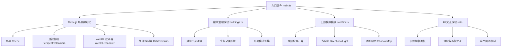

## 1. 架构设计



## 2. 技术描述

- **前端框架**：原生 TypeScript + Three.js，无需React/Vue等框架
- **构建工具**：Vite@5，提供快速开发服务器和构建
- **3D 引擎**：Three.js@0.160 + @types/three
- **类型系统**：TypeScript@5，严格模式（strict: true）
- **样式方案**：原生 CSS + 内联样式，毛玻璃效果使用 backdrop-filter
- **无后端**：纯前端应用，所有逻辑在浏览器端运行
- **无外部资源**：建筑、地面均为程序化生成，无需加载外部模型

## 3. 文件结构

| 文件路径 | 作用 |
|---------|------|
| /package.json | 项目依赖与脚本配置 |
| /index.html | 入口 HTML 页面，挂载点与 CSS |
| /vite.config.js | Vite 构建配置 |
| /tsconfig.json | TypeScript 编译配置（严格模式） |
| /src/main.ts | 入口文件，初始化场景、相机、渲染器、控制器 |
| /src/buildings.ts | 建筑生成与管理模块，生长动画，布局切换 |
| /src/sunSim.ts | 日照模拟模块，太阳位置计算，阴影控制 |
| /src/ui.ts | 用户交互 UI 模块，控制面板，滑块按钮 |

## 4. 核心模块 API 定义

### 4.1 建筑管理模块 (buildings.ts)

```typescript
// 布局模式类型
export type LayoutMode = 'grid' | 'random' | 'ring';

// 建筑配置
export interface BuildingConfig {
  count: number;        // 建筑数量 10-50
  maxHeight: number;    // 最大高度 5-20
  layout: LayoutMode;   // 布局模式
  spacing: number;      // 建筑间距（默认3单位）
}

// 建筑实例
export interface Building {
  mesh: THREE.Mesh;
  baseHeight: number;
  currentHeight: number;
  targetHeight: number;
  growthDuration: number;  // 0.5-1.5s
  growthStartTime: number;
  position: THREE.Vector3;
  baseMesh?: THREE.Mesh;    // 地基圆盘
}

// 建筑管理器类
export class BuildingManager {
  constructor(scene: THREE.Scene, config: BuildingConfig);
  generateBuildings(): void;      // 生成建筑
  startGrowthAnimation(): void;   // 开始生长动画
  update(delta: number): void;    // 每帧更新
  switchLayout(newLayout: LayoutMode): Promise<void>; // 切换布局
  setBuildingCount(count: number): void;
  setMaxHeight(height: number): void;
  dispose(): void;
}
```

### 4.2 日照模拟模块 (sunSim.ts)

```typescript
// 太阳配置
export interface SunConfig {
  azimuth: number;    // 方位角 0-360度
  altitude: number;   // 高度角 15-75度
  intensity: number;  // 光照强度
}

// 日照模拟器类
export class SunSimulator {
  constructor(scene: THREE.Scene, config: SunConfig);
  setAzimuth(degrees: number): void;    // 设置方位角
  setAltitude(degrees: number): void;   // 设置高度角
  update(): void;                       // 更新太阳位置与阴影
  getLight(): THREE.DirectionalLight;
  dispose(): void;
}
```

### 4.3 UI 模块 (ui.ts)

```typescript
// UI 配置回调
export interface UICallbacks {
  onBuildingCountChange: (count: number) => void;
  onMaxHeightChange: (height: number) => void;
  onAzimuthChange: (azimuth: number) => void;
  onAltitudeChange: (altitude: number) => void;
  onLayoutChange: (layout: LayoutMode) => void;
  onExportSnapshot: () => void;
  onResetView: () => void;
}

// UI 管理器类
export class UIManager {
  constructor(callbacks: UICallbacks);
  updateBuildingCount(value: number): void;
  updateMaxHeight(value: number): void;
  updateAzimuth(value: number): void;
  updateAltitude(value: number): void;
}
```

## 5. 性能优化策略

- **阴影优化**：使用 PCFSoftShadowMap，合理设置 shadow.mapSize（1024x1024），控制阴影相机范围
- **几何体复用**：建筑使用 BoxGeometry，高度变化通过 scale.y 实现，避免重建几何体
- **材质复用**：同类建筑共享材质实例，仅修改颜色
- **动画优化**：生长动画使用 requestAnimationFrame，仅在生长期间更新建筑scale
- **帧率目标**：50栋建筑时维持30FPS以上，阴影计算延迟低于100ms

## 6. 缓动函数

```typescript
// easeOutCubic 缓出函数
function easeOutCubic(t: number): number {
  return 1 - Math.pow(1 - t, 3);
}
```
