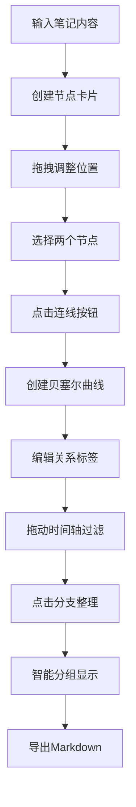

## 1. 产品概述

笔记思维导图是一款帮助用户将日常零散思考、阅读摘录或学习笔记快速转化为带有时间关联的可视化思维导图应用。主要解决笔记整理过程中信息碎片化、缺乏空间关联和时间上下文记录的问题，通过直观的图形化界面让用户能够建立知识之间的联系，形成结构化的知识网络。

## 2. 核心功能

### 2.1 用户角色

| 角色 | 注册方式 | 核心权限 |
|------|----------|----------|
| 普通用户 | 无需注册，本地使用 | 创建节点、编辑连线、整理分支、导出Markdown |

### 2.2 功能模块

1. **节点管理**：文本输入创建节点、自动生成微缩卡片、拖拽排列、网格吸附、防重叠
2. **连线系统**：节点间贝塞尔曲线连接、关系标签编辑、颜色混合、绘制动画
3. **时间轴过滤**：底部时间滑块、时间段高亮、节点透明度变化、连线显示控制
4. **分支整理**：智能分组算法、分组边框、关键词提取、组内编辑模式
5. **导出功能**：一键导出Markdown大纲、时间排序、关系缩进表示

### 2.3 页面详情

| 页面名称 | 模块名称 | 功能描述 |
|---------|----------|----------|
| 主页面 | 左侧工具栏 | 文本输入框、创建按钮、导出按钮 |
| 主页面 | 中央画布 | 节点卡片渲染、拖拽交互、连线绘制、网格背景 |
| 主页面 | 底部时间轴 | 时间范围滑块、节点高亮过滤 |
| 主页面 | 右上角工具栏 | 分支整理按钮、重置按钮 |
| 主页面 | 右下角工具 | 连线创建浮动按钮 |

## 3. 核心流程

### 3.1 节点创建流程
用户在左侧输入框输入笔记内容 → 点击+按钮或按回车键 → 系统随机分配背景色 → 生成带时间戳的微缩卡片 → 卡片放置在画布默认位置 → 用户可拖拽调整位置

### 3.2 连线创建流程
用户点击第一个节点（高亮选中）→ 点击第二个节点（高亮选中）→ 点击右下角连线按钮 → 贝塞尔曲线从起点绘制到终点（动画0.2s）→ 显示中间关系标签（默认"关联"）→ 用户可点击标签编辑关系描述

### 3.3 时间轴过滤流程
用户拖动底部时间滑块 → 系统计算当前时间范围 → 范围内节点高亮（淡黄背景）→ 范围外节点半透明（透明度0.3）→ 连线根据两端节点时间显示或隐藏

### 3.4 分支整理流程
用户点击"分支整理"按钮 → 算法按距离阈值（水平<80px且垂直<80px）分组 → 每组显示虚线边框和集群标签 → 用户双击标签进入组内编辑模式 → 背景变暗，组内节点放大占满画布

## 4. 用户界面设计

### 4.1 设计风格
- **主色调**：深蓝灰 #2C3E50
- **辅助色**：蓝色 #3498DB、绿色 #27AE60、橙色 #F39C12
- **背景色**：画布浅灰点阵 #E8E8E8，工具栏纯白 #FFFFFF
- **卡片样式**：圆角12px，浅灰边框 #D0D0D0 1px，预设16种随机背景色
- **按钮样式**：圆角8px，hover时1.05倍放大，阴影加深
- **字体**：使用现代无衬线字体，标题14px粗体，正文12px常规
- **动效**：拖拽弹簧弹性（0.3s cubic-bezier(0.68, -0.55, 0.27, 1.55)），连线绘制动画（0.2s path length）

### 4.2 页面设计概述

| 页面名称 | 模块名称 | UI元素 |
|---------|----------|--------|
| 主页面 | 左侧工具栏 | 宽度280px白色背景，1px #CCCCCC分隔线，文本输入框（圆角8px），+按钮（圆形），导出按钮（宽160px高44px深绿色） |
| 主页面 | 中央画布 | 浅灰点阵背景（间距30px，点直径2px），节点卡片（160x80px），贝塞尔曲线连线（2px宽） |
| 主页面 | 底部时间轴 | 高度40px，轨道渐变#E0E0E0→#B0B0B0，圆形手柄直径20px深蓝#2C3E50 |
| 主页面 | 右上角工具栏 | 分支整理按钮（蓝色#3498DB），重置按钮（灰色#95A5A6圆形直径40px） |
| 主页面 | 右下角工具 | 连线按钮（圆形直径48px，渐变#667eea→#764ba2） |

### 4.3 响应式设计
- **桌面端（≥768px）**：左侧工具栏280px固定宽度，画布自适应剩余空间，时间轴高度40px
- **移动端（<768px）**：左侧工具栏变为顶部窄条（宽度100%，高度120px），时间轴高度缩小为30px，节点卡片尺寸适当调整

### 4.4 交互反馈
- **按钮hover**：1.05倍缩放，阴影加深，0.2s过渡
- **节点拖拽**：弹簧弹性动画，其他节点弹性让位（0.3s ease-out）
- **节点选中**：边框高亮，轻微阴影
- **连线创建**：从起点到终点逐段绘制（animate path length 0→1，0.2s）
- **重置确认**：0.3s闪烁提示

## 5. 性能要求
- 支持50个节点和80条连线同时显示
- 拖拽和缩放操作帧率不低于45fps
- 使用requestAnimationFrame进行动画循环
- 节点渲染优化，避免不必要的重绘
