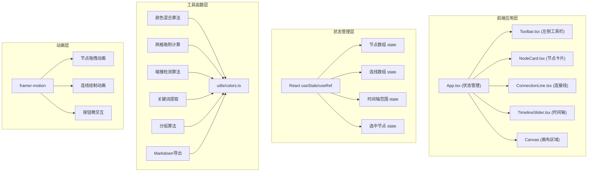

## 1. 架构设计



## 2. 技术描述

- **前端框架**：React@18 + TypeScript
- **构建工具**：Vite@5 + @vitejs/plugin-react
- **动画库**：framer-motion@11
- **图标库**：react-icons@5
- **状态管理**：React Hooks (useState, useRef, useCallback)
- **样式方案**：CSS Modules + 内联样式 + framer-motion

## 3. 项目结构

```
auto118/
├── index.html                 # 入口HTML
├── package.json               # 依赖配置
├── tsconfig.json              # TypeScript配置
├── vite.config.ts             # Vite配置
└── src/
    ├── main.tsx              # React根渲染入口
    ├── App.tsx               # 主组件，状态管理中心
    ├── types/
    │   └── index.ts          # 类型定义
    ├── utils/
    │   ├── colors.ts         # 颜色处理工具
    │   ├── geometry.ts       # 几何计算工具
    │   ├── grouping.ts       # 分组算法
    │   └── export.ts         # 导出工具
    ├── components/
    │   ├── NodeCard.tsx      # 节点卡片组件
    │   ├── ConnectionLine.tsx # 连接线组件
    │   ├── TimelineSlider.tsx # 时间轴滑块组件
    │   ├── Toolbar.tsx       # 左侧工具栏组件
    │   └── GroupBorder.tsx   # 分组边框组件
    └── hooks/
        └── useDrag.ts        # 拖拽自定义Hook
```

## 4. 数据模型

### 4.1 类型定义

```typescript
// 节点类型
interface MindMapNode {
  id: string;
  content: string;
  x: number;
  y: number;
  color: string;
  createdAt: Date;
  groupId?: string;
}

// 连线类型
interface Connection {
  id: string;
  from: string;      // 起始节点ID
  to: string;        // 目标节点ID
  label: string;     // 关系标签
  color: string;     // 混合颜色
}

// 分组类型
interface NodeGroup {
  id: string;
  nodeIds: string[];
  label: string;
  bounds: {
    x: number;
    y: number;
    width: number;
    height: number;
  };
}

// 时间范围类型
interface TimeRange {
  start: Date;
  end: Date;
}

// 画布状态
interface CanvasState {
  nodes: MindMapNode[];
  connections: Connection[];
  groups: NodeGroup[];
  selectedNodeIds: string[];
  timeRange: TimeRange | null;
  activeGroupId: string | null;
}
```

### 4.2 预设颜色板

16种预设背景色，用于节点卡片随机分配：
```typescript
const COLOR_PALETTE = [
  '#FFCDD2', '#F8BBD0', '#E1BEE7', '#D1C4E9',
  '#C5CAE9', '#BBDEFB', '#B3E5FC', '#B2EBF2',
  '#B2DFDB', '#C8E6C9', '#DCEDC8', '#F0F4C3',
  '#FFF9C4', '#FFECB3', '#FFE0B2', '#FFCCBC'
];
```

## 5. 核心算法

### 5.1 网格吸附算法
```typescript
function snapToGrid(value: number, gridSize: number = 30): number {
  return Math.round(value / gridSize) * gridSize;
}
```

### 5.2 碰撞检测与弹性让位
```typescript
function resolveCollisions(
  nodes: MindMapNode[],
  draggedId: string,
  newX: number,
  newY: number
): MindMapNode[] {
  const NODE_WIDTH = 160;
  const NODE_HEIGHT = 80;
  const PADDING = 10;
  
  // 检测重叠并计算推力
  // 使用requestAnimationFrame实现平滑动画
}
```

### 5.3 贝塞尔曲线生成
```typescript
function generateBezierPath(
  x1: number, y1: number,
  x2: number, y2: number
): string {
  const midX = (x1 + x2) / 2;
  const controlOffset = Math.abs(x2 - x1) * 0.3;
  return `M ${x1} ${y1} C ${x1 + controlOffset} ${y1}, ${x2 - controlOffset} ${y2}, ${x2} ${y2}`;
}
```

### 5.4 颜色混合算法
```typescript
function mixColors(color1: string, color2: string): string {
  // 将两个hex颜色按50%比例混合
  // 用于生成连线颜色
}
```

### 5.5 智能分组算法
```typescript
function groupNodes(
  nodes: MindMapNode[],
  thresholdX: number = 80,
  thresholdY: number = 80
): NodeGroup[] {
  // 使用并查集或聚类算法
  // 水平距离<80px且垂直距离<80px的节点归为一组
}
```

### 5.6 关键词提取
```typescript
function extractKeywords(contents: string[]): string {
  // 简单词频统计，提取出现频率最高的词
  // 若无明显关键词，返回"节点组"
}
```

## 6. 性能优化策略

1. **动画循环**：使用requestAnimationFrame统一管理所有动画
2. **节点渲染优化**：使用React.memo包裹NodeCard，避免不必要重渲染
3. **连线批量渲染**：使用SVG批量渲染连线，避免频繁DOM操作
4. **拖拽防抖**：拖拽事件使用节流，每16ms（约60fps）更新一次位置
5. **虚拟画布**：超出视口的节点使用transform隐藏，减少渲染压力
6. **CSS硬件加速**：对拖拽元素使用will-change和transform3d

## 7. 构建与运行

- **开发命令**：`npm run dev`
- **构建命令**：`npm run build`
- **安装依赖**：`npm install`
- **依赖列表**：
  - react: ^18.2.0
  - react-dom: ^18.2.0
  - framer-motion: ^11.0.0
  - react-icons: ^5.0.0
  - typescript: ^5.0.0
  - vite: ^5.0.0
  - @vitejs/plugin-react: ^4.2.0
  - @types/react: ^18.2.0
  - @types/react-dom: ^18.2.0
