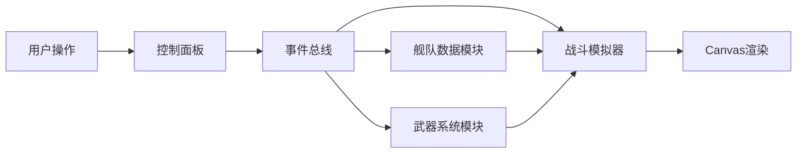

## 1. 产品概述

太空舰队阵型与集火模拟器是一款面向独立游戏开发团队的测试工具，用于在网页端可视化测试战舰编队的阵型排布、武器射程覆盖和集火攻击指令的即时反馈效果。

- 核心目标：为科幻舰队指挥官游戏提供直观的阵型与战斗模拟测试环境
- 目标用户：独立游戏开发团队的策划、程序和美术人员
- 产品价值：加速游戏玩法迭代，降低战斗系统调试成本

## 2. 核心功能

### 2.1 用户角色
| 角色 | 登录方式 | 核心权限 |
|------|----------|----------|
| 开发人员 | 本地访问 | 使用全部功能，编辑武器参数 |

### 2.2 功能模块
1. **舰队画布区域**：俯视图渲染舰队、武器射程、攻击特效、尾迹动画
2. **控制面板**：阵型选择、集火目标选择、开火按钮、射程显示开关
3. **武器编辑面板**：武器类型切换、伤害/射程/攻击间隔编辑
4. **战斗回放系统**：帧记录、播放/暂停、速度调节、进度拖拽

### 2.3 页面详情
| 页面名称 | 模块名称 | 功能描述 |
|----------|----------|----------|
| 主页面 | 舰队画布 | Canvas2D渲染舰队俯视图，支持舰船点击高亮、动画飞入、尾迹效果 |
| 主页面 | 控制面板 | 阵型下拉选择（楔形/圆筒/菱形/横列）、集火目标选择、开火按钮、射程开关 |
| 主页面 | 武器编辑面板 | 武器类型切换、伤害输入、射程滑块、攻击间隔滑块 |
| 主页面 | 回放控制器 | 记录按钮、播放/暂停、速度调节（1x/2x/4x）、进度条拖拽 |

## 3. 核心流程

### 3.1 阵型切换流程
用户选择阵型 → 事件总线广播阵型变更 → 舰队模块计算新坐标 → 战斗模拟器更新舰船目标位置 → UI渲染平滑移动动画

### 3.2 集火攻击流程
用户选择敌方目标 → 点击集火按钮 → 武器模块计算射程内舰船 → 生成攻击线数据 → 战斗模拟器播放攻击动画 → 目标闪烁反馈

### 3.3 战斗回放流程
点击记录按钮 → 模拟器每100ms保存状态快照 → 最多60帧 → 拖动进度条 → 回放到对应帧状态

## 4. 用户界面设计

### 4.1 设计风格
- 设计方向：科幻深色主题，赛博朋克风格
- 主色调：深空背景 #0B0C10，主文字 #C5C6C7
- 强调色：科技蓝 #45A29E，高亮青 #66FCF1，警示橙 #FFB347
- 按钮风格：科技感边框，hover发光效果，按下缩放反馈
- 字体：等宽科技字体，营造控制台氛围
- 布局：左侧70%画布区 + 右侧30%控制面板，卡片式设计
- 视觉元素：半透明深色卡片、发光边框、径向渐变背景、粒子星光

### 4.2 页面设计概述
| 页面名称 | 模块名称 | UI元素 |
|----------|----------|--------|
| 主页面 | 舰队画布 | 径向渐变背景、多边形舰船、发光描边、尾迹拖影、攻击射线、射程圆环 |
| 主页面 | 控制面板 | 半透明卡片、发光按钮、滑块控件、下拉选择器、标签页切换 |
| 主页面 | 武器编辑面板 | 武器类型切换、数值输入框、滑块、实时预览 |
| 主页面 | 回放控制栏 | 播放/暂停按钮、速度切换、进度条、帧计数显示 |

### 4.3 响应式
- 桌面优先设计，画布左侧、面板右侧布局
- 宽度小于768px时，面板移至画布下方，垂直排列
- 触控设备优化按钮尺寸，确保可点击区域不小于44px

### 4.4 动效设计
- 舰船飞入阵型：1s ease-out 缓动，带尾迹拖影
- 卡片切换：0.2s 淡入淡出
- 按钮交互：hover颜色渐变，active 0.1s缩放
- 攻击动画：0.8s射线持续，目标闪烁3次（0.2s周期）
- 射程圆环：淡蓝色半透明，目标进入多射程时变橙色高亮
