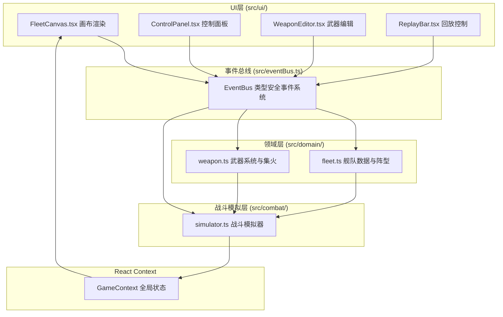

## 1. 架构设计



## 2. 技术描述

- 前端框架：React@18 + TypeScript
- 构建工具：Vite@5 + @vitejs/plugin-react
- 动画库：framer-motion
- 渲染技术：Canvas2D API
- 状态管理：React Context + 自定义事件总线
- 样式方案：CSS Modules + CSS Variables

## 3. 模块与文件定义

### 3.1 文件结构
```
src/
├── domain/
│   ├── fleet.ts       # 舰队数据类型、阵型算法
│   └── weapon.ts      # 武器类型、射程、集火计算
├── combat/
│   └── simulator.ts   # 战斗帧循环、碰撞检测、特效管理
├── ui/
│   ├── FleetCanvas.tsx    # Canvas2D舰队渲染
│   ├── ControlPanel.tsx   # 阵型与集火控制面板
│   ├── WeaponEditor.tsx   # 武器参数编辑面板
│   └── ReplayBar.tsx      # 回放控制条
├── eventBus.ts        # 类型安全事件总线
├── App.tsx            # 主应用组件
├── main.tsx           # 入口文件
└── index.css          # 全局样式
```

### 3.2 数据流向
1. **用户输入流**：UI组件 → 事件总线 → 领域模块计算 → 战斗模拟器更新 → Context → UI重渲染
2. **战斗帧流**：requestAnimationFrame → 模拟器更新状态 → 状态快照 → Canvas绘制
3. **回放流**：记录帧队列 → 进度控制 → 状态注入 → Canvas回放

## 4. 核心数据类型定义

### 4.1 舰队相关类型
```typescript
type ShipType = 'destroyer' | 'cruiser' | 'capital';
type FormationType = 'wedge' | 'cylinder' | 'diamond' | 'line';

interface Ship {
  id: string;
  type: ShipType;
  x: number;
  y: number;
  targetX: number;
  targetY: number;
  weaponType: WeaponType;
  health: number;
}

interface FleetData {
  ships: Ship[];
  formation: FormationType;
}
```

### 4.2 武器相关类型
```typescript
type WeaponType = 'laser' | 'missile' | 'railgun';

interface WeaponConfig {
  type: WeaponType;
  damage: number;
  range: number;
  fireRate: number;
  color: string;
}

interface AttackLine {
  id: string;
  fromShipId: string;
  toShipId: string;
  startX: number;
  startY: number;
  endX: number;
  endY: number;
  color: string;
  createdAt: number;
  duration: number;
}
```

### 4.3 战斗状态类型
```typescript
interface CombatState {
  playerFleet: Ship[];
  enemyFleet: Ship[];
  attackLines: AttackLine[];
  selectedTargetId: string | null;
  showRange: boolean;
  isRecording: boolean;
  recordedFrames: CombatSnapshot[];
  currentFrame: number;
  isPlaying: boolean;
  playbackSpeed: number;
}

interface CombatSnapshot {
  playerFleet: Ship[];
  enemyFleet: Ship[];
  attackLines: AttackLine[];
  timestamp: number;
}
```

## 5. 事件总线定义

### 5.1 事件类型
```typescript
type EventType =
  | 'formation:change'
  | 'target:select'
  | 'fire:focus'
  | 'range:toggle'
  | 'weapon:update'
  | 'combat:record'
  | 'combat:play'
  | 'combat:pause'
  | 'combat:seek'
  | 'combat:speed'
  | 'ship:click'
  | 'frame:update';
```

### 5.2 调用关系
- `ControlPanel` 触发 `formation:change`、`fire:focus`、`range:toggle`
- `WeaponEditor` 触发 `weapon:update`
- `FleetCanvas` 触发 `ship:click`
- `ReplayBar` 触发 `combat:*` 系列事件
- `simulator` 触发 `frame:update`，订阅其他事件更新内部状态

## 6. 性能优化策略

- Canvas脏矩形渲染，仅重绘变化区域
- 攻击线对象池复用，上限20条，超出回收最早的
- requestAnimationFrame驱动，稳定30fps+
- 状态浅比较，减少不必要重渲染
- 离屏canvas缓存静态背景元素

## 7. 技术约束

- TypeScript严格模式（strict: true）
- target ES2020
- 战斗模拟帧率 ≥ 30fps
- 攻击线数量上限 20条
- 回放帧记录上限 60帧（10fps）
