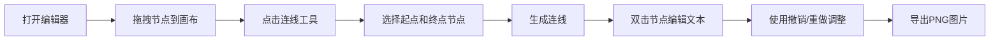

## 1. 产品概述

手绘风格流程图编辑器是一款在线可视化工具，让用户通过拖拽和连线快速创建逻辑清晰、视觉友好的流程图。目标用户为产品经理、开发者、教师等需要绘制流程图的人群，产品价值在于提供轻松愉悦的手绘风格创作体验，降低流程图制作门槛。

## 2. 核心功能

### 2.1 用户角色
| 角色 | 注册方式 | 核心权限 |
|------|----------|----------|
| 普通用户 | 无需注册 | 完整使用所有编辑功能 |

### 2.2 功能模块
1. **节点面板**：四种节点类型（开始/结束、流程、判断、子流程），支持拖拽到画布
2. **画布编辑区**：节点放置、移动、连线、文本编辑
3. **顶部工具栏**：节点类型选择、连线工具、撤销/重做、导出
4. **导出功能**：PNG格式导出，1920x1080分辨率

### 2.3 页面详情
| 页面名称 | 模块名称 | 功能描述 |
|---------|----------|----------|
| 编辑器主页面 | 左侧节点面板 | 展示四种节点缩略图，支持拖拽到画布 |
| 编辑器主页面 | 中央画布区域 | 85%宽度，带网格线，节点和连线绘制区域 |
| 编辑器主页面 | 顶部工具栏 | 操作按钮区，包含连线工具、撤销重做、导出 |
| 编辑器主页面 | 节点组件 | 手绘风格节点，支持拖拽、选中文本编辑 |
| 编辑器主页面 | 连线组件 | 手绘风格贝塞尔曲线，带箭头，自动跟随节点 |

## 3. 核心流程

用户打开编辑器 → 从左侧面板拖拽节点到画布 → 点击连线工具连接节点 → 双击节点编辑文本 → 使用撤销/重做调整 → 点击导出保存PNG

## 4. 用户界面设计

### 4.1 设计风格
- **主色调**：柔和米白色（#FFF8F0）背景，暖棕色（#8B5E3C）强调色，浅灰色（#D3C5B5）辅助色
- **节点风格**：使用roughjs生成手绘风格，笔画粗细2px，线条略微抖动
- **按钮风格**：圆角矩形，悬停有轻微阴影变化
- **字体**：系统无衬线字体，清晰可读
- **布局风格**：左侧固定面板 + 中央画布 + 顶部工具栏

### 4.2 页面设计概览
| 页面名称 | 模块名称 | UI元素 |
|---------|----------|--------|
| 编辑器主页面 | 左侧面板 | 固定宽度200px，毛玻璃效果（背景模糊8px，透明度0.3），节点缩略图列表 |
| 编辑器主页面 | 画布区域 | 米白色背景，30px间距浅网格线（透明度0.15），占据85%宽度 |
| 编辑器主页面 | 工具栏 | 顶部水平排列，暖棕色按钮，手绘风格图标 |
| 编辑器主页面 | 节点选中态 | 脉动外发光动画，0.8s周期循环 |
| 编辑器主页面 | 连线路径 | 手绘风格贝塞尔曲线，带箭头，300ms生长动画 |

### 4.3 响应式设计
- 宽屏（>1400px）：完整布局，左侧面板200px固定宽度
- 平板（>768px）：布局适当压缩，画布比例保持
- 移动端（<768px）：左侧面板变为可折叠汉堡菜单，画布全宽

### 4.4 动画与交互
- 节点拖拽：平滑跟随鼠标
- 连线生成：从起点平滑生长到终点，300ms，ease-out缓动
- 节点选中：脉动外发光，0.8s循环
- 按钮悬停：背景色渐变过渡
