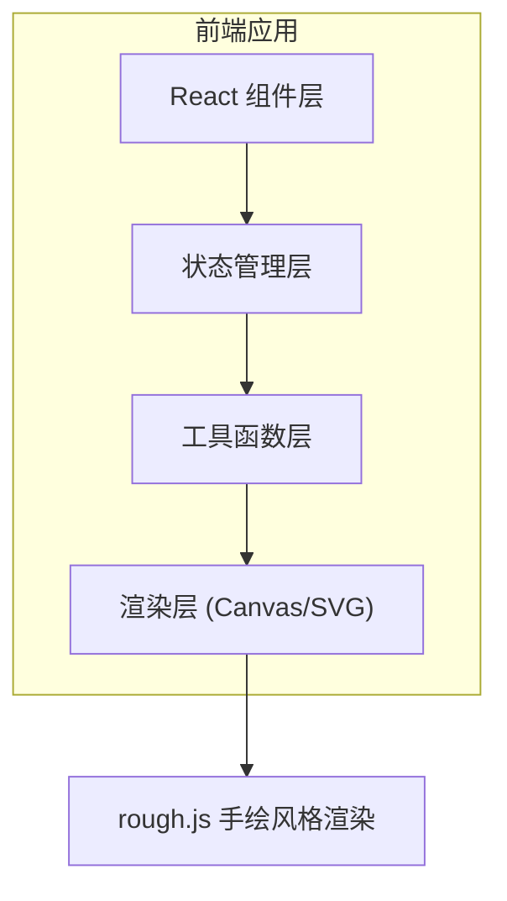

## 1. 架构设计



## 2. 技术描述
- 前端框架：React 18 + TypeScript
- 构建工具：Vite
- 手绘渲染：rough.js
- 状态管理：React useState/useReducer + 自定义Hook
- 样式方案：纯CSS + CSS变量
- 导出功能：Canvas API + html2canvas / 原生Canvas绘制

## 3. 文件结构

| 文件路径 | 用途 |
|---------|------|
| package.json | 项目依赖和脚本配置 |
| vite.config.ts | Vite构建配置 |
| tsconfig.json | TypeScript严格模式配置 |
| index.html | 入口HTML页面 |
| src/main.tsx | 应用入口 |
| src/Editor.tsx | 主编辑器组件，画布、节点、连线逻辑 |
| src/Toolbar.tsx | 顶部工具栏组件 |
| src/Node.tsx | 单个流程节点组件 |
| src/utils.ts | 工具函数（碰撞检测、路径计算、历史记录） |

## 4. 核心数据模型

### 4.1 节点类型
```typescript
type NodeType = 'start' | 'process' | 'decision' | 'subprocess';

interface FlowNode {
  id: string;
  type: NodeType;
  x: number;
  y: number;
  width: number;
  height: number;
  text: string;
}
```

### 4.2 连线类型
```typescript
interface Connection {
  id: string;
  fromNodeId: string;
  toNodeId: string;
}
```

### 4.3 历史记录
```typescript
interface HistoryState {
  nodes: FlowNode[];
  connections: Connection[];
}

interface HistoryManager {
  past: HistoryState[];
  present: HistoryState;
  future: HistoryState[];
  maxSteps: number;
}
```

## 5. 核心功能实现方案

### 5.1 节点拖拽
- 使用原生拖拽API（drag and drop）或鼠标事件模拟
- 拖拽时使用requestAnimationFrame保证60fps
- 松开鼠标时计算画布坐标并固定节点

### 5.2 连线绘制
- 使用贝塞尔曲线（二次或三次）连接节点中心
- 控制点自动计算，保证曲线平滑
- 箭头使用SVG marker实现
- rough.js绘制手绘风格线条

### 5.3 撤销/重做
- 使用历史记录栈（past/present/future）
- 最多保存30步
- 支持键盘快捷键 Ctrl+Z / Ctrl+Shift+Z

### 5.4 文本编辑
- 双击节点切换为编辑状态
- 使用contenteditable或input元素
- Enter或失焦确认编辑
- 文字自动居中

### 5.5 PNG导出
- 创建隐藏Canvas，尺寸1920x1080
- 重新绘制所有节点和连线到Canvas
- 使用canvas.toDataURL导出PNG
- 触发下载

## 6. 性能优化

- 使用React.memo避免不必要的节点重渲染
- 连线重绘使用requestAnimationFrame节流
- 拖拽时使用transform而非top/left
- 大数量场景下考虑Canvas批量绘制

## 7. 响应式布局

- 宽屏（>1400px）：左侧面板200px固定宽度
- 平板（>768px）：左侧面板180px，适当缩小
- 移动端（<768px）：左侧面板可折叠，汉堡菜单切换
- 使用CSS媒体查询实现
