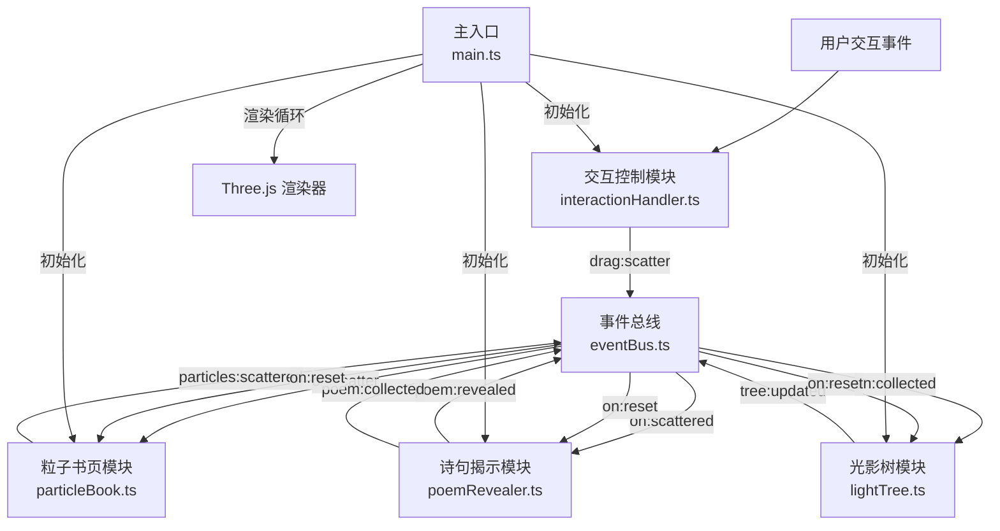

## 1. 产品概述
本项目是一个数字艺术互动可视化应用，为线上展览打造的沉浸式体验作品。参观者通过手势或鼠标拖拽，在三维空间中"吹散"由粒子构成的书页，每页散开后露出隐藏的诗句，最终所有诗句汇聚成一棵不断生长的光影树，实现从文字到自然意象的诗意转化。

- **核心目标**：创造富有诗意的互动艺术体验，将文字内容与三维粒子效果、光影生长动画结合
- **目标用户**：线上艺术展览参观者、数字艺术爱好者
- **市场价值**：探索数字艺术互动形式，为线上展览提供沉浸式互动作品

## 2. 核心特性

### 2.1 用户角色
| 角色 | 注册方式 | 核心权限 |
|------|----------|----------|
| 访客用户 | 无需注册 | 浏览互动作品、执行拖拽操作、查看光影树生长、重置场景 |

### 2.2 功能模块
1. **粒子书页系统**：由6页粒子构成的半开书，支持拖拽散开动画
2. **诗句揭示系统**：书页散开后暴露诗句粒子，随后流动到树根
3. **光影树生长系统**：根据收集的诗句数量动态生长树干、分枝和光晕
4. **交互控制系统**：鼠标/触摸拖拽、OrbitControls视角控制、重置功能
5. **事件总线**：模块间解耦通信

### 2.3 页面详情
| 页面名称 | 模块名称 | 功能描述 |
|----------|----------|----------|
| 主场景 | 粒子书页模块 | 生成6页粒子书页，每页200粒子，支持拖拽散开，带拖尾效果 |
| 主场景 | 诗句揭示模块 | 监听粒子散开事件，生成诗句粒子，3秒后S形曲线流动到树根 |
| 主场景 | 光影树模块 | 树干累积生长，每0.5单位高度分枝，枝头彩色光晕呼吸闪烁 |
| 主场景 | 交互控制模块 | 鼠标/触摸拖拽检测，计算方向速度，发射散页指令，R键/按钮重置 |
| 主场景 | UI界面 | 左上角诗句收集进度（1/6形式），右上角重置按钮 |

## 3. 核心流程

### 3.1 用户交互主流程
用户进入场景 → 看到悬浮的粒子半开书 → 鼠标拖拽书页 → 粒子沿拖拽方向散开 → 暴露诗句粒子 → 诗句停留3秒 → 诗句S形流动到树根 → 树干生长 → 积累足够诗句后分枝、生成光晕 → 6页全部收集后生成冠状光晕 → 用户按R键或点击重置按钮 → 粒子汇聚、树消失 → 恢复初始状态

### 3.2 数据流向

## 4. 用户界面设计

### 4.1 设计风格
- **主色调**：深蓝紫色渐变背景（#0F0C29 → #302B63），营造梦幻夜空氛围
- **强调色**：暖白书页粒子（#FFF8E7），彩色诗句粒子（#FF6B6B、#4ECDC4、#45B7D1、#F39C12），八色光晕循环
- **字体**：现代无衬线字体，白色带浅阴影，确保在深色背景上清晰可读
- **按钮风格**：圆形重置按钮（直径32px，#FF6B6B半透明，悬停不透明，过渡0.2s）
- **整体风格**：诗意梦幻、沉浸艺术、粒子光影、流畅动画

### 4.2 页面设计概览
| 页面名称 | 模块名称 | UI元素 |
|----------|----------|--------|
| 主场景 | 3D场景 | 深蓝紫渐变背景、半透明网格地面、悬浮粒子书页、动态生长光影树 |
| 主场景 | 粒子效果 | 书页粒子抖动动画、散开拖尾效果、诗句S形流动轨迹、光晕呼吸闪烁 |
| 主场景 | UI控件 | 左上角进度显示（白色20px字体，浅阴影）、右上角圆形重置按钮 |
| 主场景 | 光照 | 环境光 + 平行光照明，点光源光晕 |

### 4.3 响应性
- **桌面端优先**：完整支持鼠标拖拽、滚轮缩放、OrbitControls视角控制
- **移动端适配**：支持触摸拖拽、双指缩放，重置按钮尺寸适配
- **性能优化**：粒子总数≤3000，帧率稳定50fps以上，拖拽响应<50ms

### 4.4 3D场景指引
- **环境氛围**：深蓝紫色渐变夜空，半透明白色网格地面（不透明度0.05，网格间距0.5单位）
- **光照设置**：环境光（强度0.6）+ 平行光（强度0.8，位置(5, 10, 7)）+ 动态点光源（光晕）
- **相机设置**：初始位置(0, 1.5, 4)，PerspectiveCamera（fov 60，近裁0.1，远裁100），OrbitControls（阻尼0.1，可旋转缩放不可平移）
- **构图焦点**：书页悬浮在Y=0.5高度，位于场景中央，光影树从书脊根部向上生长
- **交互动画**：书页整体缓慢旋转（0.002 rad/s），粒子轻微抖动（振幅0.003），散开速度与拖拽速度成正比（最高2单位/秒），1.5秒渐隐，诗句3秒后S形流动（0.5单位/秒），汇聚动画2秒，树渐隐1秒
- **后期处理**：粒子半透明效果（PointsMaterial，sizeAttenuation开启，transparent true），线条拖尾（半透明Line）
- **性能预算**：粒子总数≤3000（6×200书页 + 6×50诗句），帧率≥50fps

## 5. 功能详细说明

### 5.1 初始场景
- 6页粒子书页组成半开书，每页200粒子构成矩形平面（宽1.2，高1.8单位）
- 书页粒子颜色#FFF8E7，随机轻微抖动（振幅0.003）
- 书页绕书脊呈15度角展开，整体缓慢旋转（0.002 rad/s）

### 5.2 交互散开
- 鼠标/手指拖拽时，对应书页粒子沿拖拽方向散开
- 散开速度与拖拽速度成正比（最高2单位/秒）
- 散开粒子持续向外扩散，1.5秒后渐隐消失
- 暴露50个细小粒子构成的诗句文字，颜色从四色中随机选取
- 每个粒子保留前3帧位置，用半透明线绘制拖尾轨迹

### 5.3 诗句流动
- 诗句粒子暴露后停留3秒
- 整体向书脊根部S形曲线流动（速度0.5单位/秒）
- 流动时粒子逐渐缩小，颜色变为浅金色#FFD700
- 到达根部后消失，树干增加0.1单位高度（颜色从#8B4513渐变到#D2691E）

### 5.4 光影树生长
- 树干每累积0.5单位高度，树顶分出一个新枝
- 枝干颜色#8B4513，长度0.3-0.6单位随机，与树干夹角30-60度随机
- 枝头生成点光源光晕（半径0.1，八色循环），0.6秒周期呼吸闪烁
- 6页全部收集后，树顶冒出20个光点组成的冠状光晕，持续闪耀并缓慢上升

### 5.5 重置机制
- 按R键或点击右上角重置按钮
- 粒子书页2秒内重新汇聚成初始状态
- 光影树1秒内渐隐消失
- 所有计数归零
