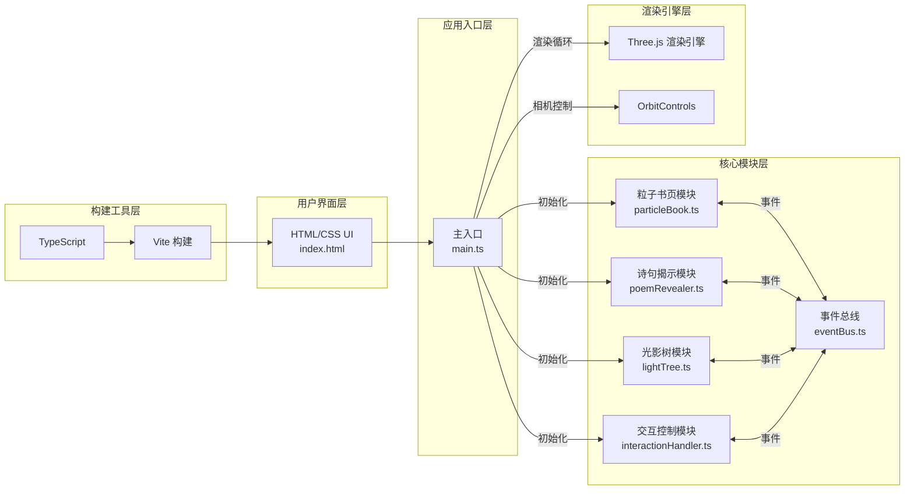
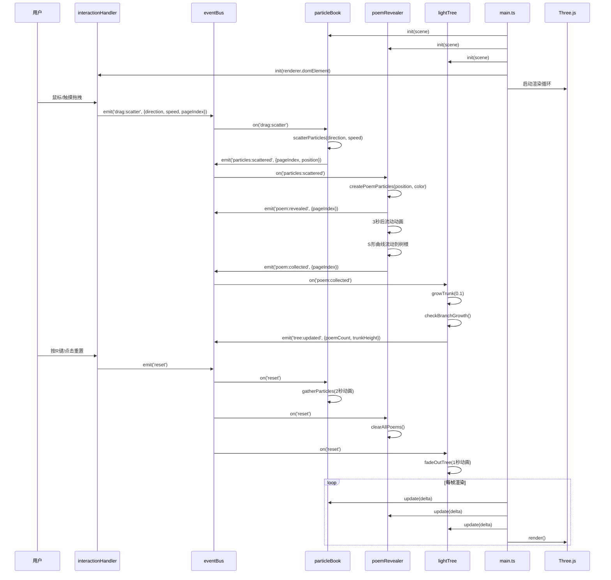

## 1. 架构设计

### 1.1 整体架构图


### 1.2 模块调用关系与数据流向



## 2. 技术描述

### 2.1 技术栈选择
- **前端框架**：原生 TypeScript + Three.js（无需React，纯3D可视化场景）
- **构建工具**：Vite 5.x
- **语言**：TypeScript 5.x（严格模式）
- **3D引擎**：Three.js 0.160.x
- **类型定义**：@types/three、@types/node
- **无后端、无数据库**：纯前端单页应用

### 2.2 项目初始化
- 使用 Vite 原生 TypeScript 模板初始化项目
- 手动安装 three、@types/three、@types/node 依赖
- 配置 tsconfig.json 严格模式
- 配置 vite.config.js 基础构建选项

### 2.3 文件结构与职责

```
auto122/
├── package.json              # 项目配置与依赖
├── index.html                # 入口HTML页面
├── vite.config.js            # Vite构建配置
├── tsconfig.json             # TypeScript配置（严格模式）
└── src/
    ├── main.ts               # 应用入口（初始化场景、相机、渲染器、各模块）
    ├── eventBus.ts           # 自定义事件总线（模块间解耦通信）
    ├── particles/
    │   ├── particleBook.ts   # 粒子书页模块（生成、管理、散开、汇聚）
    │   └── poemRevealer.ts   # 诗句揭示模块（生成诗句、流动动画）
    ├── tree/
    │   └── lightTree.ts      # 光影树模块（树干生长、分枝、光晕）
    └── controls/
        └── interactionHandler.ts  # 交互控制模块（鼠标/触摸、重置）
```

### 2.4 各文件职责与调用关系

| 文件 | 职责 | 依赖 | 被依赖 | 关键数据结构 |
|------|------|------|--------|-------------|
| [main.ts](file:///d:/Pro/tasks/auto122/src/main.ts) | 初始化Three.js场景、相机、渲染器、光照；创建各模块实例；启动渲染循环；协调模块更新 | eventBus, particleBook, poemRevealer, lightTree, interactionHandler | - | Scene, PerspectiveCamera, WebGLRenderer, Clock |
| [eventBus.ts](file:///d:/Pro/tasks/auto122/src/eventBus.ts) | 实现发布订阅模式；提供emit/on/off方法；类型化事件定义 | - | 所有业务模块 | EventMap接口, EventCallback类型 |
| [particleBook.ts](file:///d:/Pro/tasks/auto122/src/particles/particleBook.ts) | 生成6页粒子书页（每页200粒子）；处理散开动画和拖尾；处理汇聚动画；事件监听与触发 | three, eventBus | main.ts | PageParticleData, ParticleState |
| [poemRevealer.ts](file:///d:/Pro/tasks/auto122/src/particles/poemRevealer.ts) | 监听粒子散开事件；生成诗句粒子（50个/页）；S形流动动画；事件触发 | three, eventBus | main.ts | PoemParticleData, FlowState |
| [lightTree.ts](file:///d:/Pro/tasks/auto122/src/tree/lightTree.ts) | 维护树结构；树干生长；分枝生成；光晕呼吸闪烁；冠状光晕 | three, eventBus | main.ts | TreeBranch, TreeGlow, TreeState |
| [interactionHandler.ts](file:///d:/Pro/tasks/auto122/src/controls/interactionHandler.ts) | 监听鼠标/触摸事件；计算拖拽方向速度；射线检测书页；R键/按钮重置 | three, eventBus | main.ts | DragState, PointerInfo |

### 2.5 事件总线事件定义

| 事件名 | 触发方 | 监听方 | 数据载荷 | 描述 |
|--------|--------|--------|----------|------|
| `drag:scatter` | interactionHandler | particleBook | {direction: Vector3, speed: number, pageIndex: number} | 拖拽散页指令 |
| `particles:scattered` | particleBook | poemRevealer | {pageIndex: number, position: Vector3} | 粒子已散开，暴露诗句 |
| `poem:revealed` | poemRevealer | - | {pageIndex: number} | 诗句已暴露 |
| `poem:collected` | poemRevealer | lightTree, main.ts | {pageIndex: number} | 诗句已到达树根 |
| `tree:updated` | lightTree | main.ts | {poemCount: number, trunkHeight: number, branchCount: number} | 树结构更新 |
| `reset` | interactionHandler | particleBook, poemRevealer, lightTree | - | 重置整个场景 |

## 3. 核心技术实现

### 3.1 事件总线实现
```typescript
// src/eventBus.ts
type EventCallback<T = any> = (data: T) => void;

interface EventMap {
  'drag:scatter': { direction: THREE.Vector3; speed: number; pageIndex: number };
  'particles:scattered': { pageIndex: number; position: THREE.Vector3 };
  'poem:revealed': { pageIndex: number };
  'poem:collected': { pageIndex: number };
  'tree:updated': { poemCount: number; trunkHeight: number; branchCount: number };
  'reset': void;
}

class EventBus {
  private listeners: Map<keyof EventMap, Set<EventCallback>> = new Map();
  on<K extends keyof EventMap>(event: K, callback: (data: EventMap[K]) => void): void;
  emit<K extends keyof EventMap>(event: K, data: EventMap[K]): void;
  off<K extends keyof EventMap>(event: K, callback: (data: EventMap[K]) => void): void;
}
```

### 3.2 粒子书页实现要点
- 使用 `THREE.BufferGeometry` + `THREE.Points` 实现高性能粒子渲染
- 每页200粒子，按网格分布在1.2×1.8矩形平面上
- 粒子状态：idle（抖动）、scattering（散开）、gathering（汇聚）、fading（渐隐）
- 拖尾效果：每个粒子保留前3帧位置，用 `THREE.Line` + 半透明材质绘制
- 射线检测：`THREE.Raycaster` 检测鼠标与书页平面的交点

### 3.3 诗句流动实现要点
- 诗句粒子50个，沿水平方向排列模拟文字
- 流动路径：使用三次贝塞尔曲线或S形函数计算Y轴偏移
- 颜色渐变：从初始彩色渐变为#FFD700
- 尺寸渐变：从初始大小逐渐缩小到0

### 3.4 光影树实现要点
- 树干：`THREE.CylinderGeometry` + `MeshBasicMaterial`，高度动态更新
- 颜色渐变：从#8B4513到#D2691E的垂直渐变
- 分枝：`THREE.ConeGeometry`，随机长度和角度
- 光晕：`THREE.PointLight` + `THREE.Mesh`（球体），呼吸效果通过缩放和强度变化实现
- 冠状光晕：20个点光源随机分布在半球区域

### 3.5 性能优化策略
- **粒子池化**：复用粒子对象，避免频繁创建销毁
- **BufferGeometry**：使用单个BufferGeometry管理所有书页粒子
- **按需更新**：仅在状态变化时更新attribute
- **帧率控制**：`requestAnimationFrame` 配合 `Clock.getDelta()`
- **粒子总数控制**：严格控制在3000以内

## 4. 构建配置

### 4.1 package.json
```json
{
  "name": "particle-poem-tree",
  "private": true,
  "version": "1.0.0",
  "type": "module",
  "scripts": {
    "dev": "vite",
    "build": "tsc && vite build",
    "preview": "vite preview"
  },
  "dependencies": {
    "three": "^0.160.0"
  },
  "devDependencies": {
    "@types/node": "^20.10.0",
    "@types/three": "^0.160.0",
    "typescript": "^5.3.0",
    "vite": "^5.0.0"
  }
}
```

### 4.2 tsconfig.json（严格模式）
```json
{
  "compilerOptions": {
    "target": "ES2020",
    "useDefineForClassFields": true,
    "module": "ESNext",
    "lib": ["ES2020", "DOM", "DOM.Iterable"],
    "skipLibCheck": true,
    "moduleResolution": "bundler",
    "allowImportingTsExtensions": true,
    "resolveJsonModule": true,
    "isolatedModules": true,
    "noEmit": true,
    "strict": true,
    "noUnusedLocals": true,
    "noUnusedParameters": true,
    "noFallthroughCasesInSwitch": true
  },
  "include": ["src"]
}
```

### 4.3 vite.config.js
```javascript
import { defineConfig } from 'vite';
import path from 'path';

export default defineConfig({
  root: '.',
  base: './',
  server: {
    port: 5173,
    open: true
  },
  resolve: {
    alias: {
      '@': path.resolve(__dirname, './src')
    }
  }
});
```

## 5. 性能指标与约束

| 指标 | 目标值 | 实现方式 |
|------|--------|----------|
| 粒子总数 | ≤ 3000 | 6页×200 + 6×50诗句 = 1500，预留空间 |
| 帧率 | ≥ 50fps | BufferGeometry、按需更新、粒子池化 |
| 拖拽响应延迟 | < 50ms | 射线检测优化、事件节流 |
| 内存占用 | < 100MB | 复用几何和材质、及时释放资源 |

## 6. 开发与运行

```bash
# 安装依赖
npm install

# 启动开发服务器
npm run dev

# 构建生产版本
npm run build

# 预览生产构建
npm run preview
```
