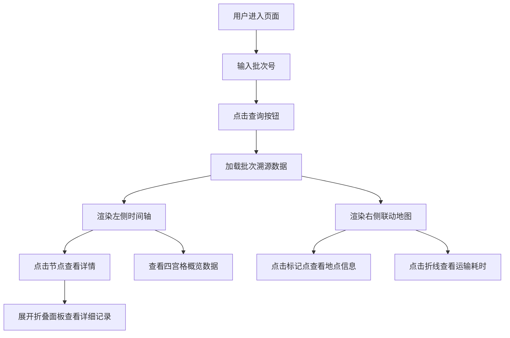

## 1. 产品概述

微型食品溯源与供应链透明化展示平台，消费者通过扫描或输入食品批次号，即可查看从原料产地、加工工厂、物流运输到上架销售的全链条追溯信息，辅以交互式时间轴和地图联动展示，提升食品安全信任感。

## 2. 核心功能

### 2.1 用户角色

| 角色 | 注册方式 | 核心权限 |
|------|----------|----------|
| 消费者 | 无需注册 | 输入批次号查询食品溯源信息 |

### 2.2 功能模块

1. **首页**：批次号搜索、交互式时间轴、联动地图、概览数据卡片

### 2.3 页面详情

| 页面名称 | 模块名称 | 功能描述 |
|----------|----------|----------|
| 首页 | 搜索模块 | 顶部搜索框，输入批次号查询溯源信息 |
| 首页 | 时间轴模块 | 左侧垂直时间轴，展示四个阶段节点，点击展开详情 |
| 首页 | 地图模块 | 右侧 Leaflet 地图，展示地点标记和运输路线 |
| 首页 | 概览卡片 | 四宫格布局展示各阶段关键数据指标 |
| 首页 | 详情面板 | 折叠面板展示详细记录，点击行弹出浮窗 |

## 3. 核心流程

用户进入页面 → 在顶部搜索框输入食品批次号 → 点击查询按钮 → 页面加载该批次溯源数据 → 左侧时间轴展示四个阶段节点 → 右侧地图同步展示产地、工厂、物流节点和销售点 → 用户点击时间轴节点查看阶段详情 → 点击地图标记点查看地点信息 → 点击折线查看运输耗时 → 在概览卡片查看各阶段汇总数据 → 展开详情面板查看详细记录

## 4. 用户界面设计

### 4.1 设计风格

- 主色：#00B894（翠绿），代表安全、新鲜
- 辅色：#0984E3（深蓝）、#FDCB6E（琥珀）、#E17055（珊瑚），分别对应不同阶段
- 背景：极浅灰 #F0F1F2，卡片纯白 #FFFFFF
- 文字：标题深灰 #2D3436，正文中灰 #636E72
- 按钮：36x36px 圆形主色按钮，点击缩放 0.95
- 圆角：搜索框 8px，地图信息窗 8px，概览卡片 12px
- 字体：系统无衬线字体，清晰易读

### 4.2 页面设计概述

| 页面名称 | 模块名称 | UI 元素 |
|----------|----------|----------|
| 首页 | 搜索模块 | 深色背景搜索框（320px 宽）、白色文字、聚焦边框渐变、圆形查询按钮 |
| 首页 | 时间轴模块 | 垂直布局、12px 彩色圆点节点、1.5px 灰色连线、详情卡片滑入动画 |
| 首页 | 地图模块 | Leaflet 地图、彩色标记点、虚线折线连接、信息弹窗 |
| 首页 | 概览卡片 | 四宫格布局、1:1 比例、内阴影、异常数字红色抖动 |
| 首页 | 详情面板 | 折叠展开动画、三列对齐列表、悬停浅蓝背景、400px 浮窗 |

### 4.3 响应式

- 桌面端：左右两栏布局（时间轴+概览在左，地图在右）
- 移动端（<768px）：上下排列，时间轴在上，地图在下，高度比例 4:3
- 四宫格在移动端变为两列两行
- 触摸优化：可点击元素最小 44x44px 触控区域

### 4.4 动效规范

- 搜索框聚焦：边框 0.3s 渐变为 #00B894
- 按钮点击：0.1s 缩放为 0.95
- 详情卡片：0.4s 从右侧滑入
- 展开图标：0.3s 旋转 90 度
- 可交互元素悬停：0.2s 背景色或阴影变化
- 异常数字：0.1s 轻微抖动动画
- 时间轴展开动画：维持 60fps
- 地图标记点载入：不超过 500ms
