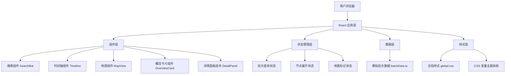

## 1. 架构设计



## 2. 技术描述

- 前端框架：React 18 + TypeScript
- 构建工具：Vite 5
- 地图库：Leaflet + react-leaflet
- 动画库：framer-motion
- 图标库：react-icons
- 状态管理：React useState/useCallback（组件内状态）
- 样式方案：原生 CSS + CSS 变量

## 3. 目录结构

```
d:\Pro\tasks\auto123\
├── index.html              # 入口 HTML
├── package.json            # 依赖配置
├── vite.config.ts          # Vite 配置
├── tsconfig.json           # TypeScript 配置
└── src\
    ├── main.tsx            # React 入口
    ├── App.tsx             # 主应用组件
    ├── timeline\
    │   └── Timeline.tsx    # 时间轴模块
    ├── map\
    │   └── MapView.tsx     # 地图模块
    ├── data\
    │   └── batchData.ts    # 模拟数据
    └── styles\
        └── global.css      # 全局样式
```

## 4. 数据模型

### 4.1 类型定义

```typescript
// 阶段类型
type StageType = 'origin' | 'processing' | 'logistics' | 'sales';

// 坐标点
interface LocationPoint {
  lat: number;
  lng: number;
  name: string;
  stage: StageType;
  arrivalTime: string;
  departureTime: string;
  personInCharge: string;
}

// 时间轴节点
interface TimelineNode {
  id: string;
  stage: StageType;
  title: string;
  description: string;
  startTime: string;
  endTime: string;
  location: LocationPoint;
  totalHours: number;
  organizations: number;
  temperatureRange: [number, number];
  anomalies: number;
  details: DetailRecord[];
}

// 详细记录
interface DetailRecord {
  id: string;
  date: string;
  type: string;
  operator: string;
  [key: string]: any;
}

// 批次数据
interface BatchData {
  batchId: string;
  productName: string;
  productionDate: string;
  nodes: TimelineNode[];
}
```

### 4.2 颜色映射

| 阶段 | 颜色代码 | 说明 |
|------|----------|------|
| 原料产地 (origin) | #00B894 | 翠绿 |
| 加工阶段 (processing) | #0984E3 | 深蓝 |
| 物流阶段 (logistics) | #FDCB6E | 琥珀 |
| 销售阶段 (sales) | #E17055 | 珊瑚 |

## 5. 组件接口定义

### 5.1 Timeline 组件

```typescript
interface TimelineProps {
  nodes: TimelineNode[];
  selectedNodeId: string | null;
  onNodeSelect: (nodeId: string) => void;
  onLocationClick: (location: LocationPoint) => void;
}
```

### 5.2 MapView 组件

```typescript
interface MapViewProps {
  locations: LocationPoint[];
  selectedLocation: LocationPoint | null;
  onMarkerClick: (location: LocationPoint) => void;
  onRouteClick: (duration: string, segment: [number, number]) => void;
}
```

### 5.3 App 组件状态

```typescript
interface AppState {
  searchQuery: string;
  currentBatch: BatchData | null;
  selectedNodeId: string | null;
  selectedLocation: LocationPoint | null;
}
```

## 6. 性能优化

- 地图标记点使用 React.memo 避免不必要重渲染
- 时间轴动画使用 transform 和 will-change 维持 60fps
- 地图实例缓存，避免重复初始化
- 详细记录列表虚拟滚动（超过 20 条时按需加载）
- framer-motion 使用 layout animations 优化过渡
