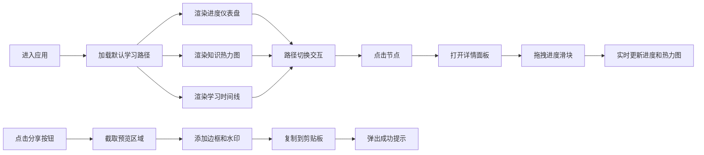

## 1. 产品概述

学习路径进度与知识热力预览应用是一款面向在线教育平台的可视化工具，帮助课程设计团队和学员直观展示不同学习路径的完成进度和知识掌握情况。

- 核心目标：提供可交互的学习路径预览和知识热力图，支持进度调节和一键分享功能
- 目标用户：在线教育平台的课程设计师、学员、学习数据分析师
- 产品价值：通过可视化热力图和进度仪表盘，让学习进度和知识掌握情况一目了然，提升学习动力和教学效果

## 2. 核心功能

### 2.1 用户角色
| 角色 | 注册方式 | 核心权限 |
|------|----------|----------|
| 课程设计师 | 平台账号登录 | 创建学习路径、预览和分享学习进度 |
| 学员 | 平台账号登录 | 查看学习路径、调节进度、分享学习成果 |

### 2.2 功能模块
1. **路径导航模块**：顶部横向导航栏，支持多条学习路径切换
2. **进度仪表盘模块**：环形进度图，直观展示总体完成进度
3. **知识热力图模块**：2D网格热力图，展示各知识点掌握程度
4. **学习时间线模块**：横向时间线，标记各节点完成状态
5. **节点详情面板**：右侧滑入面板，展示节点详情和进度调节
6. **分享模块**：一键截图分享，自动复制到剪贴板

### 2.3 页面详情
| 页面名称 | 模块名称 | 功能描述 |
|----------|----------|----------|
| 主预览页 | 路径导航栏 | 横向展示三条学习路径名称，点击切换，激活态底部紫色下划线 |
| 主预览页 | 进度仪表盘 | 环形图展示总进度百分比，直径180px，渐变色填充，1秒动画 |
| 主预览页 | 知识热力图 | 2D网格热力图，横轴节点纵轴知识点，颜色映射掌握率，悬停显示详情 |
| 主预览页 | 学习时间线 | 横向时间线展示学习节点，标记完成/进行中/未开始状态 |
| 主预览页 | 节点详情面板 | 右侧滑入，显示节点类型、名称、耗时、状态，支持进度滑块调节 |
| 主预览页 | 分享按钮 | 右上角渐变按钮，点击截取预览区，添加水印边框，自动复制剪贴板 |

## 3. 核心流程

用户进入应用后，默认展示第一条学习路径的进度和热力图。用户可通过顶部导航切换不同学习路径，仪表盘和预览区同步更新。点击时间线中的节点可打开详情面板，通过滑块调节进度，实时看到热力图变化。点击分享按钮可截取当前预览画面并分享。

## 4. 用户界面设计

### 4.1 设计风格
- **主色调**：深蓝色 #2C3E50，营造专业、沉稳的学习氛围
- **强调色**：紫色渐变 #667eea → #764ba2，用于按钮、进度条、激活态标识
- **热力图色阶**：浅蓝 #E3F2FD 到 深绿 #00C853，映射0-100%掌握率
- **按钮风格**：圆角20px，渐变背景，点击缩放+抖动微动画
- **字体**：现代无衬线字体，清晰易读，大标题加粗
- **布局风格**：左右两栏布局，左侧导航+仪表盘，右侧主预览区
- **图标风格**：使用 react-icons 线性图标，简洁现代

### 4.2 页面设计概述
| 页面名称 | 模块名称 | UI元素 |
|----------|----------|--------|
| 主预览页 | 路径导航栏 | 横向排列、白色文字、激活态下划线、悬停半透明背景、0.1s过渡 |
| 主预览页 | 进度仪表盘 | 环形渐变、直径180px、中心百分比数字28px加粗、颜色随进度红→绿渐变、1秒填充动画 |
| 主预览页 | 知识热力图 | 2D网格、0.5px浅灰边框、0.1s颜色过渡、悬停放大1.1倍+阴影、0.2s过渡 |
| 主预览页 | 学习时间线 | 横向节点、状态标记、类型图标、点击交互 |
| 主预览页 | 详情面板 | 右侧滑入、宽320px、背景#34495E、圆角12px、4px阴影、0.3s动画 |
| 主预览页 | 分享按钮 | 右上角、渐变背景、圆角20px、点击缩放0.9+抖动0.1s |

### 4.3 响应式设计
- **桌面端**（≥768px）：左右两栏布局，左侧导航+仪表盘，右侧主预览区
- **移动端**（<768px）：上下布局，导航和仪表盘在上，预览区在下
- 热力图和仪表盘高度自适应容器
- 触摸优化：按钮和可点击区域≥44px

### 4.4 动效设计
- 仪表盘环形进度：1秒填充动画，ease-out缓动
- 详情面板滑入：0.3s ease-in-out
- 热力图格子悬停：0.2s放大+阴影
- 分享提示：0.3s淡入，停留2秒，0.3s淡出
- 路径切换：内容交叉淡入淡出
- 进度滑块：实时更新，热力图平滑过渡
