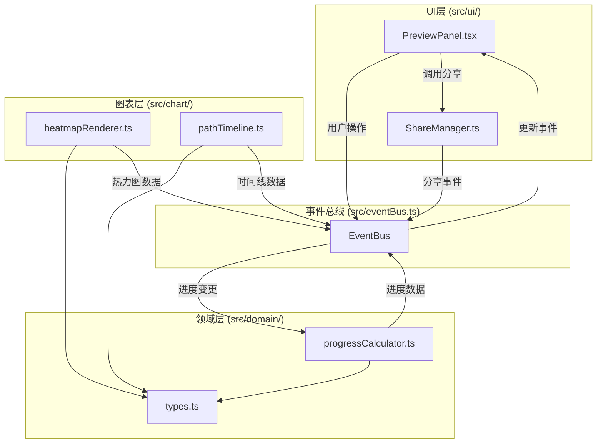

## 1. 架构设计

本应用采用模块化分层架构，通过自定义事件总线实现各模块间的解耦通信。分为领域层（domain）、图表层（chart）和UI层（ui），数据单向流动，事件总线作为消息中枢。



**数据流向：**
1. 用户在UI层操作 → 事件总线发布事件 → 领域层更新数据
2. 领域层计算完成 → 事件总线发布更新事件 → 图表层重新渲染
3. 图表层渲染完成 → 事件总线发布渲染事件 → UI层更新视图
4. 分享功能由UI层直接调用ShareManager，通过事件总线通知分享状态

## 2. 技术栈说明

- **前端框架**：React@18 + TypeScript
- **构建工具**：Vite + @vitejs/plugin-react
- **图表库**：Recharts（React图表库，支持热力图和时间线）
- **动画库**：framer-motion（React动画库，处理过渡和微交互）
- **图标库**：react-icons（提供各类图标资源）
- **截图工具**：html2canvas（HTML转Canvas，支持截图分享）
- **状态管理**：自定义EventBus + React Context
- **代码规范**：TypeScript严格模式，target ES2020

## 3. 模块文件结构

| 文件路径 | 职责说明 |
|----------|----------|
| `src/main.tsx` | 应用入口，挂载React根组件 |
| `src/App.tsx` | 根组件，集成Context和Provider |
| `src/eventBus.ts` | 自定义事件总线，实现发布订阅模式 |
| `src/domain/types.ts` | 类型定义：学习路径节点、进度数据、知识点标签、计算函数类型 |
| `src/domain/progressCalculator.ts` | 进度计算：总进度、分区进度、知识掌握热力值 |
| `src/domain/pathData.ts` | 预设三条学习路径的Mock数据 |
| `src/chart/heatmapRenderer.ts` | 热力图渲染：Recharts封装，支持缩放和悬停 |
| `src/chart/pathTimeline.ts` | 时间线渲染：Recharts封装，节点状态标记 |
| `src/ui/PreviewPanel.tsx` | 主UI组件：导航、仪表盘、热力图、时间线、分享按钮 |
| `src/ui/NodeDetailPanel.tsx` | 节点详情面板：右侧滑入，进度滑块 |
| `src/ui/ShareToast.tsx` | 分享提示组件：淡入淡出提示 |
| `src/ui/ShareManager.ts` | 分享管理：html2canvas截图，剪贴板复制 |
| `src/context/LearningPathContext.tsx` | React Context，跨组件状态共享 |
| `src/styles/globals.css` | 全局样式和CSS变量 |

## 4. 事件总线定义

### 4.1 事件类型

| 事件名称 | 触发方 | 订阅方 | 数据载荷 | 说明 |
|----------|--------|--------|----------|------|
| `path:change` | UI层 | 领域层、图表层 | `{ pathId: string }` | 切换学习路径 |
| `progress:update` | UI层 | 领域层 | `{ nodeId: string, progress: number }` | 更新节点进度 |
| `data:updated` | 领域层 | 图表层、UI层 | `ProgressData` | 进度数据更新完成 |
| `heatmap:rendered` | 图表层 | UI层 | `HeatmapData` | 热力图渲染完成 |
| `timeline:rendered` | 图表层 | UI层 | `TimelineData` | 时间线渲染完成 |
| `share:trigger` | UI层 | ShareManager | `{ element: HTMLElement }` | 触发分享截图 |
| `share:success` | ShareManager | UI层 | `{ imageUrl: string }` | 分享成功 |
| `share:error` | ShareManager | UI层 | `{ error: string }` | 分享失败 |
| `node:select` | UI层 | 领域层 | `{ nodeId: string }` | 选中节点 |

### 4.2 EventBus API

```typescript
interface EventBus {
  on(event: string, handler: Function): void;
  off(event: string, handler: Function): void;
  emit(event: string, data?: any): void;
  once(event: string, handler: Function): void;
  destroy(): void;
}
```

## 5. 数据模型

### 5.1 学习路径节点

```typescript
interface LearningNode {
  id: string;
  name: string;
  type: 'video' | 'article' | 'quiz';
  duration: number; // 预计耗时（分钟）
  knowledgeTags: string[]; // 知识点标签
  order: number; // 节点顺序
}
```

### 5.2 学习路径

```typescript
interface LearningPath {
  id: string;
  name: string;
  description: string;
  nodes: LearningNode[];
  knowledgePoints: KnowledgePoint[];
}
```

### 5.3 知识点

```typescript
interface KnowledgePoint {
  id: string;
  name: string;
  description: string;
}
```

### 5.4 节点进度

```typescript
interface NodeProgress {
  nodeId: string;
  progress: number; // 0-100
  status: 'completed' | 'in-progress' | 'not-started';
  completedAt?: Date;
}
```

### 5.5 聚合进度数据

```typescript
interface ProgressData {
  totalProgress: number;
  sectionProgress: Record<string, number>;
  heatmapData: HeatmapCell[];
  nodeProgressList: NodeProgress[];
}
```

### 5.6 热力图单元格

```typescript
interface HeatmapCell {
  nodeId: string;
  nodeName: string;
  knowledgeId: string;
  knowledgeName: string;
  mastery: number; // 0-100
  description: string;
}
```

## 6. 性能优化策略

### 6.1 进度计算性能（≤50ms）
- 使用Memoization缓存计算结果，仅当输入变化时重新计算
- 热力图数据使用增量更新，而非全量重算
- 进度滑块使用节流（throttle），限制更新频率

### 6.2 图表渲染性能
- 使用React.memo优化图表组件重渲染
- 热力图使用CSS transform实现悬停放大，避免重排
- 大数据量下使用虚拟滚动（当前数据量小，暂不需要）

### 6.3 截图生成性能（≤800ms）
- html2canvas配置优化：关闭useCORS，设置scale=2
- 截图前暂停动画，避免画面不一致
- 使用Canvas.toBlob异步生成图片，不阻塞主线程

### 6.4 动画性能
- 使用transform和opacity属性实现动画，触发GPU加速
- 避免在动画中修改layout属性（width/height/top/left）
- 使用will-change提示浏览器优化

## 7. 预设数据

### 7.1 学习路径一：视频解析
- 包含6个节点，涵盖微积分基础概念
- 知识点：极限、导数、积分、微分方程

### 7.2 学习路径二：文章精读
- 包含5个节点，涵盖英语语法进阶
- 知识点：时态、语态、从句、词汇

### 7.3 学习路径三：测验闯关
- 包含7个节点，涵盖力学基础测验
- 知识点：牛顿定律、动量、能量、圆周运动

## 8. 运行与构建

- **开发模式**：`npm run dev` - 启动Vite开发服务器
- **依赖安装**：`npm install`
- **生产构建**：`npm run build`
- **预览构建**：`npm run preview`
