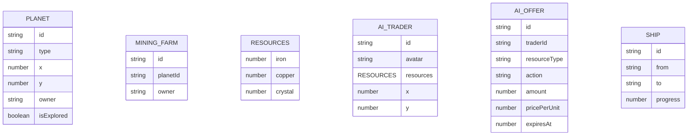

## 1. 架构设计

```mermaid
graph TD
    A["UI层 (React组件层
    B["状态管理层 (zustand
    C["领域逻辑层
    D["事件总线
    E["UI组件
    F["游戏状态
    G["AI交易逻辑
```

## 2. 技术描述

- 前端框架：React 18 + TypeScript
- 构建工具：Vite
- 状态管理：zustand
- 动画库：framer-motion
- 图表库：recharts
- 图标库：react-icons
- 样式方案：原生CSS + CSS变量

## 3. 路由定义

| 路由 | 用途 |
|-------|---------|
| / | 游戏主界面 |

## 4. 数据模型

### 4.1 数据模型定义



### 4.2 核心文件结构

- src/ui/
  - App.tsx - 主布局
  - MapGrid.tsx - 星球网格
  - TradePanel.tsx - 贸易面板
  - ResourceBar.tsx - 资源进度条
- src/domain/
  - gameState.ts - 游戏状态
  - aiTrader.ts - AI交易逻辑
  - eventBus.ts - 事件总线
