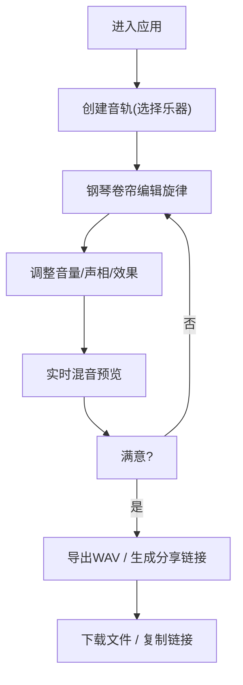

## 1. 产品概述

Melody Mix Sandbox 是一个面向音乐创作爱好者的在线旋律混音沙盒平台，解决创意灵感难以快速融合与分享的痛点，让成员能将原创旋律片段相互混音、叠加并实时预览。

- 核心目标：提供直观的钢琴卷帘编辑器、多音轨混音和实时预览，降低音乐创作门槛
- 目标用户：音乐创作爱好者、独立音乐人、社群成员
- 产品价值：快速融合创意、实时预览效果、便捷分享作品

## 2. 核心功能

### 2.1 用户角色

| 角色 | 注册方式 | 核心权限 |
|------|----------|----------|
| 普通用户 | 无需注册（访客模式） | 使用全部编辑、混音、导出和分享功能 |

### 2.2 功能模块

1. **旋律编辑器**：钢琴卷帘界面，点击创建音符，拖拽调整时长和音高
2. **多音轨管理**：最多6条音轨，不同乐器音色，拖拽排序
3. **实时混音**：音量、声相、混响/延迟调节，实时预览
4. **播放控制**：播放/暂停、进度条、BPM调节、循环模式
5. **导出与分享**：导出WAV文件，生成分享链接

### 2.3 页面详情

| 页面名称 | 模块名称 | 功能描述 |
|----------|----------|----------|
| 主界面 | 顶部工具栏 | 添加音轨、导出、分享按钮 |
| 主界面 | 中部音轨面板 | 音轨卡片列表、波形缩略图、混音控制台 |
| 主界面 | 底部播放栏 | 播放/暂停、进度条、BPM、循环开关 |
| 旋律编辑器 | 钢琴卷帘 | 左侧钢琴键、右侧时间轴网格、音符编辑 |
| 混音控制台 | 效果调节 | 叠加波形预览、主音量、混响/延迟旋钮 |

## 3. 核心流程

用户进入应用 → 创建新音轨（选择乐器）→ 在钢琴卷帘中编辑旋律 → 调整音量和效果 → 实时预览混音效果 → 导出WAV文件 / 生成分享链接

## 4. 用户界面设计

### 4.1 设计风格

- **主色调**：霓虹紫 #8B5CF6（按钮、选中状态）
- **背景色**：深色调 #1E1E2E（页面背景），#2D2D44（卡片背景）
- **文字色**：#EAEAEA（主要文字）
- **音符渐变**：低音 #3498DB 到高音 #E74C3C
- **卡片效果**：悬停阴影 #00000044（Y偏移2px，模糊8px），边框高亮 #8B5CF6
- **按钮反馈**：点击缩放 0.15s（1 → 0.95）
- **滑块样式**：轨道高度4px，圆角2px，滑块直径16px，填充色 #8B5CF6
- **动画时长**：拖拽排序 0.2s ease-out，导出进度 0.5s ease-in-out

### 4.2 页面设计概述

| 页面名称 | 模块名称 | UI元素 |
|----------|----------|--------|
| 主界面 | 顶部工具栏 | 深色背景、霓虹紫按钮、图标+文字 |
| 主界面 | 音轨卡片 | 卡片式布局、波形Canvas、音量滑块、静音/删除按钮 |
| 主界面 | 混音控制台 | 叠加波形Canvas、旋钮控件、主音量滑块 |
| 主界面 | 底部播放栏 | 固定底部、播放按钮、进度条、BPM滑块、循环开关 |
| 旋律编辑器 | 钢琴卷帘 | 左侧钢琴键、网格背景、彩色音符、拖拽手柄 |

### 4.3 响应式

- 桌面端（≥768px）：音轨卡片横向排列，混音控制台常驻显示
- 移动端（<768px）：音轨卡片纵向堆叠，混音控制台折叠为可展开面板
- 触摸优化：按钮和滑块尺寸适配触摸操作

### 4.4 性能约束

- 所有动画帧率 ≥ 45 FPS
- 音频合成延迟 ≤ 200ms
- 6条音轨时波形预览更新频率 ≥ 10 FPS
