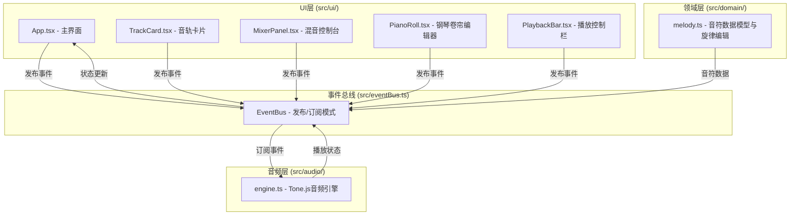

## 1. 架构设计



## 2. 技术描述

- **前端框架**：React 18 + TypeScript
- **构建工具**：Vite + @vitejs/plugin-react
- **音频引擎**：Tone.js（Web Audio封装）
- **状态管理**：自定义 EventBus + React Context（按用户要求）
- **图标库**：react-icons
- **样式方案**：CSS Modules / 内联样式（深色主题）

## 3. 文件结构与数据流向

### 3.1 目录结构

```
src/
├── eventBus.ts          # 事件总线（模块间通信）
├── domain/
│   └── melody.ts        # 音符数据模型与旋律编辑逻辑
├── audio/
│   └── engine.ts        # Tone.js音频引擎
└── ui/
    ├── App.tsx          # 主应用组件
    ├── TrackCard.tsx    # 单个音轨卡片
    ├── MixerPanel.tsx   # 混音控制台
    ├── PianoRoll.tsx    # 钢琴卷帘编辑器
    └── PlaybackBar.tsx  # 底部播放控制栏
```

### 3.2 数据流向

1. **UI → 事件总线**：用户交互触发事件发布（addTrack, mixTrack, playAll, stopAll 等）
2. **事件总线 → 音频引擎**：音频模块订阅事件，调用 Tone.js API 执行操作
3. **音频引擎 → 事件总线**：返回播放进度、状态变化
4. **事件总线 → UI**：UI 订阅状态变化，更新界面

### 3.3 模块调用关系

- `App.tsx`：引入所有子组件，通过 Context 提供全局状态
- `TrackCard.tsx`：接收 track 数据，调用 eventBus 发布 addTrack/mixTrack 事件
- `MixerPanel.tsx`：订阅所有音轨状态，发布 mixTrack 事件
- `PianoRoll.tsx`：编辑音符数据，调用 createMelody/transposeMelody
- `melody.ts`：导出 MelodyTrack 接口、createMelody、transposeMelody
- `engine.ts`：管理 Tone.js Synth、音量、效果，订阅事件总线

## 4. 事件定义

### 4.1 事件总线事件

| 事件名 | 触发方 | 订阅方 | 数据载荷 |
|--------|--------|--------|----------|
| addTrack | UI | Engine, Melody | { id, instrument, notes } |
| removeTrack | UI | Engine | { id } |
| updateTrack | UI | Engine | { id, volume, pan, mute } |
| mixTrack | UI | Engine | { reverb, delay, masterVolume } |
| playAll | UI | Engine | { bpm, loop } |
| stopAll | UI | Engine | {} |
| seekTo | UI | Engine | { time } |
| exportWav | UI | Engine | {} |
| playbackProgress | Engine | UI | { time, duration } |
| exportProgress | Engine | UI | { progress } |
| exportComplete | Engine | UI | { url } |

## 5. 数据模型

### 5.1 MelodyTrack

```typescript
interface Note {
  midi: number;      // MIDI音高 (0-127)
  time: number;      // 起始时间（拍）
  duration: number;  // 持续时间（拍）
  velocity: number;  // 力度 (0-1)
}

interface MelodyTrack {
  id: string;
  name: string;
  instrument: 'piano' | 'guitar' | 'bass' | 'drums' | 'strings' | 'synth';
  notes: Note[];
  volume: number;    // 0-1
  pan: number;       // -1到1 (左到右)
  mute: boolean;
  reverb: number;    // 0-1
  delay: number;     // 0-1
}
```

### 5.2 导出数据

- WAV格式，最长60秒
- 分享链接：模拟生成唯一ID
