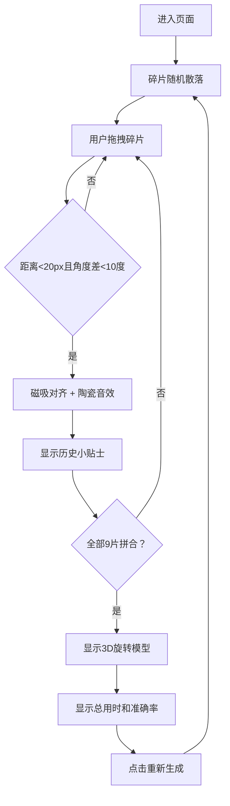

## 1. 产品概述

微型虚拟古董修复与拼图鉴赏项目，用户通过拖拽和旋转碎片拼合古代陶器，在修复过程中学习历史知识，完成后欣赏3D立体成品。

- 核心目的：将文化遗产教育与益智拼图游戏结合，提供沉浸式古董修复体验
- 目标用户：历史文化爱好者、拼图游戏玩家、教育场景用户
- 产品价值：寓教于乐，让用户在动手拼合过程中了解古代陶瓷文化

## 2. 核心特性

### 2.1 功能模块
1. **工作台区域**：展示碎裂陶器碎片，支持拖拽和旋转操作
2. **信息面板**：显示拼接进度、历史小贴士、鉴赏计数器
3. **3D模型展示**：完成拼合后展示3D立体陶器模型
4. **重新生成功能**：支持重置游戏，重新开始拼合挑战

### 2.2 页面详情
| 页面名称 | 模块名称 | 功能描述 |
|---------|---------|---------|
| 主页面 | 工作台区域 | 9片不规则多边形碎片，拖拽旋转拼合，磁吸对齐，碰撞音效 |
| 主页面 | 信息面板 | 进度条、历史小贴士书写动画、时长/准确率计数器 |
| 主页面 | 3D模型展示 | 拼合完成后显示旋转的3D陶器模型，金属光泽材质 |
| 主页面 | 重新生成按钮 | 重置所有碎片和计数器，开始新一轮 |

## 3. 核心流程

用户进入页面 → 看到散落在工作台上的陶器碎片 → 拖拽碎片进行拼合 → 碎片靠近时自动磁吸对齐 → 每拼合一片显示历史小贴士 → 全部拼合完成 → 显示3D立体模型和总统计 → 点击重新生成 → 开始新一轮

## 4. 用户界面设计

### 4.1 设计风格
- 整体风格：古朴典雅，博物馆鉴赏风格
- 主色调：旧纸质感浅黄色 #F5E6C8，深木色 #8B5A2B，深灰面板 #2C3E50
- 强调色：进度条渐变色 #E74C3C → #2ECC71，计数器金色 #F39C12
- 字体：小贴士使用 serif 衬线字体，计数器使用 monospace 等宽字体
- 质感：木板工作台带渐变和边框，信息面板带内阴影，碎片带轮廓线

### 4.2 页面设计概述
| 页面名称 | 模块名称 | UI 元素 |
|---------|---------|--------|
| 主页面 | 工作台区域 | 700x500px，圆角16px，深木色渐变，2px深棕色边框，9片不规则多边形碎片 |
| 主页面 | 信息面板 | 300px宽，深灰背景，圆角12px，内阴影，顶部进度条，中间小贴士，底部计数器 |
| 主页面 | 3D模型 | 工作台中央，旋转动画12秒周期，金属光泽材质 |
| 主页面 | 重新生成按钮 | 圆角8px，红色背景，白色文字，hover变暗 |

### 4.3 交互动效
- 碎片拖拽：requestAnimationFrame 优化，保持45fps以上
- 磁吸对齐：0.2s ease-out 动画
- 小贴士：从左到右书写展开动画，耗时1.5s
- 3D模型：12秒周期缓慢旋转
- 按钮：hover状态颜色过渡

### 4.4 响应式
- 桌面端优先设计
- 固定布局尺寸，居中显示
- 支持鼠标和触摸操作
