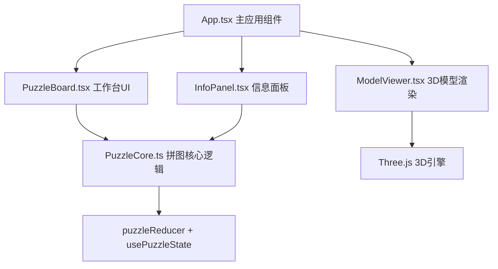

## 1. 架构设计



## 2. 技术描述

- 前端框架：React 18 + TypeScript
- 构建工具：Vite
- 3D渲染：Three.js + @types/three
- 状态管理：React useReducer + 自定义Hook
- 音频：Web Audio API（生成陶瓷碰撞音效）
- 图形渲染：SVG多边形（碎片）+ CSS Transform（拖拽旋转）

## 3. 项目结构

```
d:\Pro\tasks\auto129\
├── package.json
├── index.html
├── vite.config.js
├── tsconfig.json
└── src/
    ├── main.tsx
    └── modules/
        ├── app/
        │   └── App.tsx
        ├── puzzle/
        │   └── PuzzleCore.ts
        ├── board/
        │   └── PuzzleBoard.tsx
        ├── info/
        │   └── InfoPanel.tsx
        └── three/
            └── ModelViewer.tsx
```

## 4. 核心模块说明

### 4.1 PuzzleCore.ts
- 定义 IPuzzleState 接口（碎片位置、旋转、拼合状态）
- 定义 IPuzzlePiece 接口（id、顶点坐标、目标位置、当前位置、旋转角度）
- puzzleReducer：处理拖拽、旋转、拼合、重置等action
- usePuzzleState：自定义Hook，封装状态管理逻辑
- 碰撞检测算法：计算碎片中心点距离和角度差
- 磁吸对齐算法：吸附到目标位置，带动画过渡

### 4.2 PuzzleBoard.tsx
- 渲染9片SVG多边形碎片
- 实现 onPointerDown / onPointerMove / onPointerUp 拖拽事件
- 使用 requestAnimationFrame 优化拖拽性能
- 调用 PuzzleCore 的碰撞检测函数
- 每个碎片用div包裹，transform: translate + rotate
- 碎片边缘1px浅灰 #D3D3D3 轮廓线

### 4.3 InfoPanel.tsx
- 顶部：渐变进度条（#E74C3C → #2ECC71）
- 中间：历史小贴士书写动画（serif字体，16px，#ECF0F1）
- 底部：鉴赏计数器（monospace字体，#F39C12）
  - 用时：MM:SS 格式
  - 准确率：成功拼合次数 ÷ 碎片触碰次数，保留一位小数

### 4.4 ModelViewer.tsx
- 封装 Three.js 场景
- useEffect 初始化渲染循环
- RingGeometry 环面几何体模拟陶器
- 旋转动画：0° → 360°，周期12秒
- 材质：金属光泽 + 反射
- 暴露 startRotation / stopRotation 方法

### 4.5 App.tsx
- 组合 PuzzleBoard、InfoPanel、ModelViewer
- 统一管理全局状态
- 监听拼合完成状态，触发3D模型显示
- 传递重置回调给重新生成按钮

## 5. 性能优化

- 拖拽使用 requestAnimationFrame 批量更新
- 碎片使用 CSS transform 而非 top/left
- 碰撞检测只在拖拽移动时触发
- Three.js 渲染循环在非活动状态暂停
- 目标帧率：拖拽时不低于45fps

## 6. 数据模型

### 6.1 拼图状态接口
```typescript
interface IPuzzlePiece {
  id: number;
  points: string; // SVG多边形顶点
  targetX: number;
  targetY: number;
  targetRotation: number;
  currentX: number;
  currentY: number;
  currentRotation: number;
  isPlaced: boolean;
}

interface IPuzzleState {
  pieces: IPuzzlePiece[];
  totalPieces: number;
  placedCount: number;
  touchCount: number;
  successCount: number;
  startTime: number;
  elapsedTime: number;
  isCompleted: boolean;
  currentTip: string;
}
```
