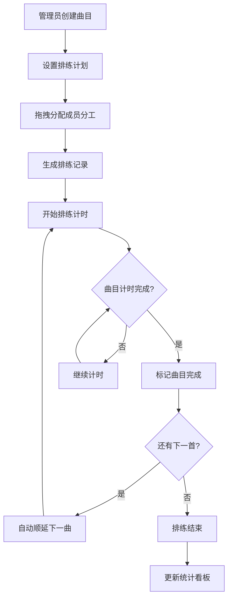

## 1. 产品概述

一款面向小型乐队的曲目排练协作管理应用，解决曲目谱表分散、排练进度难追踪、成员间分工不清晰的问题。目标用户为3-6人编制的独立乐队，提供从曲目录入、分工排练到计时追踪的全流程管理能力。

## 2. 核心功能

### 2.1 用户角色

| 角色 | 说明 | 核心权限 |
|------|------|----------|
| 乐队管理员 | 默认角色 | 创建/编辑/删除曲目、设置排练计划、分配分工、查看统计 |
| 乐队成员 | 由管理员分配 | 查看曲目库、查看个人分工、参与排练计时 |

### 2.2 功能模块

1. **曲目库页面**：曲目卡片列表、创建曲目表单、PDF谱表上传、难度颜色标示
2. **排练计划页面**：排练日程设置、成员分工标签拖拽、排练记录自动生成
3. **统计看板页面**：本周排练总时长、已完成曲目数、成员参与条形图、曲目平均完成度

### 2.3 页面详情

| 页面名称 | 模块名称 | 功能描述 |
|----------|----------|----------|
| 曲目库 | 曲目卡片网格 | 展示曲名、调式、BPM、难度星级，难度用颜色区分（绿/黄/红），悬停放大1.05倍+0.3s弹性动画 |
| 曲目库 | 创建曲目表单 | 输入曲名、调式、BPM滑块（60-200）、难度星级选择（1-5）、PDF文件上传 |
| 曲目库 | 完成标记 | 已完成曲目卡片右上角显示绿色对勾图标，带缩放弹入动画 |
| 排练计划 | 排练日程 | 设置排练日期、预计时长（30-120分钟滑块） |
| 排练计划 | 分工标签 | 主唱/吉他/贝斯/鼓四个标签，可拖拽分配成员，拖拽时半透明阴影+路径轨迹动画 |
| 排练计划 | 排练记录 | 分工分配后自动生成排练记录行 |
| 排练计时器 | 计时控制 | 开始/暂停/下一曲，按曲目顺序播放 |
| 排练计时器 | 进度展示 | 当前曲目进度条+倒计时数字，当前曲目高亮，完成自动顺延 |
| 统计看板 | 数据卡片 | 本周排练总时长、已完成曲目数，实时更新，完成时闪烁0.5s |
| 统计看板 | 成员参与条形图 | 各成员参与次数横向条形图 |
| 统计看板 | 曲目完成度 | 每首曲目的排练次数百分比 |

## 3. 核心流程

1. 管理员创建曲目，录入曲名、调式、BPM、难度、上传PDF谱表
2. 为曲目设置排练计划，选择日期和预计时长
3. 将分工标签拖拽分配给各成员，系统自动生成排练记录
4. 开始排练后，计时器按曲目顺序运行，显示进度条和倒计时
5. 曲目计时完成自动跳转下一首，卡片标记完成
6. 统计看板实时更新各项数据

## 4. 用户界面设计

### 4.1 设计风格

- **主色调**：深色主题 #1e1e2e，霓虹青绿点缀 #00d4aa
- **卡片样式**：半透磨砂玻璃效果（backdrop-filter: blur(12px)），圆角12px
- **按钮样式**：圆角8px，点击带水波纹反馈
- **字体**：标题使用 Outfit（粗体醒目），正文使用 Noto Sans SC（中文友好）
- **布局风格**：三栏布局（导航1:内容3:侧栏1），768px以下单列
- **动画风格**：霓虹风格微交互，弹性缓动，进度条发光

### 4.2 页面设计概览

| 页面名称 | 模块名称 | UI元素 |
|----------|----------|--------|
| 曲目库 | 曲目卡片网格 | 磨砂玻璃卡片、难度色条、星级图标、悬停放大动画 |
| 曲目库 | 创建表单 | 发光聚焦输入框、BPM滑块、星级选择器、文件上传区 |
| 排练计划 | 日程设置 | 日期选择器、时长滑块、分工标签拖拽区 |
| 排练计划 | 记录列表 | 时间线条目、成员头像标签、曲目信息摘要 |
| 排练计时器 | 计时面板 | 圆形进度条、倒计时数字、曲目名称高亮、控制按钮 |
| 统计看板 | 数据概览 | 数字卡片（带闪烁动画）、条形图（Canvas绘制）、百分比环形图 |

### 4.3 响应式设计

- 桌面优先（≥1024px）：三栏布局，1:3:1比例
- 平板（768px-1023px）：导航折叠为顶部标签栏，内容区和侧栏2:1
- 移动端（<768px）：单列布局，标签栏切换，计时器浮动按钮触发
- 触控优化：拖拽标签增大触控区域（44px最小），按钮间距≥8px

### 4.4 动效规范

- Tab切换：内容区横向滑动过渡 0.4s ease-in-out
- 卡片悬停：scale(1.05) + 0.3s cubic-bezier(0.34, 1.56, 0.64, 1)
- 完成标记：绿色对勾缩放弹入 animation
- 拖拽标签：半透明阴影 + 路径轨迹
- 看板闪烁：0.5s opacity闪动
- 水波纹：按钮点击radial扩散
- 输入框聚焦：边框 #00d4aa 发光（box-shadow）
- 输入框失焦：边框恢复半透明灰色
