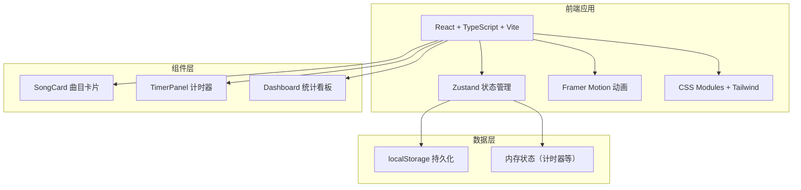
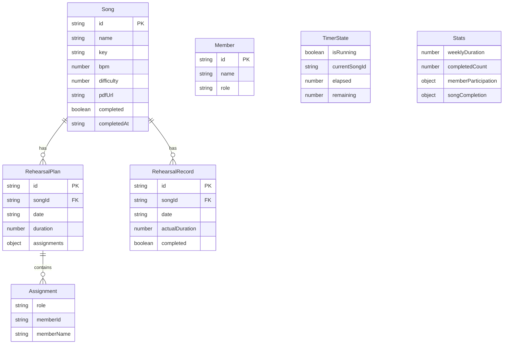

## 1. 架构设计



纯前端应用，无后端服务。所有数据通过 Zustand 管理并持久化到 localStorage。

## 2. 技术说明

- **前端框架**：React 18 + TypeScript（严格模式）
- **构建工具**：Vite + @vitejs/plugin-react
- **状态管理**：Zustand（轻量级全局状态，支持持久化中间件）
- **动画库**：Framer Motion（拖拽、弹性动画、布局动画）
- **样式方案**：Tailwind CSS + CSS 自定义属性（磨砂玻璃效果等）
- **图表**：Canvas 2D 手绘条形图（避免引入重型图表库）
- **持久化**：localStorage（曲目、排练计划、统计数据）
- **初始化工具**：vite-init（react-ts 模板）

## 3. 路由定义

本项目为单页面应用，不使用 react-router，通过 Zustand 状态管理 Tab 切换：

| Tab标识 | 功能 | 默认激活 |
|---------|------|----------|
| songs | 曲目库 | 是 |
| rehearsals | 排练计划 | 否 |
| dashboard | 统计看板 | 否 |

## 4. 数据模型

### 4.1 数据模型定义



### 4.2 TypeScript 类型定义

```typescript
interface Song {
  id: string;
  name: string;
  key: string;
  bpm: number;
  difficulty: 1 | 2 | 3 | 4 | 5;
  pdfUrl: string;
  completed: boolean;
  completedAt?: string;
}

interface RehearsalPlan {
  id: string;
  songId: string;
  date: string;
  duration: number;
  assignments: Assignment[];
}

interface Assignment {
  role: 'vocal' | 'guitar' | 'bass' | 'drums';
  memberId: string;
  memberName: string;
}

interface RehearsalRecord {
  id: string;
  songId: string;
  date: string;
  actualDuration: number;
  completed: boolean;
}

interface Member {
  id: string;
  name: string;
  defaultRole: string;
}

interface TimerState {
  isRunning: boolean;
  currentSongId: string | null;
  elapsed: number;
  remaining: number;
}

interface Stats {
  weeklyDuration: number;
  completedCount: number;
  memberParticipation: Record<string, number>;
  songCompletion: Record<string, number>;
}
```

## 5. 文件结构

```
├── package.json
├── vite.config.ts
├── tsconfig.json
├── index.html
├── src/
│   ├── main.tsx
│   ├── App.tsx
│   ├── index.css
│   ├── store/
│   │   └── useStore.ts
│   ├── components/
│   │   ├── SongCard.tsx
│   │   ├── TimerPanel.tsx
│   │   └── Dashboard.tsx
│   ├── types/
│   │   └── index.ts
│   └── utils/
│       └── helpers.ts
```

## 6. 性能策略

- 曲目库列表：使用 React.memo + 虚拟化考虑（100条时FPS≥55）
- 拖拽操作：Framer Motion 的 useDraggable，requestAnimationFrame驱动，延迟<16ms
- 计时器：setInterval 1s刷新，不使用更短间隔
- 动画：优先使用 CSS transform/opacity（GPU加速），避免触发重排
- 状态更新：Zustand 浅比较，避免不必要的重渲染
