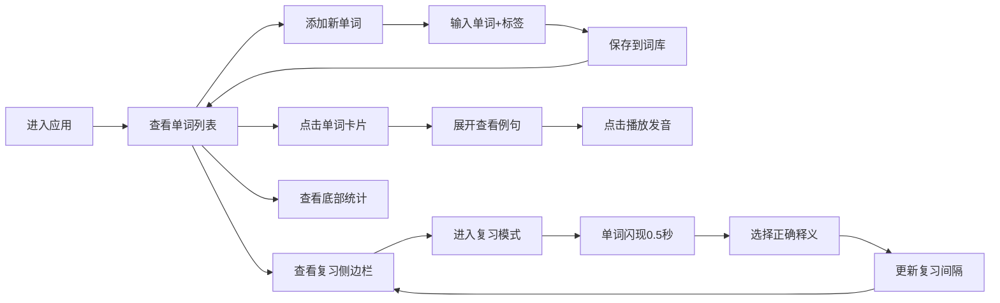

## 1. 产品概述

沉浸式语言学习应用，帮助用户通过上下文语境积累和复习生词，解决传统单词表枯燥、缺乏语境、难以长期记忆的问题。目标用户为英语学习者，提供单词收藏、智能例句生成、间隔重复复习和学习进度追踪功能。

## 2. 核心功能

### 2.1 用户角色
| 角色 | 注册方式 | 核心权限 |
|------|----------|----------|
| 普通用户 | 无需注册，本地存储 | 添加单词、管理标签、生成例句、复习测验、查看统计 |

### 2.2 功能模块
1. **单词管理模块**：单词添加、标签管理、列表展示、标签分组
2. **例句生成模块**：模板匹配、高亮标记、语音播放
3. **复习模块**：间隔重复算法、快速测验、侧边栏推荐
4. **统计模块**：学习时长计时、掌握进度环、连续打卡

### 2.3 页面详情
| 页面名称 | 模块名称 | 功能描述 |
|----------|----------|----------|
| 主页面 | 单词列表区 | 中央列表展示收藏单词，支持按时间/标签分组切换 |
| 主页面 | 添加单词区 | 左侧渐变圆形按钮，点击展开添加表单 |
| 主页面 | 复习侧边栏 | 右侧固定侧边栏，展示今日复习单词和数量提醒 |
| 主页面 | 统计底部栏 | 底部固定深色条，展示学习时长、进度环、打卡天数 |
| 单词卡片 | 展开详情 | 点击卡片展开3条例句，支持语音播放 |
| 复习模式 | 快速测验 | 单词闪现，3选1中文释义选择 |

## 3. 核心流程

## 4. 用户界面设计

### 4.1 设计风格
- **主题**：深色科技风，主背景#0D1117，卡片区#1A1D23
- **主色调**：渐变紫色#667eea→#764ba2（添加按钮），青色#00B894（强调色），橙色#E67E22（高亮/提醒）
- **卡片样式**：圆角12px，投影rgba(0,0,0,0.4) 0px 2px 8px
- **字体**：使用现代无衬线字体，标题18px粗体，正文14px常规
- **标签徽章**：36×18px，圆角6px，8种预设色随机分配，9px白色字体
- **动画**：framer-motion实现弹性展开、悬停上移、渐变过渡

### 4.2 页面设计概述
| 页面名称 | 模块名称 | UI元素 |
|----------|----------|--------|
| 主页面 | 单词列表区 | 卡片网格布局，悬停上移2px，标签彩色徽章 |
| 主页面 | 添加按钮 | 44px直径圆形渐变按钮，scale弹性动画展开表单 |
| 主页面 | 复习侧边栏 | 220px宽，#1E272E背景，左上/左下圆角16px，橙色数字气泡 |
| 主页面 | 统计底部栏 | 60px高深色条，三栏布局：计时→进度环→打卡 |
| 单词卡片 | 例句区 | 280px宽#2D3436卡片，#636E72边框，悬停变#00B894，目标词#E67E22高亮下划线 |
| 复习模式 | 测验区 | 单词0.5秒渐变闪现，3个选项卡片，正确/错误反馈动画 |

### 4.3 响应式设计
- 桌面端（≥1024px）：左右布局，左侧主内容+右侧复习栏
- 移动端（<1024px）：上下布局，复习栏置于底部或可折叠
- 触摸优化：增大点击区域，按钮最小44×44px

### 4.4 性能要求
- 单词搜索响应<150ms
- 列表滚动流畅60FPS
- 所有过渡动画0.2s ease-out
