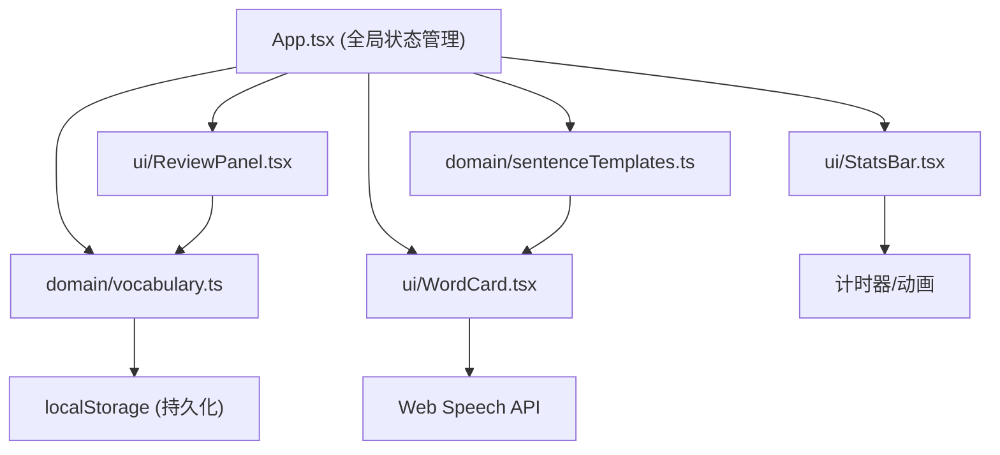

## 1. 架构设计



## 2. 技术描述

- **前端框架**：React@18 + TypeScript@5
- **构建工具**：Vite@5 + @vitejs/plugin-react@4
- **动画库**：framer-motion@11
- **状态管理**：React Hooks (useState, useEffect, useCallback)
- **数据持久化**：localStorage
- **语音合成**：Web Speech API (SpeechSynthesis)
- **样式方案**：CSS-in-JS + framer-motion

## 3. 目录结构

| 路径 | 用途 |
|------|------|
| `package.json` | 项目依赖和脚本 |
| `index.html` | 入口HTML |
| `vite.config.ts` | Vite配置 |
| `tsconfig.json` | TypeScript配置 |
| `src/App.tsx` | 主应用组件 |
| `src/domain/vocabulary.ts` | 单词数据模型和管理函数 |
| `src/domain/sentenceTemplates.ts` | 例句模板库和匹配函数 |
| `src/ui/WordCard.tsx` | 单词卡片UI组件 |
| `src/ui/ReviewPanel.tsx` | 复习侧边栏组件 |
| `src/ui/StatsBar.tsx` | 底部统计栏组件 |

## 4. 数据模型

### 4.1 类型定义

```typescript
interface Word {
  id: string;
  word: string;
  meaning: string;
  partOfSpeech: 'noun' | 'verb' | 'adjective' | 'adverb';
  tags: string[];
  createdAt: number;
  reviewLevel: number;
  lastReviewedAt: number;
  nextReviewAt: number;
}

interface SentenceTemplate {
  id: string;
  template: string;
  partOfSpeech: string[];
  difficulty: 'easy' | 'medium' | 'hard';
}

interface ReviewStats {
  studySeconds: number;
  masteredWords: number;
  streakDays: number;
  lastStudyDate: string;
}
```

### 4.2 核心函数

| 函数 | 模块 | 说明 |
|------|------|------|
| `addWord(word, meaning, pos, tags)` | vocabulary.ts | 添加新单词 |
| `getWordsByTag(tag)` | vocabulary.ts | 按标签筛选单词 |
| `getReviewWords()` | vocabulary.ts | 获取今日复习单词 |
| `updateReviewLevel(wordId, correct)` | vocabulary.ts | 更新复习间隔 |
| `getSentencesForWord(word, pos)` | sentenceTemplates.ts | 生成3条例句 |
| `getPresetWords()` | vocabulary.ts | 获取200个预置词汇 |

## 5. 间隔重复算法

- **首次复习**：1天后
- **第二次**：2天后
- **第三次**：4天后
- **第四次及以后**：7天后
- **回答错误**：重置为首次复习间隔

```typescript
const REVIEW_INTERVALS = [1, 2, 4, 7, 7, 7]; // 天数
```

## 6. 性能优化策略

1. **单词搜索**：使用Memoize缓存搜索结果，目标<150ms
2. **列表渲染**：React.memo + useMemo优化重渲染
3. **滚动性能**：CSS `will-change: transform` + 硬件加速
4. **动画优化**：framer-motion自动优化，避免layout thrashing
5. **数据持久化**：debounce localStorage写入，减少IO
