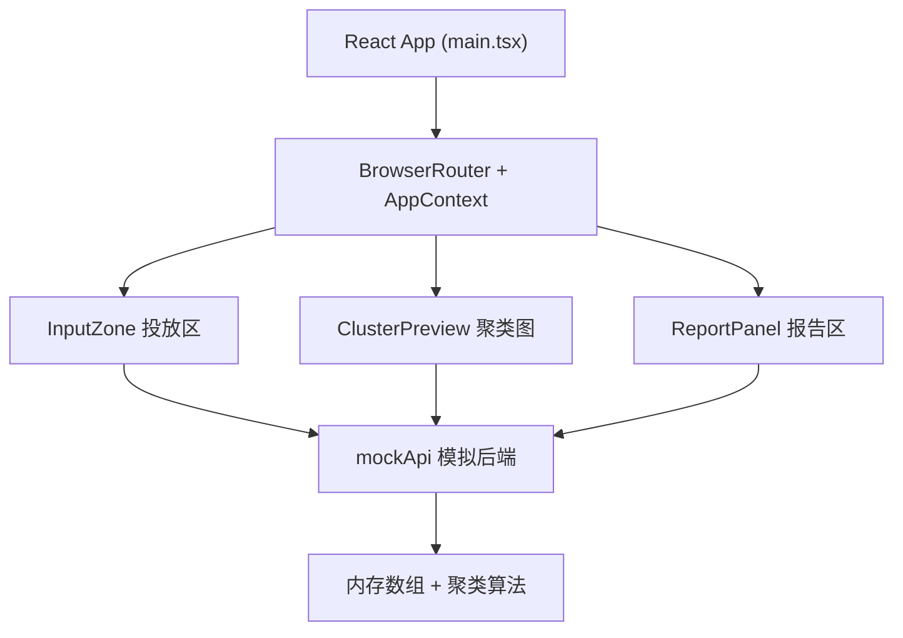
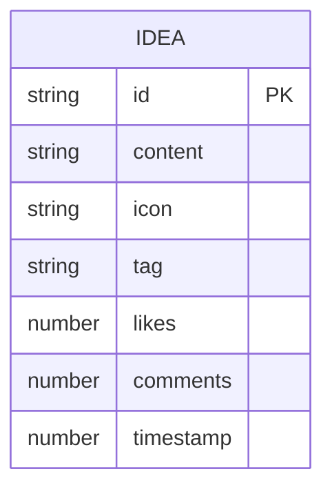

## 1. 架构设计

纯前端SPA，无真实后端，由 mockApi 模块维护内存状态。



## 2. 技术说明

- **前端框架**：React 18 + TypeScript（严格模式）
- **构建工具**：Vite 5 + @vitejs/plugin-react
- **路由**：react-router-dom 6
- **状态管理**：React Context（全局单例 store）
- **可视化**：D3 v7（forceSimulation 力导向图）
- **动画**：framer-motion
- **后端**：无，使用 src/api/mockApi.ts 内存模块

## 3. 路由定义

| 路由 | 用途 |
|------|------|
| `/` | 主工作台（唯一页面） |

## 4. API 定义（mockApi 模块）

模块签名：

```ts
interface Idea {
  id: string;
  content: string;
  icon: string;       // 预设8个 emoji/标识
  tag: string;        // 系统自动分配主题
  likes: number;
  comments: number;   // 仅显示数字
  timestamp: number;
}

declare module 'src/api/mockApi' {
  export function addIdea(idea: Omit<Idea, 'id'|'likes'|'comments'|'timestamp'|'tag'> & Partial<Idea>): Idea;
  export function likeIdea(id: string): Idea | null;
  export function deleteIdea(id: string): boolean;
  export function getClusterData(): { nodes: ClusterNode[]; links: ClusterLink[]; themes: ThemeMap };
  export function getAllIdeas(): Idea[];
}
```

聚类算法简化版：按预设关键词命中 → 归类到8个主题之一；相似度 = 共同关键词数。

## 5. 文件结构

```
auto132/
├── index.html
├── package.json
├── vite.config.ts
├── tsconfig.json
└── src/
    ├── main.tsx
    ├── types.ts
    ├── api/
    │   └── mockApi.ts
    ├── context/
    │   └── AppContext.tsx
    └── components/
        ├── InputZone.tsx
        ├── ClusterPreview.tsx
        └── ReportPanel.tsx
```

## 6. 数据模型

### 6.1 实体关系



### 6.2 初始化种子数据

首次启动 mockApi 时内置 6-8 条示例灵感，覆盖 3+ 主题，确保聚类图初次渲染有内容。
