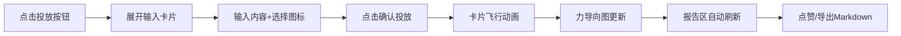

## 1. 产品概述

微型团队知识星火碰撞与灵感聚合器，供团队成员随时投放零散想法/灵感，系统自动聚类并生成可视化报告，助力每周站会创意盘点。

- 目标场景：小团队（5-20人）日常创意收集、每周站会热点回顾
- 核心价值：降低想法表达门槛，让碎片化灵感可视化、结构化

## 2. 核心功能

### 2.1 功能模块

1. **灵感投放区（左）**：圆形投放按钮、展开式输入卡片、文字输入、图标选择、飞行动画
2. **聚类预览区（右上）**：D3力导向图、节点热度大小、主题配色、相似度连线、悬停摘要
3. **聚合报告区（右下）**：Top5热度排行、星级显示、Markdown导出

### 2.2 页面详情

| 区域 | 模块 | 功能说明 |
|------|------|---------|
| 左侧 40% | 投放按钮 | 圆形渐变，悬停旋转发光，点击展开卡片 |
| 左侧 40% | 输入卡片 | 340x280，圆角16，深色背景金色边框，支持文字+图标 |
| 左侧 40% | 飞行动画 | 彩色卡片从输入区飞向聚类图，0.6s贝塞尔曲线 |
| 右上 35% | 力导向图 | D3实现，节点12-32px，8主题色，连线0.5-3px |
| 右上 35% | 节点交互 | 悬停放大1.3倍，显示摘要浮层 |
| 右下 25% | 热度排行 | Top5灵感，1-5颗金星热度展示 |
| 右下 25% | 导出功能 | 生成结构化Markdown并自动下载 |

## 3. 核心流程

用户点击圆形按钮 → 展开输入卡片 → 填写文字+选择图标 → 点击投放 → 灵感卡片飞向右上角 → 力导向图新增节点并重排 → 报告区刷新排行 → 可随时点赞/导出报告

## 4. 用户界面设计

### 4.1 设计风格

- **主色**：深紫 `#1A1A2E`（背景）
- **点缀**：金色 `#FFD700`（边框/星星/强调）
- **渐变按钮**：`#667eea → #764ba2`（投放按钮）
- **8主题色**：`#FF6B6B / #4ECDC4 / #45B7D1 / #96CEB4 / #FFEAA7 / #DDA0DD / #98D8C8 / #F7DC6F`
- **背景**：细微网格纹理增强科技感
- **字体**：标题使用有设计感的衬线/展示字体，正文使用现代无衬线
- **圆角**：卡片 16px，浮层 8px，按钮圆形

### 4.2 动画规范

| 场景 | 参数 |
|------|------|
| 卡片进入淡入上移 | 0.4s |
| 按钮点击缩放 | 0.2s |
| 投放按钮悬停旋转15°+外发光 | 0.3s ease |
| 卡片飞向聚类图 | 0.6s cubic-bezier |
| 点赞节点大小变化 | 流畅 ≥30fps |

### 4.3 响应式

- 桌面端（>768px）：左右分栏 40% / 60%，右侧再上下 35% / 25%
- 移动端（≤768px）：上下结构，输入区在上，预览+报告在下

### 4.4 性能目标

- 首次加载后操作响应 ≤100ms
- 聚类图更新节流 ≤0.5s
- 点赞动画 ≥30fps
- 滚动/拖拽零延迟
