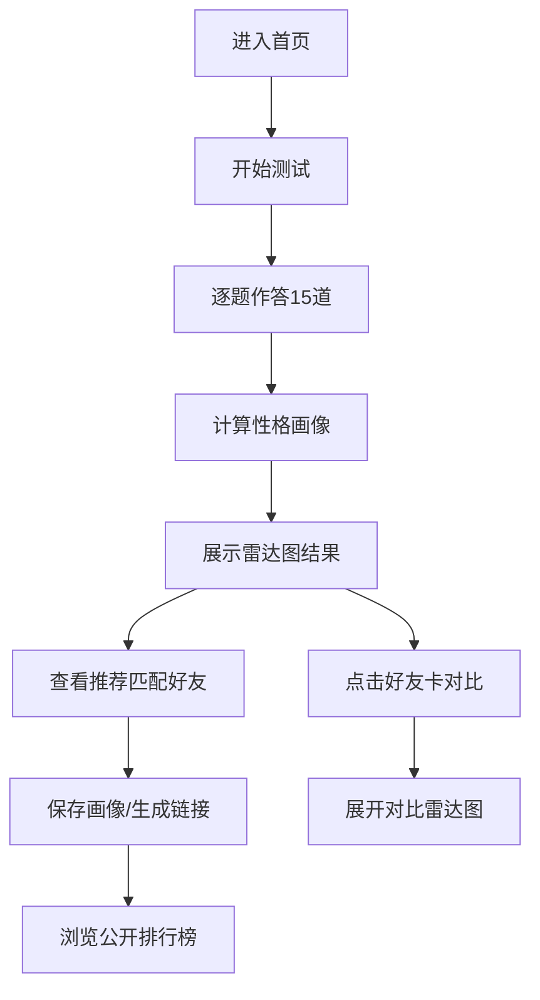

## 1. 产品概述

音乐性格匹配测试与创作者画像应用，帮助音乐爱好者通过测试了解自己的音乐性格维度，并匹配志同道合的创作伙伴。

- 解决音乐社群成员缺乏轻量化匹配工具、即兴合作机会流失的问题
- 目标用户：音乐爱好者、独立音乐人、社群创作者

## 2. 核心功能

### 2.1 用户角色

| 角色 | 注册方式 | 核心权限 |
|------|----------|----------|
| 访客用户 | 无需注册 | 完成测试、查看结果、浏览公开排行榜 |
| 注册用户 | 输入昵称保存画像 | 保存画像、生成分享链接、查看匹配详情 |

### 2.2 功能模块

1. **测试页**：15道音乐偏好选择题，进度条实时反馈，逐题作答
2. **结果页**：雷达图画像展示，性格标签，推荐匹配好友
3. **匹配页**：好友画像对比，相似度展示，公开排行榜

### 2.3 页面详情

| 页面名称 | 模块名称 | 功能描述 |
|----------|----------|----------|
| 测试页 | 进度条 | 顶部渐变色进度条，实时反映答题进度 |
| 测试页 | 问题卡片 | 单题展示，4个圆形选项按钮，2x2网格排列 |
| 结果页 | 雷达图 | 5维度极坐标雷达图，渐变填充，动画展开 |
| 结果页 | 推荐卡片 | 3位匹配度最高的好友，点击展开对比 |
| 结果页 | 保存分享 | 昵称输入，生成唯一分享链接 |
| 结果页 | 排行榜 | 已保存的公开画像按相似度排序 |

## 3. 核心流程

用户进入应用 → 开始测试 → 逐题作答（15题）→ 自动计算画像 → 展示结果与雷达图 → 查看推荐匹配 → 保存画像/生成分享链接 → 浏览公开排行榜

## 4. 用户界面设计

### 4.1 设计风格

- **主色调**：深紫蓝渐变（#1A1A2E → #16213E）背景，渐变强调色 #6C63FF → #FF6584
- **按钮风格**：圆形选项按钮（直径48px），弹性缩放动画，点击缩放反馈
- **字体**：现代无衬线字体，标题加粗，正文清晰可读
- **布局风格**：卡片式设计，居中布局（最大宽度920px），三级发散式结果布局
- **动效**：呼吸光晕、弹性缩放、雷达图顺时针展开、卡片过渡动画

### 4.2 页面设计概览

| 页面名称 | 模块名称 | UI元素 |
|----------|----------|--------|
| 测试页 | 进度条 | 渐变填充、高度4px、0.3s过渡 |
| 测试页 | 问题卡片 | 半透明深灰背景、呼吸光晕、4选项2x2网格、悬停高亮 |
| 结果页 | 雷达图 | 居中展示、5维度、渐变填充、浅灰网格线、0.8s动画 |
| 结果页 | 推荐卡 | 横向排列、圆角12px、深色背景、底部渐变色横条、点击放大 |
| 结果页 | 昵称输入 | 深色背景、圆角6px、白字、12字符限制 |
| 结果页 | 渐变文字 | Cliptext技术、粉紫渐变 |

### 4.3 响应式

- **桌面端（>1024px）**：推荐卡横向排列，卡片固定宽度
- **平板（≤1024px）**：推荐卡纵向排列
- **移动端（≤768px）**：卡片宽度100%自适应，间距缩小

### 4.4 性能约束

- 题目切换延迟 ≤ 200ms
- 雷达图渲染帧率 ≥ 30fps
- 保存请求响应 ≤ 500ms
