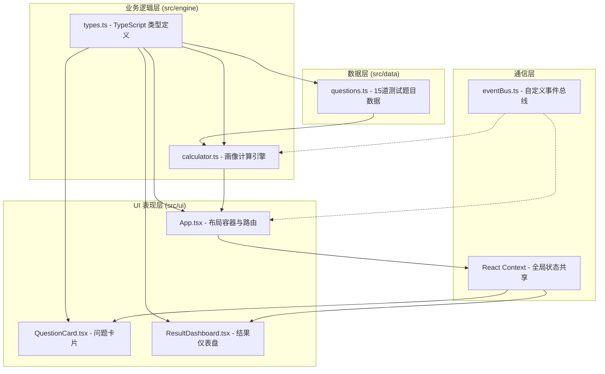

## 1. 架构设计

应用采用三层模块化架构，通过自定义事件总线和 React Context 实现模块间解耦通信。



## 2. 技术描述

- **前端框架**：React 18 + TypeScript
- **构建工具**：Vite 5 + @vitejs/plugin-react
- **状态管理**：React Context + 自定义事件总线
- **动画库**：framer-motion
- **图表库**：recharts
- **样式方案**：CSS Modules + 内联样式（framer-motion）
- **数据存储**：localStorage（模拟后端）

**项目结构**：
```
src/
├── data/
│   └── questions.ts      # 测试题目数据
├── engine/
│   ├── types.ts          # TypeScript 接口定义
│   └── calculator.ts     # 画像计算引擎
├── ui/
│   ├── App.tsx           # 主应用容器
│   ├── QuestionCard.tsx  # 问题卡片组件
│   └── ResultDashboard.tsx # 结果仪表盘组件
├── eventBus.ts           # 自定义事件总线
└── main.tsx              # 入口文件
```

## 3. 模块职责与数据流向

### 3.1 数据模块 (src/data/)

| 文件 | 职责 | 流向 |
|------|------|------|
| questions.ts | 定义15道音乐偏好选择题，每题4个选项，每个选项关联性格维度标签 | 被 src/engine/calculator.ts 读取 |

### 3.2 业务逻辑模块 (src/engine/)

| 文件 | 职责 | 流向 |
|------|------|------|
| types.ts | 定义 Question、Option、Profile、MatchResult 等 TypeScript 接口 | 被所有模块引用 |
| calculator.ts | 接收用户答案数组，计算各维度得分，生成主导/副性格画像 | 输出画像到 src/ui/ 模块 |

### 3.3 UI 模块 (src/ui/)

| 文件 | 职责 | 流向 |
|------|------|------|
| App.tsx | 布局容器，管理全局状态，路由控制（测试页/结果页/匹配页） | 通过 Context 传递画像数据和共享状态 |
| QuestionCard.tsx | 显示单道选择题，圆形选项按钮，点击动画 | 接收当前问题数据和 onAnswer 回调 |
| ResultDashboard.tsx | 展示雷达图、推荐匹配、保存分享、排行榜 | 接收画像对象和匹配列表 |

### 3.4 通信层

| 文件 | 职责 |
|------|------|
| eventBus.ts | 发布/订阅模式，实现模块间解耦通信 |
| React Context | 共享全局状态（画像数据、当前题目索引、答案列表） |

## 4. 数据模型

### 4.1 核心类型定义

```typescript
// 性格维度
type PersonalityDimension = 'Melody' | 'Rhythm' | 'Lyric' | 'Mood' | 'Complexity'

// 选项
interface Option {
  id: string
  text: string
  dimension: PersonalityDimension
  score: number
}

// 问题
interface Question {
  id: number
  text: string
  options: Option[]
}

// 画像
interface Profile {
  id?: string
  nickname?: string
  dimensions: Record<PersonalityDimension, number>
  primaryType: PersonalityDimension
  secondaryType: PersonalityDimension
}

// 匹配结果
interface MatchResult {
  profile: Profile
  similarity: number
}
```

## 5. 关键实现说明

### 5.1 计算引擎算法

- 每个选项关联一个维度和得分（0-25分）
- 累计各维度得分，归一化到 0-100
- 得分最高的维度为主导性格，次高为副性格

### 5.2 匹配算法

- 余弦相似度计算两个画像的维度向量相似度
- 从20个预设虚拟好友中选出相似度最高的3位

### 5.3 事件总线

- `test:answer` - 用户答题事件
- `test:complete` - 测试完成事件
- `profile:save` - 保存画像事件
- `profile:loaded` - 画像加载事件

### 5.4 性能优化

- 题目切换使用 CSS transform 而非重排
- 雷达图使用 Recharts 内置动画，避免不必要重绘
- 本地存储使用 debounce 优化写入频率
