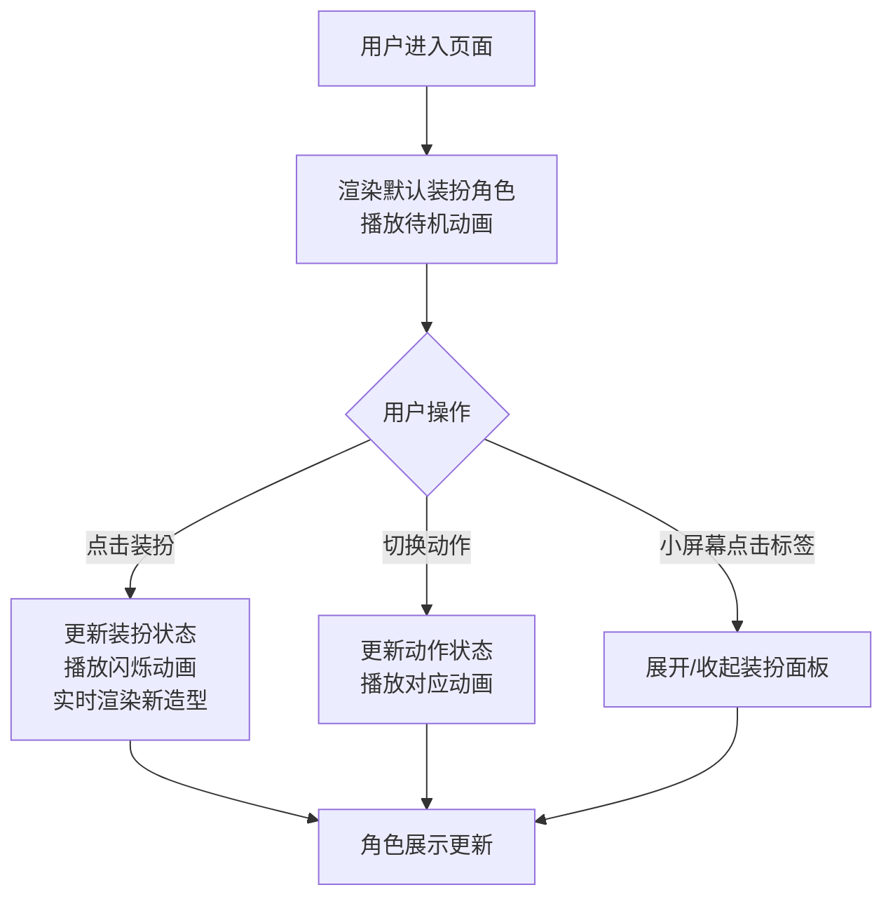

## 1. 产品概述
像素风角色装扮与换装秀是一款在线创意换装应用，用户可以创建个性化的像素小人，通过丰富的装扮库自由搭配造型，实时预览换装效果，并观看角色以不同动作展示装扮的动画秀。

- 核心价值：为用户提供轻松有趣的像素角色创作体验，通过丰富的装扮选项和流畅的动画效果激发创意表达
- 目标用户：像素艺术爱好者、喜欢换装游戏的年轻用户、需要快速创建像素角色的创作者

## 2. 核心功能

### 2.2 功能模块
1. **主展示区**：16x16 像素网格渲染的角色展示，支持换装实时预览和动画播放
2. **装扮面板**：四个分区的装扮选项（头饰、上衣、下装、鞋子武器），点击即可应用
3. **动作切换栏**：三种动作状态切换（行走、跳跃、待机），每种都有独立动画
4. **响应式布局**：小屏幕自动收起装扮面板，通过侧边标签展开/收起

### 2.3 页面详情
| 页面名称 | 模块名称 | 功能描述 |
|-----------|-------------|---------------------|
| 主页面 | 角色展示区 | 420x480px 圆角容器，中央渲染 16x16 像素角色，支持换装闪烁动画 |
| 主页面 | 装扮面板 | 220px 宽侧边栏，四个分区展示装扮选项，64x64px 图标，悬停放大效果 |
| 主页面 | 动作切换栏 | 底部三个动作按钮，切换角色动画状态 |
| 主页面 | 响应式侧边栏 | 1024px 以下宽度时面板收起，通过标签按钮展开/收起 |

## 3. 核心流程

用户进入页面 → 看到默认装扮的像素角色（待机动画）→ 点击右侧装扮选项 → 角色对应部位变色并播放闪烁动画 → 点击底部动作按钮 → 角色切换为对应动作动画 → 小屏幕时点击侧边标签展开/收起装扮面板

## 4. 用户界面设计

### 4.1 设计风格
- **主色调**：柔和紫调渐变背景 (#F0E6FF → #E0D4F0)，主题色 #6C63FF，强调色 #FFD54F
- **按钮风格**：圆角胶囊形按钮，选中状态主题色填充，未选中浅灰背景
- **字体**：采用现代无衬线字体，清晰易读
- **布局风格**：三栏式布局（中央展示区 + 右侧装扮面板 + 底部动作栏），卡片式设计
- **像素风格**：角色采用 16x16 像素网格，保持复古像素艺术美感

### 4.2 页面设计概述
| 页面名称 | 模块名称 | UI 元素 |
|-----------|-------------|-------------|
| 主页面 | 角色展示区 | 420x480px 圆角 20px 容器，浅灰背景 #F5F5F5，2px 虚线边框 #D0D0D0，Canvas 像素渲染 |
| 主页面 | 装扮面板 | 220px 宽，纯白背景 #FFFFFF，顶部圆角 12px，四个分区标题，64x64px 图标网格，悬停放大 1.2 倍（0.2s 过渡），选中时边框亮色 #FFD54F |
| 主页面 | 动作切换栏 | 三个按钮（行走/跳跃/待机），80x32px，圆角 16px，选中背景 #6C63FF 白字，未选中 #E0E0E0 深灰字 |
| 主页面 | 响应式标签 | 20x80px，#6C63FF 背景，圆角 8px 0 0 8px，小屏幕时显示 |

### 4.3 响应式设计
- **桌面端（≥1024px）**：完整显示中央展示区和右侧装扮面板，底部动作栏横跨
- **移动端（<1024px）**：装扮面板收起到右侧边缘，通过标签按钮展开/收起，展开时覆盖在展示区上方
- **触控优化**：按钮和图标尺寸适配触控操作，最小触控目标 44x44px

### 4.4 动画效果
- **换装闪烁**：0.2 秒白色到目标色过渡动画
- **行走动画**：双腿交替摆动，每步 0.4 秒
- **跳跃动画**：整体向上位移 40px 后落回，0.6 秒弹性效果
- **待机动画**：轻微上下浮动，幅度 4px，周期 2 秒
- **悬停效果**：图标放大 1.2 倍，0.2 秒平滑过渡

## 5. 性能要求
- 装扮切换响应时间 ≤ 100ms
- 动画帧率稳定在 60fps
- 使用 requestAnimationFrame 驱动动画循环
- Canvas 像素渲染优化，避免不必要的重绘
