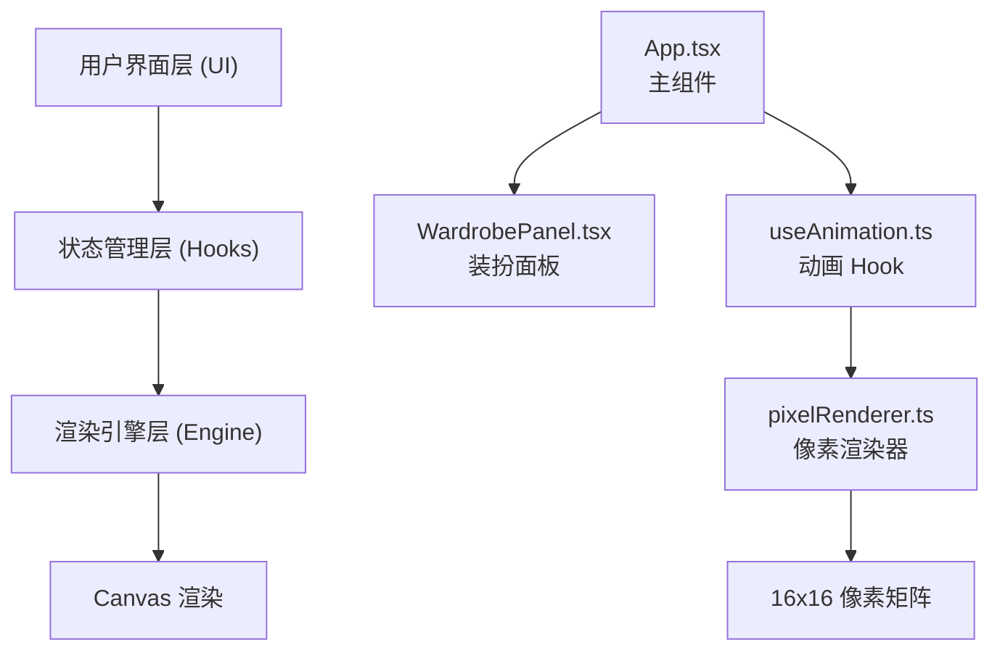

## 1. 架构设计



## 2. 技术栈描述
- **前端框架**：React 18 + TypeScript
- **构建工具**：Vite
- **渲染方式**：HTML5 Canvas 像素级渲染
- **状态管理**：React useState + 自定义 Hook
- **动画驱动**：requestAnimationFrame
- **样式方案**：CSS Modules / 内联样式

## 3. 项目文件结构

```
d:\Pro\tasks\auto136\
├── package.json              # 项目依赖配置
├── index.html                # 入口 HTML
├── vite.config.js            # Vite 配置
├── tsconfig.json             # TypeScript 配置
├── src\
│   ├── types.ts              # 类型定义
│   ├── data\
│   │   └── wardrobe.ts       # 装扮数据
│   ├── engine\
│   │   └── pixelRenderer.ts  # 像素渲染引擎
│   ├── hooks\
│   │   └── useAnimation.ts   # 动画 Hook
│   └── ui\
│       ├── App.tsx           # 主应用组件
│       └── WardrobePanel.tsx # 装扮面板组件
```

## 4. 核心数据定义

### 4.1 类型定义 (types.ts)
```typescript
// 像素小人部位枚举
enum BodyPart {
  SKIN = 'skin',
  HAIR = 'hair',
  TOP = 'top',
  BOTTOM = 'bottom',
  SHOES = 'shoes',
  WEAPON = 'weapon',
  ACCESSORY = 'accessory'
}

// 装扮选项接口
interface WardrobeItem {
  id: string;
  name: string;
  color: string;
  part: BodyPart;
  pattern?: string;
}

// 动作类型联合类型
type ActionType = 'idle' | 'walk' | 'jump';

// 装扮状态
interface OutfitState {
  [BodyPart.HAIR]: string;
  [BodyPart.TOP]: string;
  [BodyPart.BOTTOM]: string;
  [BodyPart.SHOES]: string;
  [BodyPart.WEAPON]: string;
  [BodyPart.ACCESSORY]: string;
}
```

### 4.2 装扮数据 (wardrobe.ts)
- **头饰分区**：4 种发型 + 3 种帽子
- **上衣分区**：5 种颜色 + 2 种图案
- **下装分区**：4 种颜色
- **鞋子武器分区**：3 种鞋 + 3 种武器

## 5. 核心模块说明

### 5.1 pixelRenderer.ts - 像素渲染引擎
- **职责**：根据装扮状态和动画帧生成 16x16 像素颜色矩阵
- **核心方法**：
  - `generatePixelMatrix(outfit: OutfitState, frame: AnimationFrame): string[][]`
  - `drawToCanvas(ctx: CanvasRenderingContext2D, matrix: string[][], scale: number): void`
- **像素映射**：预设每个部位在 16x16 网格中的坐标范围

### 5.2 useAnimation.ts - 动画 Hook
- **职责**：管理动作动画循环，计算帧间插值
- **核心功能**：
  - 使用 requestAnimationFrame 驱动 60fps 动画循环
  - 根据动作类型计算当前帧的像素偏移
  - 处理换装时的 0.2 秒闪烁过渡动画
  - 返回当前帧的像素矩阵

### 5.3 App.tsx - 主组件
- **职责**：管理全局装扮状态和动作状态，协调各子组件
- **状态管理**：
  - `outfitState`：当前装扮
  - `actionType`：当前动作
  - `panelOpen`：小屏幕面板展开状态
  - `flashParts`：正在闪烁的部位（用于换装动画）

### 5.4 WardrobePanel.tsx - 装扮面板
- **职责**：渲染装扮选项，处理用户选择
- **交互**：
  - 点击装扮项触发换装
  - 悬停时图标放大效果
  - 选中项高亮边框

## 6. 动画实现方案

### 6.1 帧动画系统
- **Idle（待机）**：使用正弦函数计算 Y 轴偏移，幅度 4px，周期 2 秒
- **Walk（行走）**：双腿交替偏移，每步 0.4 秒，使用时间戳计算相位
- **Jump（跳跃）**：使用弹性缓动函数计算 Y 轴偏移，总时长 0.6 秒

### 6.2 换装闪烁动画
- 触发换装时记录时间戳
- 在 0.2 秒内从 #FFFFFF 插值到目标颜色
- 使用 HSL 颜色空间插值保证过渡自然

## 7. 性能优化策略
1. **Canvas 局部重绘**：仅在像素矩阵变化时重绘
2. **对象池复用**：避免频繁创建像素矩阵数组
3. **requestAnimationFrame 节流**：保证 60fps 稳定帧率
4. **CSS 硬件加速**：面板展开/收起使用 transform 动画
5. **响应式断点**：使用 CSS media query 处理布局切换

## 8. 启动方式
```bash
npm install
npm run dev
```
