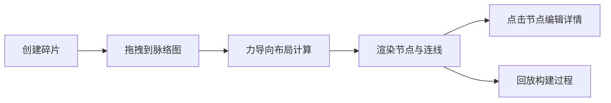

## 1. 产品概述

叙事碎片拼合与脉络可视化应用，帮助创意写作社群成员在线协作时，通过视觉化方式将碎片化的故事片段（角色、场景、情节转折）自由组合，并实时看到整体故事脉络图的变化。

- 核心价值：将抽象的故事构思过程具象化，通过拖拽组合和力导向布局，让创作者直观感受故事结构
- 目标用户：创意写作社群成员、故事创作者、编剧

## 2. 核心功能

### 2.1 用户角色

| 角色 | 注册方式 | 核心权限 |
|------|----------|----------|
| 创作者 | 无需注册，直接使用 | 创建碎片、拖拽组合、编辑详情、回放构建过程 |

### 2.2 功能模块

1. **碎片素材库**：左侧面板，包含创建表单和碎片卡片列表
2. **脉络图可视化**：中央区域，力导向布局展示碎片节点和连线
3. **详情编辑区**：右侧面板，编辑选中碎片内容，查看连接关系
4. **故事线回放**：按添加顺序动画重现脉络图构建过程

### 2.3 页面详情

| 页面名称 | 模块名称 | 功能描述 |
|----------|----------|----------|
| 主页面 | 碎片创建表单 | 文本输入框 + 类型下拉框，添加新故事碎片 |
| 主页面 | 碎片素材库 | 彩色卡片展示所有碎片，支持拖拽到脉络图 |
| 主页面 | 脉络图画布 | 力导向布局渲染节点和连线，支持节点拖拽微调 |
| 主页面 | 详情编辑区 | 编辑选中碎片内容，显示连接关系列表 |
| 主页面 | 回放控制 | "回放构建过程"按钮，动画重现构建过程 |

## 3. 核心流程

用户在左侧创建故事碎片 → 拖拽碎片到中央脉络图区域 → 系统自动算力导向布局并生成连线 → 用户点击节点查看/编辑详情 → 点击回放按钮动画重现构建过程

## 4. 用户界面设计

### 4.1 设计风格

- **主色调**：淡珊瑚色 #FF6F61
- **辅助色**：浅蓝色 #6AB0F3、浅绿色 #6BCB77
- **碎片类型色**：角色 #FF6B6B、场景 #4ECDC4、情节转折 #FFE66D
- **按钮风格**：圆角 8px，主按钮背景 #FF6F61，悬停亮度+10%，点击缩放 0.95（0.1s）
- **字体**：现代无衬线字体，清晰易读
- **布局风格**：三栏式布局，卡片式设计
- **动效风格**：柔和过渡，ease-in-out 曲线

### 4.2 页面设计概述

| 页面名称 | 模块名称 | UI 元素 |
|----------|----------|---------|
| 主页面 | 左栏素材库 | 浅灰背景 #F9F9F9，宽 280px，分隔线 #E0E0E0 2px 实线 |
| 主页面 | 中栏脉络图 | 纯白背景 #FFFFFF，自适应宽度，SVG 画布 |
| 主页面 | 右栏详情区 | 浅灰背景 #F0F0F0，宽 320px，编辑表单 + 连接列表 |
| 主页面 | 碎片卡片 | 宽 200px 高 100px，圆角 10px，顶部类型标签，左侧彩色条纹 |
| 主页面 | 连线 | 半透明浅灰 #D0D0D0，宽度 2px，可点击删除 |

### 4.3 响应式设计

- **桌面端（>768px）**：左中右三栏布局
- **移动端（≤768px）**：上下布局，左栏变为顶部横向滚动素材库，中栏在中间，右栏收缩为底部可展开抽屉
- 触摸优化：增大点击区域，支持触摸拖拽

### 4.4 动画效果

- 碎片卡片拖拽：scale 1.05 + 阴影（#D0D0D0，4px 4px 10px），0.2s 过渡
- 节点进入：淡入上移（translateY -10px），0.5s
- 连线绘制：宽度渐变，0.4s
- 回放动画：每 1.5s 出现一个节点，连线平滑生长，ease-in-out 曲线
