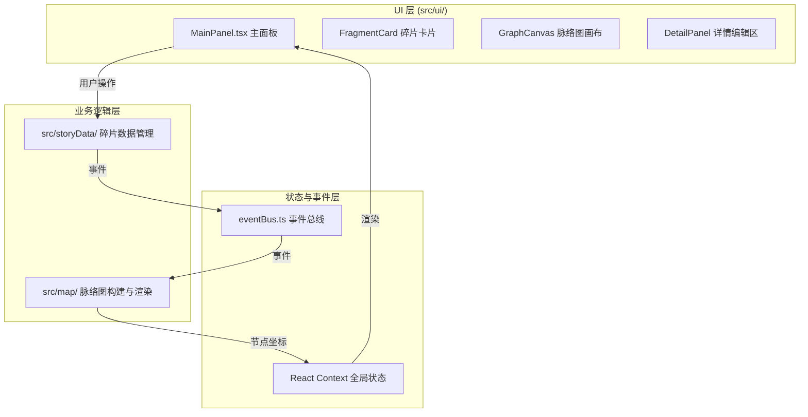

## 1. 架构设计



## 2. 技术选型

- **前端框架**：React 18 + TypeScript
- **构建工具**：Vite 5 + @vitejs/plugin-react
- **动画库**：framer-motion
- **力导向布局**：d3-force
- **状态管理**：React Context + 事件总线（自定义 eventBus）
- **样式方案**：CSS Modules / 内联样式（framer-motion）

## 3. 文件结构

```
src/
├── eventBus.ts              # 事件总线，模块间解耦通信
├── storyData/
│   └── storyFragment.ts     # 碎片数据管理模块
├── map/
│   └── storyGraph.ts        # 力导向布局与图数据计算
├── ui/
│   ├── MainPanel.tsx        # 主面板组件
│   ├── FragmentCard.tsx     # 碎片卡片组件
│   ├── GraphCanvas.tsx      # 脉络图画布组件
│   └── DetailPanel.tsx      # 详情编辑面板
├── App.tsx
├── main.tsx
└── index.css
```

## 4. 模块调用关系与数据流向

### 4.1 事件总线 (eventBus.ts)
- 提供 `on`、`emit`、`off` 方法
- 事件类型：
  - `fragment:created` - 碎片创建
  - `fragment:updated` - 碎片更新
  - `fragment:dropped` - 碎片拖入脉络图
  - `graph:updated` - 图数据更新
  - `node:selected` - 节点选中

### 4.2 storyData 模块 (src/storyData/)
- **输入**：用户输入（文本、类型）
- **输出**：通过 eventBus 发出 `fragment:created`、`fragment:updated` 事件
- **职责**：管理碎片 CRUD，维护碎片列表状态

### 4.3 map 模块 (src/map/)
- **输入**：监听 `fragment:dropped` 事件，接收碎片数据
- **输出**：通过 eventBus 发出 `graph:updated` 事件，输出节点和连线坐标
- **职责**：使用 d3-force 计算力导向布局，生成节点位置和连线

### 4.4 ui 模块 (src/ui/)
- **输入**：通过 React Context 订阅图数据和选中状态
- **输出**：用户操作触发 eventBus 事件
- **职责**：渲染界面，处理用户交互

## 5. 数据模型

### 5.1 StoryFragment（故事碎片）

```typescript
interface StoryFragment {
  id: string;
  type: 'character' | 'scene' | 'plot-twist';
  content: string;
  color: string;
  createdAt: number;
}
```

### 5.2 GraphNode（图节点）

```typescript
interface GraphNode {
  id: string;
  fragmentId: string;
  x: number;
  y: number;
  fx?: number;  // 固定位置 x
  fy?: number;  // 固定位置 y
  vx?: number;  // 速度 x
  vy?: number;  // 速度 y
}
```

### 5.3 GraphLink（图连线）

```typescript
interface GraphLink {
  id: string;
  source: string;
  target: string;
}
```

## 6. 性能优化策略

- 使用 d3-force 的 `alphaTarget` 控制模拟冷却
- 节点拖拽时使用 `fx`/`fy` 固定位置，避免全量重绘
- 使用 React.memo 优化节点和连线组件渲染
- 动画使用 CSS transform 和 opacity，触发 GPU 加速
- 限制力导向模拟的迭代次数
- 回放动画使用 requestAnimationFrame 保证流畅度

## 7. 力导向布局配置

- `forceCenter`：中心力，将节点拉向画布中心
- `forceManyBody`：节点间斥力，避免重叠
- `forceLink`：连线拉力，连接相关节点
- `forceCollide`：碰撞检测，防止节点重叠
- 连线规则：角色 ↔ 情节转折，场景 ↔ 情节转折
