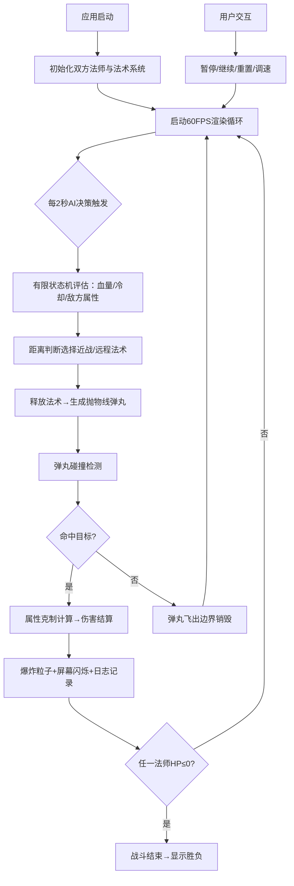

## 1. 产品概述
模拟小型魔法竞技场中两位AI法师自动对战的可视化应用，用于在缺少完整游戏引擎时验证法术碰撞检测、属性克制计算以及AI战术决策链路的实时交互问题。
- 核心目的：提供法术系统、AI决策、碰撞检测的实时可视化验证平台
- 目标用户：游戏开发者、算法工程师、战斗系统设计师

## 2. 核心功能

### 2.1 用户角色
不涉及多用户角色区分，为单页实时模拟应用。

### 2.2 功能模块
1. **竞技场渲染模块**：600x400像素战斗区域，法师角色生成与渲染，法术弹丸抛物线轨迹
2. **法师与法术系统**：双方法师属性管理，5种法术（火球术、冰霜弹、闪电链、护盾、治疗波），冷却管理，属性克制计算
3. **AI对战决策模块**：有限状态机（空闲、蓄力、防御、治疗），距离判断，法术选择策略
4. **粒子特效模块**：法术拖尾粒子，命中爆炸效果，屏幕边缘受击闪烁
5. **战斗统计面板**：血量条显示，施法次数统计，滚动战斗日志
6. **交互控制模块**：暂停/继续按钮，重置按钮，速度控制滑块（1x/2x/3x）

### 2.3 页面详情
| 页面名称 | 模块名称 | 功能描述 |
|-----------|-------------|---------------------|
| 主页面 | 顶部控制栏 | 暂停/继续按钮（绿色，80x32px）、重置按钮（红色）、速度滑块（圆润带刻度） |
| 主页面 | 竞技场区域 | 600x400px浅灰圆角区域，双方法师自动站位，法术弹丸飞行与碰撞 |
| 主页面 | 战斗统计面板 | 右下角实时面板：双方血量条（200x20px圆角红色渐变）、施法次数统计、20行滚动日志 |

## 3. 核心流程
应用启动后自动初始化两位法师（左火右水），启动60FPS游戏循环。每2秒AI进行一次决策，基于有限状态机和距离判断选择法术释放。法术弹丸以抛物线轨迹飞行，命中时计算属性克制伤害并触发爆炸粒子。生命值变化时更新血量条并写入日志。支持暂停、继续、重置和调速操作。

## 4. 用户界面设计

### 4.1 设计风格
- **主色调**：深紫(#1B0D2E)到黑蓝(#0F0821)径向渐变背景
- **竞技场**：浅灰(#2D2D44)圆角12px，2px紫色发光边框(#8E44AD)
- **左方法师**：紫色(#8E44AD)火焰属性
- **右方法师**：蓝色(#2980B9)水属性
- **按钮**：圆角8px，绿色暂停(#2ECC71→悬停#27AE60)，红色重置(#E74C3C)
- **字体**：采用有奇幻感的衬线/半衬线显示字体搭配简洁等宽日志字体
- **动效**：按钮点击0.95缩放反馈(0.15s)，法术拖尾粒子，爆炸径向扩散，受击屏幕边缘红色闪烁(0.3s周期)

### 4.2 页面设计概述
| 页面名称 | 模块名称 | UI元素 |
|-----------|-------------|-------------|
| 主页面 | 顶部控制栏 | 横向排列按钮组，圆润滑块带刻度标识，悬停变手型 |
| 主页面 | 竞技场 | 居中展示，法师两端站位，弹丸抛物线带拖尾，命中爆炸粒子扩散 |
| 主页面 | 战斗统计面板 | 右下悬浮卡片，血量条红色渐变圆角，施法次数带小图标，日志区域11px字体自动滚底 |

### 4.3 响应式
- 桌面优先设计（默认横向布局：竞技场+右侧面板）
- 800px宽度以下：竞技场与面板自动纵向排列，面板高度自适应
- 触控优化：按钮最小触控区域40x40px

### 4.4 性能约束
- 目标帧率：稳定60FPS
- 粒子上限：不超过200个同时存在
- 弹丸轨迹：抛物线数学计算，无物理引擎依赖
