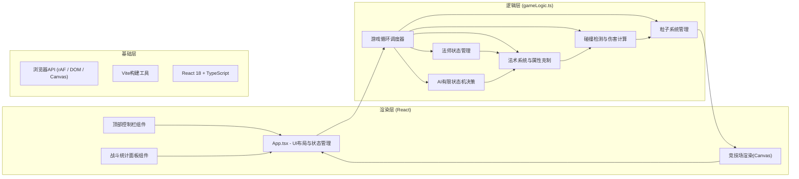

## 1. 架构设计
纯前端单页应用，采用React + TypeScript + Vite构建，使用requestAnimationFrame驱动60FPS游戏循环，Canvas或DOM渲染战场元素。



## 2. 技术描述
- **前端框架**：React@18 + ReactDOM@18
- **构建工具**：Vite@5 + @vitejs/plugin-react
- **语言**：TypeScript@5（严格模式strict: true）
- **样式**：原生CSS（styles.css），CSS变量主题，关键帧动画
- **渲染方案**：Canvas 2D渲染竞技场（法师、弹丸、粒子），DOM渲染UI控件和统计面板
- **状态管理**：React useState/useRef + useCallback，游戏状态使用ref存储避免重渲染
- **游戏循环**：requestAnimationFrame + deltaTime计算，支持速度倍率
- **项目初始化**：手动创建文件结构（用户指定固定文件列表）

## 3. 文件结构
```
auto139/
├── package.json              # 依赖与启动脚本
├── index.html                # 入口HTML，全屏无滚动
├── vite.config.js            # Vite基础配置
├── tsconfig.json             # TS严格模式配置
└── src/
    ├── main.tsx              # React入口，渲染App
    ├── App.tsx               # 主组件：状态循环、AI调度、UI布局
    ├── gameLogic.ts          # 核心逻辑：法术、碰撞、AI、粒子
    └── styles.css            # 全局样式、主题、动画关键帧
```

## 4. 核心数据模型 (TypeScript类型定义)

```typescript
// 属性类型
type ElementType = 'fire' | 'ice' | 'lightning' | 'shield' | 'heal';

// 法师状态
interface Mage {
  id: 'left' | 'right';
  name: string;
  color: string;
  element: ElementType;
  x: number;
  y: number;
  hp: number;
  maxHp: number;
  shieldActive: boolean;
  shieldEndTime: number;
  state: 'idle' | 'charging' | 'defending' | 'healing';
  lastSpell: ElementType | null;
  spellCooldowns: Record<ElementType, number>;
  castCount: Record<ElementType, number>;
  totalCasts: number;
}

// 法术定义
interface Spell {
  type: ElementType;
  name: string;
  cooldown: number;       // 1-5秒
  damage: number;         // 0 for heal/shield
  baseColor: string;
  isProjectile: boolean;  // false for heal/shield
  isMelee: boolean;       // 近战标识
  healAmount?: number;
  shieldDuration?: number;
}

// 飞行弹丸
interface Projectile {
  id: number;
  type: ElementType;
  x: number;
  y: number;
  startX: number;
  startY: number;
  targetX: number;
  targetY: number;
  progress: number;       // 0-1 抛物线进度
  speed: number;          // px/sec
  color: string;
  ownerId: 'left' | 'right';
  damage: number;
}

// 粒子
interface Particle {
  id: number;
  x: number;
  y: number;
  vx: number;
  vy: number;
  life: number;
  maxLife: number;
  size: number;
  color: string;
  type: 'trail' | 'explosion';
}

// 战斗日志
interface BattleLog {
  timestamp: number;
  message: string;
  type: 'cast' | 'hit' | 'heal' | 'shield' | 'death' | 'system';
}

// 游戏状态
interface GameState {
  mages: [Mage, Mage];
  projectiles: Projectile[];
  particles: Particle[];
  logs: BattleLog[];
  isPaused: boolean;
  speedMultiplier: 1 | 2 | 3;
  gameTime: number;
  lastDecisionTime: Record<'left' | 'right', number>;
  winner: 'left' | 'right' | null;
  hitFlash: { side: 'left' | 'right' | null; startTime: number };
}
```

## 5. 法术定义与属性克制表

| 法术名称 | 属性 | 冷却(秒) | 伤害 | 类型 | 说明 |
|---------|------|---------|------|------|------|
| 火球术 | fire | 2 | 15 | 远程 | 抛物线弹道 |
| 冰霜弹 | ice | 2.5 | 12 | 远程 | 抛物线弹道 |
| 闪电链 | lightning | 4 | 20 | 近战/瞬发 | 近距离高伤害 |
| 护盾 | shield | 5 | 0 | 防御 | 减伤50%，持续3秒 |
| 治疗波 | heal | 5 | 0 | 恢复 | 恢复20HP |

**克制倍率**：
- fire → ice (x1.5)，fire → shield (x0.8)
- ice → fire (x1.5)，ice → shield (x0.8)
- lightning → shield (x2.0 破盾)，对其他属性 (x1.0)
- shield 激活时：受到伤害 x0.5
- heal/shield 不受克制影响

## 6. 关键算法说明

### 6.1 抛物线弹道
```
t = progress (0→1)
height = -4 * arcHeight * t * (t - 1)  // 抛物线顶点
x = startX + (targetX - startX) * t
y = startY + (targetY - startY) * t - height
```
arcHeight = 80px，飞行速度200px/s，根据两点距离计算飞行时长。

### 6.2 碰撞检测
法师碰撞体：圆形，半径20px。弹丸与敌方法师圆心距离 ≤ 弹丸半径(6) + 法师半径(20) 即命中。

### 6.3 AI决策逻辑（有限状态机）
```
每2秒评估：
1. HP < 30 且 治疗冷却完成 → 优先治疗
2. HP < 50 且 护盾冷却完成 → 防御状态开护盾
3. 距离 < 150px → 优先近战法术(闪电链)
4. 否则 → 从冷却完成的远程法术中选择
   - 避免与上次相同法术
   - 优先选择克制敌方属性的法术
5. 无法术可用 → idle
```
