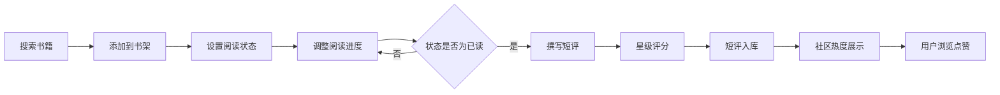

## 1. 产品概述

本项目是一个在线阅读进度追踪与社区书评共享平台，帮助用户记录书籍阅读进度、撰写短评，并与社区成员分享阅读体验。

- 核心目标：提供优雅的阅读管理体验，让用户能够追踪阅读进度、记录阅读感受，并通过社区发现优质书籍推荐。
- 目标用户：热爱阅读、希望系统化管理阅读进度并与他人分享阅读体验的读者群体。
- 产品价值：通过可视化的阅读进度追踪、精美的书籍卡片展示、活跃的社区互动，打造有温度的阅读社区。

## 2. 核心功能

### 2.1 用户角色

| 角色 | 注册方式 | 核心权限 |
|------|----------|----------|
| 普通用户 | 无需注册，本地存储 | 搜索书籍、管理书架、撰写短评、浏览社区热度排行 |

### 2.2 功能模块

1. **书架页面**：书籍搜索、三栏状态布局、阅读进度管理、状态切换
2. **书籍卡片**：渐变封面、3D悬停翻转、进度条展示、状态切换按钮
3. **短评系统**：星级评分、短评撰写、时间倒序展示
4. **社区热度排行**：7天点赞排行榜、点赞互动、全文展开

### 2.3 页面详情

| 页面名称 | 模块名称 | 功能描述 |
|---------|---------|----------|
| 书架页面 | 书籍搜索 | 支持书名/作者关键词搜索 |
| 书架页面 | 三栏布局 | 未读、在读、已读三栏展示 |
| 书架页面 | 书籍卡片 | 渐变封面、3D翻转、进度条 |
| 书架页面 | 状态切换 | 点击按钮切换阅读状态 |
| 书架页面 | 进度设置 | 滑块调整阅读进度百分比 |
| 短评模块 | 星级评分 | 5颗星点击评分，带动画效果 |
| 短评模块 | 短评撰写 | 50-200字短评输入 |
| 短评模块 | 短评列表 | 时间倒序，最新高亮 |
| 社区热度排行 | 热度榜单 | 最近7天点赞前10短评 |
| 社区热度排行 | 点赞交互 | 点赞+1动画，按钮变红 |
| 社区热度排行 | 全文展开 | 点击展开完整短评 |

## 3. 核心流程

用户搜索书籍 → 添加到书架 → 设置阅读状态和进度 → 阅读完成后撰写短评 → 短评展示在社区 → 其他用户浏览点赞

## 4. 用户界面设计

### 4.1 设计风格

- 主色调：温暖米白色背景 #FFF8E7
- 主色点缀：深棕色 #6B4226，橙色 #E07A2F
- 按钮风格：圆角按钮，悬停时有微妙的阴影变化
- 字体：使用优雅的衬线字体搭配清晰的无衬线字体
- 布局风格：卡片式网格布局，三栏状态分类
- 图标风格：简洁线性图标，符合温暖阅读氛围

### 4.2 页面设计概述

| 页面名称 | 模块名称 | UI元素 |
|---------|---------|--------|
| 书架页面 | 导航栏 | 固定顶部，半透明毛玻璃效果 backdrop-filter: blur(10px) |
| 书架页面 | 搜索栏 | 圆角输入框，带搜索图标 |
| 书架页面 | 三栏标题 | 棕色字体，橙色下划线 |
| 书架页面 | 书籍卡片 | 渐变封面（根据分类生成），3D翻转效果（Y轴180度，0.5s过渡） |
| 书架页面 | 进度条 | 橙色渐变进度条 |
| 短评模块 | 星级评分 | 星星逐个点亮，0.2s弹跳动画 |
| 短评模块 | 最新短评 | 黄色高亮边框 |
| 社区热度排行 | 热度卡片 | 点赞按钮缩放动画（0.3s放大） |
| 社区热度排行 | 展开动画 | 平滑高度过渡 |

### 4.3 响应式设计

- 桌面端：三栏布局，每栏自适应宽度
- 平板端：两列布局
- 手机端：单列布局
- 卡片间距使用自适应 gap
- 触摸优化：增大点击区域，优化触摸反馈

### 4.4 动画与性能

- 页面切换动画：0.3s ease-in-out 滑动过渡
- 卡片悬停：Y轴180度翻转，0.5s过渡
- 星级评分：0.2s弹跳效果
- 点赞按钮：0.3s缩放放大动画
- 性能要求：500本书首次渲染时间 ≤ 1.5秒
