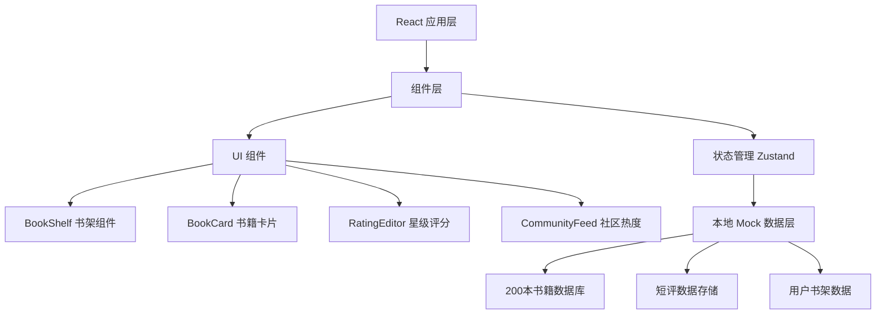
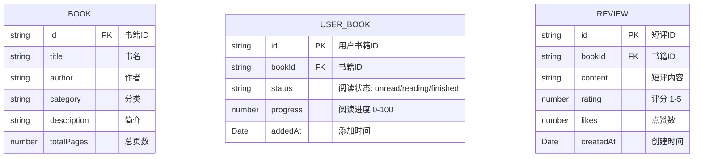

## 1. 架构设计



## 2. 技术描述

- 前端框架：React 18 + TypeScript
- 构建工具：Vite 5
- 状态管理：Zustand
- 样式方案：CSS Modules + CSS Variables
- 数据存储：localStorage + Mock 数据
- 路由：React Router DOM
- 图标：Lucide React

## 3. 目录结构

```
src/
├── main.tsx              # 应用入口
├── App.tsx               # 根组件
├── BookShelf.tsx         # 书架三栏布局组件
├── BookCard.tsx         # 书籍卡片组件
├── RatingEditor.tsx     # 星级评分组件
├── CommunityFeed.tsx    # 社区热度排行组件
├── store/
│   └── useBookStore.ts # 书籍状态管理
├── data/
│   └── books.ts       # 预置200本书籍数据
│   └── mockReviews.ts # Mock短评数据
├── types/
│   └── index.ts       # TypeScript类型定义
└── styles/
    └── index.css      # 全局样式
```

## 4. 路由定义

| 路由 | 用途 |
|------|------|
| / | 书架页面，展示三栏书籍列表 |
| /community | 社区热度排行页面 |

## 5. 数据模型

### 5.1 数据模型定义



### 5.2 类型定义

```typescript
type BookStatus = 'unread' | 'reading' | 'finished';

interface Book {
  id: string;
  title: string;
  author: string;
  category: string;
  description: string;
  totalPages: number;
}

interface UserBook {
  id: string;
  bookId: string;
  status: BookStatus;
  progress: number;
  addedAt: Date;
}

interface Review {
  id: string;
  bookId: string;
  content: string;
  rating: number;
  likes: number;
  createdAt: Date;
}
```

## 6. 性能优化策略

1. **虚拟列表/按需渲染**：使用 CSS contain 优化大量卡片渲染
2. **React.memo**：对 BookCard 等频繁渲染组件进行记忆化
3. **状态分片**：书架数据按状态分块更新，避免全量重渲染
4. **CSS 硬件加速**：3D 动画使用 transform 和 will-change 优化
5. **图片预加载**：渐变封面使用 CSS 生成，无需图片资源加载
6. **requestAnimationFrame**：进度条等动画使用 RAF 优化
