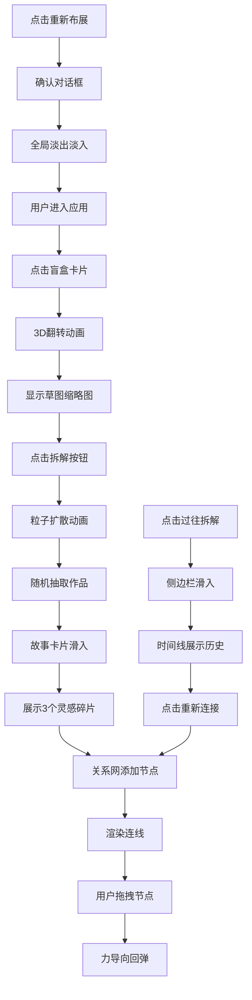

## 1. 产品概述

青年艺术节草图盲盒拆解与灵感关系网应用，为参展艺术家提供作品展示渠道，为观众提供沉浸式艺术体验。通过"盲盒抽卡"交互方式随机抽取艺术家作品草图，拆解背后的创作故事和灵感碎片，最终形成可视化的灵感关系网络。

- 目标用户：青年艺术节参展艺术家与现场/线上观众
- 核心价值：打破传统艺术欣赏模式，以游戏化、社交化方式让观众深入理解艺术创作过程，建立作品间的灵感关联

## 2. 核心功能

### 2.1 用户角色
| 角色 | 注册方式 | 核心权限 |
|------|----------|----------|
| 观众用户 | 无需注册 | 抽取盲盒、拆解作品、浏览灵感关系网、查看历史记录、重置体验 |

### 2.2 功能模块
1. **盲盒抽取模块**：3D翻转动画、随机抽取作品、拆解粒子特效
2. **创作故事展示**：灵感碎片标签、滑入动画、毛玻璃卡片
3. **灵感关系网**：力导向布局、节点拖拽、连线主题映射、缩放平移
4. **历史记录管理**：时间线展示、重新连接功能、侧边栏交互
5. **重置功能**：确认对话框、全局淡入淡出过渡

### 2.3 页面详情
| 页面名称 | 模块名称 | 功能描述 |
|---------|----------|----------|
| 主页面 | 盲盒卡片 | 3D翻转动画、悬停光晕、拆解按钮、粒子特效 |
| 主页面 | 灵感关系网 | Canvas力导向图、节点拖拽、连线渲染、缩放平移 |
| 主页面 | 故事卡片 | 灵感碎片标签、向上滑入动画、毛玻璃效果 |
| 主页面 | 历史侧边栏 | 时间线倒序、缩略图展示、重新连接按钮 |
| 主页面 | 重置对话框 | 半透明遮罩、确认/取消按钮、全局过渡动画 |

## 3. 核心流程

用户进入应用 → 点击中央盲盒卡片 → 3D翻转显示草图缩略图 → 点击"拆解"按钮 → 粒子动画特效 → 随机抽取作品 → 故事卡片滑入展示灵感碎片 → 灵感关系网动态添加节点和连线 → 用户可拖拽节点调整位置 → 点击"过往拆解"查看历史 → 点击"重新连接"将旧作品关键词加入关系网 → 点击"重新布展"清空重置

## 4. 用户界面设计

### 4.1 设计风格
- **主色调**：暗色主题，主背景#2C3E50，副背景#34495E
- **强调色**：紫粉色渐变#6C5CE7到#FD79A8
- **文字色**：#ECF0F1（主文字）
- **标签色**：灵感源#00B894、情绪标签#6C5CE7、主题#FDCB6E
- **按钮风格**：圆角设计，悬停缩放1.02，点击缩放0.95
- **字体**：使用Inter字体（需要替换为更具艺术感的字体）
- **动效**：弹性缓动cubic-bezier(0.68, -0.55, 0.27, 1.55)
- **特殊效果**：毛玻璃背景、光晕悬停、粒子动画、3D翻转

### 4.2 页面设计概述
| 页面名称 | 模块名称 | UI Elements |
|---------|----------|-------------|
| 主页面 | 盲盒卡片 | 240x320px，紫粉渐变，圆角16px，问号图案，悬停光晕，3D翻转0.6s |
| 主页面 | 拆解按钮 | 直径40px圆形，白色背景，宝箱图标，点击缩放0.9 |
| 主页面 | 粒子动画 | 0.8秒，向外扩散消失 |
| 主页面 | 故事卡片 | 280px宽，毛玻璃rgba(255,255,255,0.7)，圆角12px，向上滑入0.3s |
| 主页面 | 灵感标签 | 80x28px，圆角6px，白色文字10px，按类型着色 |
| 主页面 | 关系网区域 | 400x500px，背景#2D3436，圆角12px，Canvas渲染 |
| 主页面 | 关系网节点 | 半径8-18px，6种预设颜色，缩放渐入0.5s |
| 主页面 | 关系网连线 | 半透明#636E72，线宽1.5px |
| 主页面 | 历史按钮 | 120x36px，圆角8px，背景#F8E71C，文字#2D3436 |
| 主页面 | 历史侧边栏 | 300px宽，右侧滑入0.3s，时间线倒序 |
| 主页面 | 历史记录项 | 高40px，16x16px缩略图，重新连接按钮 |
| 主页面 | 重置按钮 | 140x40px，圆角20px，背景#D63031，白色文字 |
| 主页面 | 确认对话框 | 320px宽，圆角16px，半透明遮罩，红/灰按钮 |

### 4.3 响应式设计
- **桌面端**（>768px）：居中单栏布局，关系网左侧固定（400x500px），盲盒居中，历史侧边栏右侧滑入
- **移动端**（≤768px）：关系网折叠为顶部横向滚动（200px高，100%宽），盲盒卡片和故事卡片上下布局，所有元素自适应宽度
- **触摸优化**：按钮最小44x44px触摸区域，拖拽手势支持

### 4.4 动效规范
- 卡片翻转动画：0.6秒，3D透视效果
- 悬停效果：0.2秒过渡，scale 1.02
- 点击效果：scale 0.95后恢复
- 拆解粒子：0.8秒，弹性缓动
- 故事卡片滑入：0.3秒缓动
- 节点渐入：0.5秒缩放动画
- 侧边栏滑入：0.3秒
- 全局重置：0.3秒淡出 + 0.3秒淡入
- 节点回弹：0.3秒弹性动画
