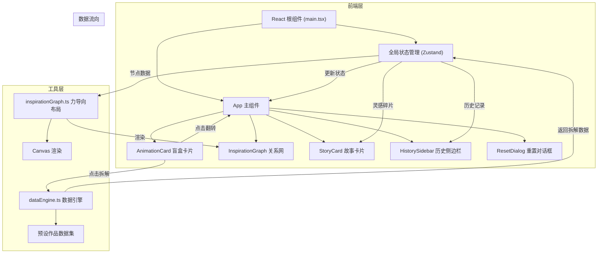

## 1. 架构设计



## 2. 技术描述

- **前端框架**：React 18 + TypeScript
- **构建工具**：Vite 5 + @vitejs/plugin-react
- **状态管理**：Zustand
- **动画库**：framer-motion
- **图表库**：recharts（备用，关系网使用自定义Canvas实现）
- **样式方案**：CSS-in-JS with framer-motion + 原生CSS
- **图标**：lucide-react

## 3. 项目结构与依赖

### 3.1 文件结构

```
auto141/
├── package.json              # 项目依赖与脚本
├── index.html                # 入口HTML
├── vite.config.js            # Vite构建配置
├── tsconfig.json             # TypeScript配置（严格模式）
└── src/
    ├── main.tsx              # React根渲染入口
    ├── App.tsx               # 主应用组件
    ├── store/
    │   └── useStore.ts       # Zustand全局状态管理
    ├── components/
    │   ├── AnimationCard.tsx    # 盲盒卡片组件
    │   ├── InspirationGraph.tsx # 灵感关系网组件
    │   ├── StoryCard.tsx        # 创作故事卡片
    │   ├── HistorySidebar.tsx   # 历史记录侧边栏
    │   ├── ResetDialog.tsx      # 重置确认对话框
    │   └── ParticleEffect.tsx   # 拆解粒子特效
    └── utils/
        ├── dataEngine.ts      # 数据引擎（随机抽取、拆解解析）
        └── inspirationGraph.ts # 力导向布局与Canvas渲染
```

### 3.2 文件调用关系

```
main.tsx → App.tsx → useStore.ts
                   ↓
    ┌────────────┼────────────┐
    ↓            ↓            ↓
AnimationCard  StoryCard  InspirationGraph
    ↓            ↓            ↑
dataEngine.ts  useStore.ts  inspirationGraph.ts
    ↑
预设作品数据集 (内置mock数据)
```

### 3.3 数据流向

1. **用户点击盲盒**：AnimationCard → 触发翻转动画 → 显示拆解按钮
2. **点击拆解**：AnimationCard → 调用dataEngine.randomPick() → 返回作品数据 → 更新store
3. **状态更新**：store → 触发StoryCard滑入、InspirationGraph添加节点
4. **关系网渲染**：InspirationGraph → 调用inspirationGraph.forceLayout() → Canvas绘制
5. **历史记录**：store.history → HistorySidebar展示
6. **重新连接**：HistorySidebar → 调用dataEngine.extractNodes() → 更新store.nodes
7. **重置操作**：ResetDialog → 调用store.reset() → 所有状态清空

## 4. 数据模型

### 4.1 TypeScript类型定义

```typescript
// 作品数据类型
interface Artwork {
  id: string;
  title: string;
  artist: string;
  thumbnail: string;
  coverColor: string;
  sketchElements: {
    theme: string[];
    colors: string[];
    emotions: string[];
    inspiration: string[];
  };
}

// 灵感碎片类型
type FragmentType = 'inspiration' | 'emotion' | 'theme';

interface InspirationFragment {
  id: string;
  type: FragmentType;
  content: string;
  color: string;
}

// 关系网节点类型
interface GraphNode {
  id: string;
  name: string;
  type: FragmentType;
  relevance: number; // 0-100, 决定节点大小
  x: number;
  y: number;
  vx: number;
  vy: number;
  color: string;
  isNew: boolean;
  isDragging: boolean;
}

// 关系网连线类型
interface GraphEdge {
  id: string;
  source: string;
  target: string;
  similarity: number; // 0-100, 决定连线颜色
}

// 历史记录类型
interface HistoryRecord {
  id: string;
  artworkId: string;
  artworkTitle: string;
  thumbnail: string;
  timestamp: number;
  fragments: InspirationFragment[];
}

// 全局状态类型
interface AppState {
  isCardFlipped: boolean;
  currentArtwork: Artwork | null;
  currentFragments: InspirationFragment[];
  showStoryCard: boolean;
  graphNodes: GraphNode[];
  graphEdges: GraphEdge[];
  history: HistoryRecord[];
  showHistory: boolean;
  showResetDialog: boolean;
  isTransitioning: boolean;
  particlePosition: { x: number; y: number } | null;
}
```

### 4.2 预设作品数据

内置10组作品mock数据，包含：
- 作品ID、标题、艺术家
- 缩略图（使用渐变色占位）
- 草图元素：主题、颜色、情绪、灵感源
- 每种元素3-5个标签，用于拆解后生成灵感碎片

## 5. 核心技术实现要点

### 5.1 数据引擎 (dataEngine.ts)

```typescript
// 核心方法
- randomPick(): Artwork | null  // 从10组预设中随机抽取
- parseFragments(artwork: Artwork): InspirationFragment[]  // 解析3个灵感碎片
- extractNodes(fragments: InspirationFragment[]): Partial<GraphNode>[]  // 生成关系网节点
- calculateSimilarity(node1: GraphNode, node2: GraphNode): number  // 计算主题相似性
```

### 5.2 力导向布局 (inspirationGraph.ts)

```typescript
// 核心算法
- forceLayout(nodes, edges, iterations): void  // 力导向模拟
- applyRepulsion(nodes): void  // 节点间斥力
- applyAttraction(edges): void  // 连线间引力
- applyCenter(nodes): void  // 中心吸引力
- integrate(nodes, dt): void  // 积分更新位置
- render(ctx, nodes, edges): void  // Canvas渲染

// 交互处理
- handleMouseDown(): void  // 开始拖拽
- handleMouseMove(): void  // 拖拽中
- handleMouseUp(): void  // 结束拖拽，弹性回弹
```

### 5.3 性能优化

- 关系网Canvas使用requestAnimationFrame渲染
- 力导向计算限制在30节点内，每帧不超过16ms
- 使用Object.freeze冻结预设数据
- React.memo优化子组件重渲染
- framer-motion使用will-change提示GPU加速

## 6. 性能指标

| 指标 | 目标值 |
|------|--------|
| 卡面翻转动画帧率 | ≥50FPS |
| 拆解粒子动画帧率 | ≥50FPS |
| 关系网30节点交互响应 | ≤16ms |
| 历史侧边栏切换延迟 | 无感知 |
| 首屏加载时间 | ≤2s |
