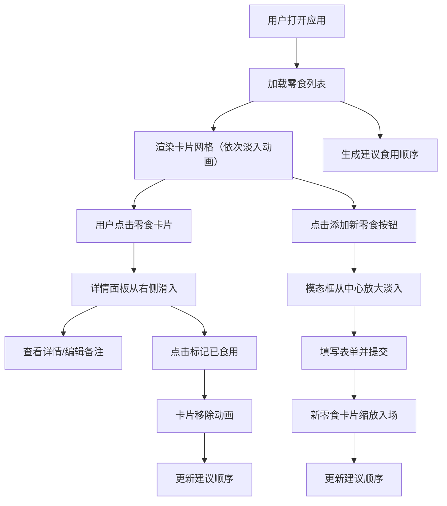

## 1. 产品概述
个人云端零食库存管理与过期预警工具，帮助用户管理家中囤放的零食，自动计算保质期剩余天数，通过视觉警示提醒用户临期和过期零食，并生成建议食用顺序，减少食物浪费。

- **目标用户**：喜欢囤零食、经常忘记保质期导致食物浪费的家庭用户
- **核心价值**：可视化管理零食库存，智能提醒临期食品，优化食用顺序
- **产品定位**：温馨、实用的个人零食仓库管理工具

## 2. 核心功能

### 2.1 用户角色
| 角色 | 注册方式 | 核心权限 |
|------|----------|----------|
| 普通用户 | 无需注册，本地存储 | 添加、查看、编辑、删除零食，查看建议食用顺序 |

### 2.2 功能模块
1. **首页**：零食卡片网格展示、导航栏、建议食用顺序悬浮面板、添加新零食按钮
2. **详情面板**：零食详细信息展示、圆形进度条、备注编辑、标记已食用
3. **添加模态框**：零食信息录入表单、表单验证、提交保存

### 2.3 页面详情
| 页面名称 | 模块名称 | 功能描述 |
|----------|----------|----------|
| 首页 | 零食卡片网格 | 以卡片形式展示所有零食，支持点击查看详情，卡片依次淡入动画 |
| 首页 | 建议食用顺序面板 | 按剩余保质期从小到大展示3种最需优先食用的零食，点击高亮对应卡片 |
| 首页 | 添加新零食按钮 | 底部浮动按钮，脉冲动画，点击弹出添加模态框 |
| 详情面板 | 圆形进度条 | 可视化展示剩余保质期天数，不同天数显示不同颜色 |
| 详情面板 | 标记已食用 | 点击后零食从网格中移除，带动画效果 |
| 添加模态框 | 表单录入 | 包含零食名称、类别、购买日期、保质期截止日、备注字段 |

## 3. 核心流程
用户打开应用 → 查看零食卡片网格和建议食用顺序 → 点击卡片查看详情 → 可标记已食用或添加新零食 → 系统自动计算剩余保质期并更新建议顺序

## 4. 用户界面设计

### 4.1 设计风格
- **主色调**：米白色背景 #FDF5E6，深棕色导航栏 #4A2F1A，紫色主题色 #6C5CE7
- **类别标签色**：薯片类 #FF7675、巧克力类 #74B9FF、饮料类 #55E6C1、坚果类 #FDCB6E
- **进度条颜色**：>30天绿色 #00B894，7-30天橙色 #FDCB6E，<7天红色 #FF7675
- **按钮风格**：渐变背景 #6C5CE7 → #A29BFE，圆角8px，悬停上移2px
- **字体**：使用现代无衬线字体，标题加粗，正文清晰易读
- **布局风格**：卡片式网格布局，固定宽度900px中央展示
- **图标风格**：简洁线性图标，使用lucide-react图标库

### 4.2 页面设计概述
| 页面名称 | 模块名称 | UI元素 |
|----------|----------|--------|
| 首页 | 导航栏 | 高60px，深棕色 #4A2F1A，白色文字，0.3s背景色过渡 |
| 首页 | 零食卡片 | 宽200px高280px，圆角12px，白色背景带浅灰阴影，悬停上移4px阴影加深 |
| 首页 | 类别标签 | 宽44px高20px，圆角6px，10px白色加粗字体，彩色背景 |
| 首页 | 建议悬浮面板 | 宽240px，磨砂玻璃效果，圆角16px，2px白边，距右边缘20px固定 |
| 详情面板 | 圆形进度条 | 直径80px，圆环颜色根据剩余天数变化，数字居中 |
| 添加模态框 | 表单字段 | 输入框、下拉菜单、日期选择器、文本域，统一圆角和阴影 |
| 添加模态框 | 提交按钮 | 宽200px，渐变背景，圆角8px，悬停上移2px |

### 4.3 响应式设计
- **桌面端（>768px）**：卡片网格多列布局，右侧固定悬浮建议面板
- **平板端（≤768px）**：卡片网格2列，建议面板改为底部固定横向滑动条
- **移动端（≤480px）**：卡片网格1列，底部固定建议滑动条

### 4.4 动画效果
- 卡片入场：依次从左到右淡入并轻微上移，间隔0.1秒
- 详情面板：右侧滑入，0.35秒 cubic-bezier(0.25, 0.46, 0.45, 0.94)
- 模态框：中心放大淡入0.3秒
- 按钮点击：缩放0.95，光效掠过
- 卡片高亮：金色边框 #F9CA24，闪烁两次，每次0.5秒
- 浮动按钮：脉冲动画，缩放1.0→1.1→1.0，周期2秒无限循环

## 5. 性能要求
- 所有动画帧率稳定在55fps以上
- 使用CSS GPU加速属性（transform、opacity）
- 添加新零食时重渲染时间不超过20ms
- 使用framer-motion动画库优化性能
