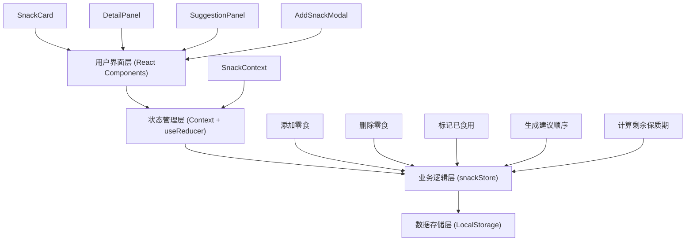
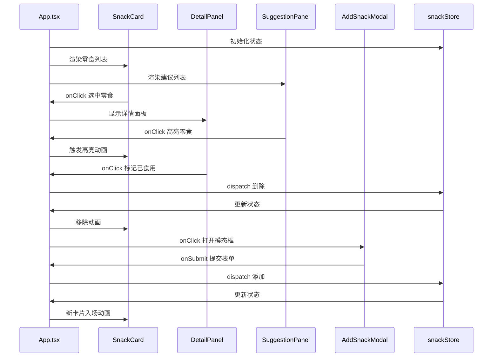

## 1. 架构设计



## 2. 技术描述
- **前端框架**：React 18 + TypeScript
- **构建工具**：Vite 5
- **动画库**：framer-motion
- **路由**：react-router-dom
- **唯一ID生成**：uuid
- **状态管理**：React Context + useReducer
- **数据持久化**：LocalStorage

## 3. 目录结构
```
auto143/
├── src/
│   ├── components/
│   │   ├── SnackCard.tsx       # 零食卡片组件
│   │   ├── DetailPanel.tsx     # 详情面板组件
│   │   ├── SuggestionPanel.tsx # 建议食用顺序面板
│   │   └── AddSnackModal.tsx   # 添加新零食模态框
│   ├── store/
│   │   └── snackStore.ts       # 零食状态管理
│   ├── App.tsx                 # 应用主组件
│   └── main.tsx                # 应用入口
├── index.html                  # 入口HTML
├── vite.config.ts              # Vite配置
├── tsconfig.json               # TypeScript配置
└── package.json                # 项目依赖
```

## 4. 数据模型

### 4.1 数据类型定义
```typescript
enum SnackCategory {
  CHIPS = 'chips',        // 薯片类
  CHOCOLATE = 'chocolate', // 巧克力类
  DRINK = 'drink',        // 饮料类
  NUTS = 'nuts',          // 坚果类
}

interface Snack {
  id: string;
  name: string;
  category: SnackCategory;
  purchaseDate: string;   // ISO date string
  expiryDate: string;     // ISO date string
  notes: string;
  createdAt: number;
}

interface SnackState {
  snacks: Snack[];
  selectedSnackId: string | null;
  isModalOpen: boolean;
  highlightedSnackId: string | null;
}

type SnackAction =
  | { type: 'ADD_SNACK'; payload: Omit<Snack, 'id' | 'createdAt'> }
  | { type: 'DELETE_SNACK'; payload: string }
  | { type: 'MARK_AS_EATEN'; payload: string }
  | { type: 'SELECT_SNACK'; payload: string | null }
  | { type: 'TOGGLE_MODAL'; payload: boolean }
  | { type: 'HIGHLIGHT_SNACK'; payload: string | null }
  | { type: 'UPDATE_NOTES'; payload: { id: string; notes: string } };
```

## 5. 核心功能实现

### 5.1 剩余保质期计算
```typescript
function calculateRemainingDays(expiryDate: string): number {
  const today = new Date();
  today.setHours(0, 0, 0, 0);
  const expiry = new Date(expiryDate);
  expiry.setHours(0, 0, 0, 0);
  const diffTime = expiry.getTime() - today.getTime();
  const diffDays = Math.ceil(diffTime / (1000 * 60 * 60 * 24));
  return diffDays;
}
```

### 5.2 进度条颜色判断
```typescript
function getProgressColor(days: number): string {
  if (days > 30) return '#00B894';  // 绿色
  if (days >= 7) return '#FDCB6E';   // 橙色
  return '#FF7675';                   // 红色
}
```

### 5.3 建议食用顺序生成
```typescript
function getSuggestedSnacks(snacks: Snack[], limit: number = 3): Snack[] {
  return [...snacks]
    .sort((a, b) => {
      const daysA = calculateRemainingDays(a.expiryDate);
      const daysB = calculateRemainingDays(b.expiryDate);
      return daysA - daysB;
    })
    .slice(0, limit);
}
```

## 6. 性能优化策略

### 6.1 动画性能
- 使用 `framer-motion` 的硬件加速属性（`transform`、`opacity`）
- 为动画元素添加 `will-change: transform` 提示
- 使用 `layout` 动画时启用 `positionTransition`

### 6.2 渲染性能
- 使用 `React.memo` 优化列表项组件
- 使用 `useMemo` 缓存计算结果（建议食用顺序、剩余天数）
- 使用 `useCallback` 缓存事件处理函数
- 避免在渲染过程中创建新对象或数组

### 6.3 动画帧率保证
- 所有动画使用 CSS transitions 或 framer-motion
- 避免在动画期间执行昂贵的计算
- 使用 `requestAnimationFrame` 进行手动动画控制

## 7. 状态管理设计

### 7.1 Context 结构
```typescript
interface SnackContextType {
  state: SnackState;
  dispatch: React.Dispatch<SnackAction>;
  getSuggestedSnacks: () => Snack[];
  calculateRemainingDays: (expiryDate: string) => number;
  getProgressColor: (days: number) => string;
  getCategoryColor: (category: SnackCategory) => string;
  getCategoryLabel: (category: SnackCategory) => string;
}
```

### 7.2 Reducer 处理
- 添加零食：生成唯一ID，加入列表
- 删除零食：根据ID移除
- 标记已食用：同删除操作（可扩展为归档）
- 选择零食：设置选中ID，触发详情面板
- 高亮零食：设置高亮ID，触发闪烁动画

## 8. 组件通信


