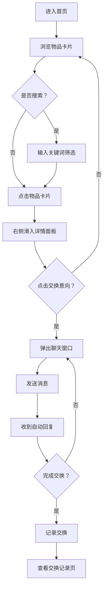

## 1. 产品概述
微型二手物品以物易物交换集市应用，让用户能发布闲置物品信息并浏览他人发布的物品，通过弹窗聊天实现即时交换意向沟通，最后完成交换记录统计。

- 主要目的：构建一个简洁易用的物品交换平台，促进闲置资源流通
- 目标用户：有闲置物品并希望通过以物易物方式获取所需物品的用户
- 产品价值：提供零成本、便捷的物品交换渠道，减少浪费，促进社区共享

## 2. 核心功能

### 2.1 用户角色
| 角色 | 注册方式 | 核心权限 |
|------|----------|----------|
| 普通用户 | 无需注册（模拟） | 发布物品、浏览物品、发起交换意向、查看交换记录 |

### 2.2 功能模块
1. **物品展示页面**：物品卡片网格、搜索筛选、分类标签
2. **物品发布表单**：弹窗表单、字段验证、提交保存
3. **物品详情面板**：侧边滑入、物品信息展示、发布者信息
4. **聊天弹窗**：即时消息、模拟自动回复、消息气泡
5. **交换记录页面**：统计卡片、交换列表、状态标签

### 2.3 页面详情
| 页面名称 | 模块名称 | 功能描述 |
|----------|----------|----------|
| 物品展示页 | 导航栏 | Logo、搜索框、交换记录入口、发布按钮 |
| 物品展示页 | 物品卡片网格 | 展示所有物品卡片，响应式布局 |
| 物品展示页 | 物品详情面板 | 右侧滑入展示物品详情和交换按钮 |
| 物品展示页 | 发布表单弹窗 | 填写新物品信息并提交 |
| 物品展示页 | 聊天弹窗 | 与物品发布者沟通交换意向 |
| 交换记录页 | 统计卡片 | 展示发布数、成功数、进行中数 |
| 交换记录页 | 交换列表 | 按时间倒序展示所有交换记录 |

## 3. 核心流程
用户主要流程：浏览物品 → 搜索/筛选 → 查看详情 → 发起交换意向 → 聊天沟通 → 完成交换 → 查看记录

## 4. 用户界面设计

### 4.1 设计风格
- 主色调：紫色 #6C63FF、粉色 #FF6584（渐变色点缀）
- 背景色：浅灰 #FAFAFA
- 卡片：白色背景 #FFFFFF，圆角 12px，细腻阴影
- 按钮样式：圆角按钮，渐变背景，点击缩放回弹动画
- 字体：现代无衬线字体，清晰的层级关系
- 布局风格：卡片式网格布局，顶部导航栏
- 动画效果：framer-motion 过渡动画（0.2-0.4s）

### 4.2 页面设计概述
| 页面名称 | 模块名称 | UI 元素 |
|----------|----------|---------|
| 物品展示页 | 导航栏 | Logo、搜索框（聚焦渐变边框）、交换记录图标、绿色发布按钮 |
| 物品展示页 | 物品卡片 | 图片、类别标签（彩色）、发布时间（相对时间）、悬停上移动画 |
| 物品展示页 | 详情面板 | 大图、描述、发布者头像昵称、渐变交换按钮 |
| 物品展示页 | 聊天弹窗 | 顶部用户信息、消息气泡区（左右分栏）、输入框和发送按钮 |
| 交换记录页 | 统计卡片 | 三个并排卡片，渐变色数字 |
| 交换记录页 | 交换列表 | 隔行变色，悬停高亮，状态标签 |

### 4.3 响应式设计
- 桌面端（>768px）：物品卡片网格最多 4 列
- 移动端（≤768px）：单列布局，卡片宽度自适应，导航栏收缩为汉堡菜单
- 触摸优化：按钮点击区域 ≥ 44px，适当间距

### 4.4 动画规范
- 卡片悬停：阴影加深 + 上移 -4px，0.3s ease-out
- 详情面板：右侧滑入，0.4s cubic-bezier(0.4, 0, 0.2, 1)
- 聊天弹窗：缩放 0.8 → 1.0，0.3s ease-out
- 按钮点击：缩放 0.95 回弹，0.15s
- 输入框聚焦：边框渐变过渡 0.3s
