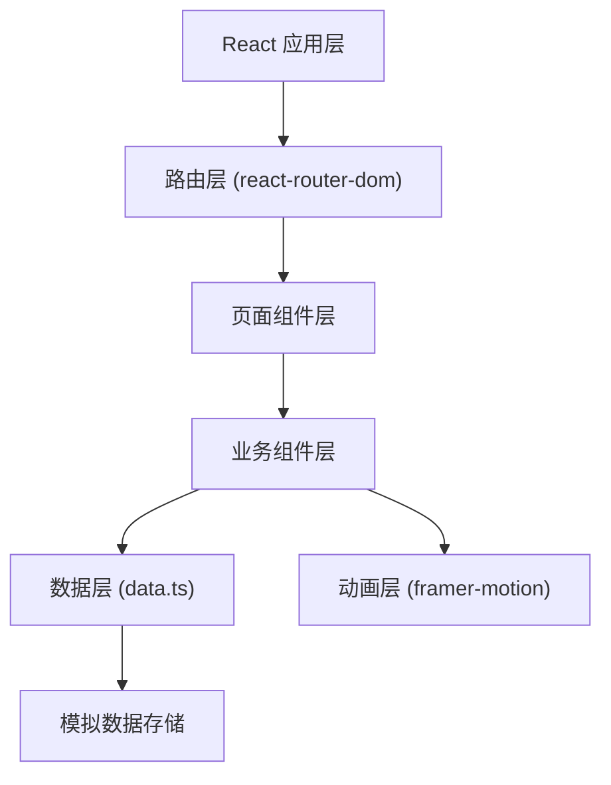
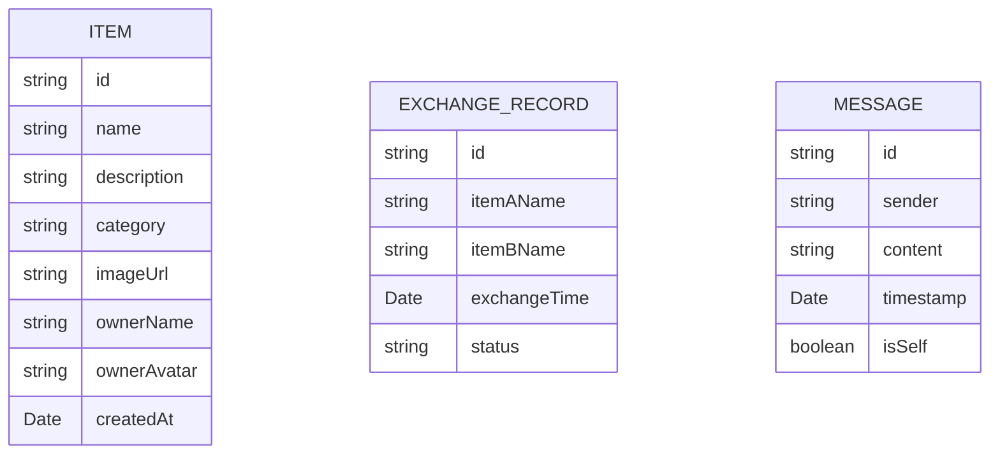

## 1. 架构设计



## 2. 技术描述
- 前端框架：React@18 + TypeScript
- 构建工具：Vite@5 + @vitejs/plugin-react
- 路由：react-router-dom@6
- 动画：framer-motion@11
- 数据管理：本地模拟数据 (data.ts)，组件间 props 传递
- 样式方案：内联样式 + CSS（style 标签）

## 3. 路由定义
| 路由 | 用途 |
|------|------|
| / | 首页（物品展示、发布、详情、聊天） |
| /records | 交换记录统计页面 |

## 4. 数据模型

### 4.1 数据模型定义



### 4.2 类型定义

```typescript
type Category = '电子产品' | '书籍' | '家居' | '服饰' | '其他';

interface Item {
  id: string;
  name: string;
  description: string;
  category: Category;
  imageUrl: string;
  ownerName: string;
  ownerAvatar: string;
  createdAt: Date;
}

interface ExchangeRecord {
  id: string;
  itemAName: string;
  itemBName: string;
  exchangeTime: Date;
  status: '已完成' | '进行中';
}

interface Message {
  id: string;
  sender: string;
  content: string;
  timestamp: Date;
  isSelf: boolean;
}
```

## 5. 项目文件结构

```
d:\Pro\tasks\auto146
├── package.json
├── index.html
├── vite.config.js
├── tsconfig.json
└── src
    ├── main.tsx          # 应用入口
    ├── App.tsx           # 主布局、路由、导航栏
    ├── data.ts           # 模拟数据源
    └── components
        ├── ItemList.tsx      # 物品卡片网格
        ├── ItemForm.tsx      # 发布物品表单
        └── ChatPanel.tsx     # 聊天弹窗
```

## 6. 组件通信设计

- 数据流向：`data.ts` → `App.tsx` → 子组件
- 状态提升：物品列表、交换记录等共享状态维护在 App.tsx
- 回调模式：子组件通过 props 回调函数更新父组件状态
- 本地状态：表单输入、聊天消息等组件内部状态使用 useState

## 7. 性能优化策略

- 搜索防抖：300ms 延迟过滤，避免频繁计算
- 列表渲染：合理使用 React key，避免不必要重渲染
- 动画性能：优先使用 transform 和 opacity 动画
- 响应式图片：使用合适尺寸图片，懒加载（可选）
