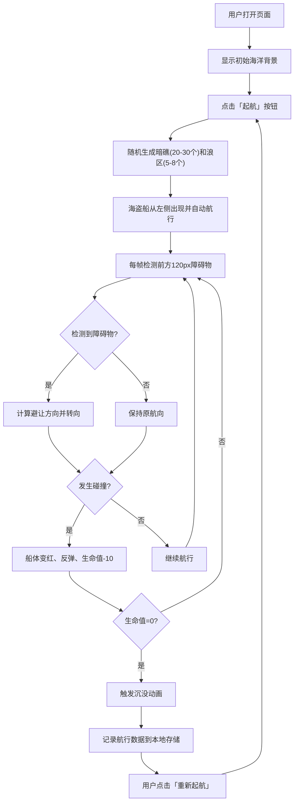

## 1. 产品概述

一个基于 TypeScript 和原生 Canvas 的 2D 海盗船避障游戏，模拟海盗船在海面上自动航行并智能避开暗礁和浪区障碍物。

- 主要目的：验证在缺少完整物理引擎场景下，实时碰撞检测与路径规划算法的协同工作效果
- 目标用户：算法验证人员、游戏开发者、对路径规划与碰撞检测研究者

## 2. 核心功能

### 2.1 功能模块

1. **海面与障碍物生成模块**：随机生成暗礁（不规则多边形）和动态浪区（椭圆形浮动动画）
2. **自动避障与航向调整模块**：视线检测障碍物、自动转向避让、浪区倾斜减速效果
3. **碰撞与状态反馈模块**：碰撞检测、生命值系统、沉没动画
4. **航行距离与计分模块**：实时航行距离统计、生命值进度条
5. **历史最佳记录模块**：本地存储历史最佳记录、右侧面板展示

### 2.2 页面详情

| 页面名称 | 模块名称 | 功能描述 |
|-----------|-------------|---------------------|
| 游戏主页面 | 海面渲染区域 | 800x600 Canvas 海面，包含暗礁、浪区、海盗船实时渲染 |
| 游戏主页面 | 顶部状态栏 | 显示航行距离（米）、生命值进度条 |
| 游戏主页面 | 控制按钮 | 「起航」/「重新起航」按钮，控制游戏开始与重置 |
| 游戏主页面 | 右侧历史记录面板 | 展示最近5次航行最佳距离和生命值，浅灰色背景 |
| 游戏主页面 | 游戏结束模块 | 船体沉没动画、结束状态展示 |

## 3. 核心流程

用户打开页面 → 看到深蓝色渐变海洋背景和初始画面 → 点击「起航」按钮 → 随机生成暗礁和浪区 → 海盗船从左侧出现开始航行 → 实时检测前方障碍物 → 自动转向避让 → 与障碍物碰撞时扣减生命值 → 生命值归零触发沉没动画 → 记录本次航行数据 → 用户点击「重新起航」重置游戏。

## 4. 用户界面设计

### 4.1 设计风格

- **主色调**：深蓝色渐变 #0D47A1 → #1A237E（海洋主题）
- **辅助色**：暗礁 #5D4037（棕色）、船体 #8D6E63（浅棕）、生命条 #4CAF50 / #FFC107 / #F44336
- **按钮风格**：深灰色 #37474F 背景，白色文字，圆角6px，悬停变浅 #546E7A 并上移2px，0.2s 过渡
- **字体**：现代无衬线字体，14px 主文字
- **布局风格**：海面区域居中，右侧历史面板，顶部状态栏
- **动画**：浪区1.5秒周期左右漂移，暗礁0.3秒淡入，船体0.2秒平滑旋转

### 4.2 页面设计概述

| 页面名称 | 模块名称 | UI 元素 |
|-----------|-------------|-------------|
| 游戏主页面 | 海面区域 | 800x600 Canvas，#B0BEC5 1px边框，4px圆角，居中显示 |
| 游戏主页面 | 顶部状态栏 | 航行距离文字（左）、生命值进度条（右） |
| 游戏主页面 | 控制按钮 | 「起航」按钮，统一按钮风格 |
| 游戏主页面 | 历史记录面板 | 右侧 200px宽，#F5F5F5背景，圆角8px，列表项交替背景色 |
| 游戏主页面 | 碰撞计数 | 右上角显示碰撞次数 |

### 4.3 响应式设计

- 桌面端（≥768px）：海面区域居中800x600，右侧历史面板 200px宽
- 移动端（<768px）：右侧历史面板移至底部，海面区域宽度自适应
