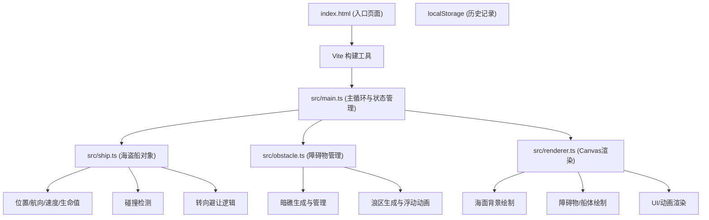

## 1. 架构设计



## 2. 技术描述

- **前端框架**：TypeScript@5 + Vite@5
- **渲染技术**：原生 HTML5 Canvas 2D API
- **构建工具**：Vite@5
- **数据存储**：浏览器 localStorage（历史记录持久化）
- **无后端**：纯前端应用，不依赖后端服务
- **性能目标**：60FPS 稳定运行，每帧碰撞检测 ≤ 2ms

## 3. 文件结构

| 文件路径 | 用途 |
|-------|---------|
| /package.json | 项目依赖配置（vite、typescript、@types/node） |
| /index.html | 入口 HTML 页面 |
| /vite.config.js | Vite 构建配置 |
| /tsconfig.json | TypeScript 严格模式配置（target ES2020） |
| /src/main.ts | 主循环、游戏状态管理、帧更新驱动 |
| /src/ship.ts | 海盗船类（位置、航向、速度、生命值、碰撞、转向） |
| /src/obstacle.ts | 暗礁和浪区障碍物类、生成逻辑、碰撞辅助 |
| /src/renderer.ts | Canvas 绘图模块（背景、障碍物、船体、UI、动画） |

## 4. 核心数据模型

### 4.1 游戏状态类型定义

```typescript
type GameState = 'idle' | 'playing' | 'gameover';

interface Ship {
  x: number;          // X坐标
  y: number;          // Y坐标
  heading: number;    // 航向角度（弧度）
  speed: number;     // 当前速度 px/s
  health: number;    // 生命值 0-100
  isHit: boolean;   // 是否正在碰撞闪烁
  hitTimer: number; // 碰撞闪烁计时器
  tiltAngle: number;  // 浪区倾斜角度
  tiltTimer: number; // 倾斜计时器
  slowTimer: number;  // 浪区减速计时器
  turning: boolean;  // 是否正在转向
  turnDirection: number; // 转向方向 -1左 1右
  turnAngleRemaining: number; // 剩余转向角度
  turnDuration: number; // 转向持续时间
}

interface Reef {
  id: number;
  x: number;
  y: number;
  points: { x: number; y: number }[]; // 多边形顶点
  opacity: number;  // 淡入透明度
}

interface WaveZone {
  id: number;
  x: number;
  y: number;
  a: number;     // 长轴半径
  b: number;     // 短轴半径
  phase: number; // 浮动相位
  speed: number; // 浮动速度
}

interface GameRecord {
  distance: number; // 航行距离（米）
  health: number;   // 剩余生命值
  timestamp: number;  // 记录时间
}
```

### 4.2 核心算法

- **视线碰撞检测**：每帧检测船体前方 120px 扇形区域内障碍物
- **转向策略**：检测左右两侧安全距离，选择更安全方向转向 5-15 度
- **船体与暗礁碰撞**：点到多边形最短距离 < 20px 判定碰撞
- **船体与浪区碰撞**：点是否在椭圆内判定进入浪区
- **避让回归**：避让完成后每帧逐渐回归原航向（朝右）

## 5. 性能优化策略

- **空间分区**：使用简单网格分区优化障碍物查询（可选）
- **距离缓存**：避免重复计算同一帧内相同距离
- **Canvas 分层渲染**：背景静态层 + 动态对象层分离
- **requestAnimationFrame**：使用浏览器原生动画帧驱动
- **碰撞检测优化**：只检测前方范围内的障碍物
