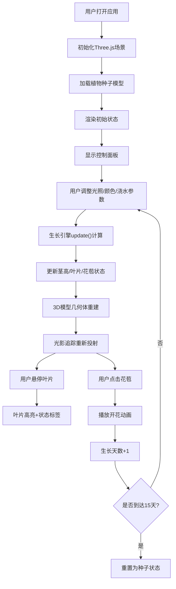

## 1. 产品概述

微型室内植物生长模拟与光影追踪可视化应用，通过3D建模和实时模拟让用户观察植物在不同光照、水分条件下的完整生长周期。

- 主要用途：教育娱乐、植物生长可视化演示，目标用户为植物爱好者、学生和教育工作者
- 核心价值：将抽象的植物生长过程具象化，通过交互式3D体验增强用户对植物生长规律的理解

## 2. 核心功能

### 2.1 用户角色
| 角色 | 注册方式 | 核心权限 |
|------|----------|----------|
| 普通用户 | 无需注册 | 调整参数、观看模拟、交互操作 |

### 2.2 功能模块
1. **主3D场景页面**：植物3D模型展示、动态光影效果、圆形光影网格平面
2. **控制面板模块**：光照强度滑块、光谱颜色滑块、浇水频率滑块、生长周期进度条、生长阶段信息
3. **交互反馈模块**：叶片悬停高亮、状态标签、花苞点击动画、状态切换过渡

### 2.3 页面详情
| 页面名称 | 模块名称 | 功能描述 |
|----------|----------|----------|
| 主3D场景页面 | 植物3D渲染 | 茎杆高度动态变化、叶片数量动态生成、花苞状态切换、软阴影投射 |
| 主3D场景页面 | 光影追踪系统 | 点光源模拟日照、聚光灯补光、软阴影实时计算、光照角度控制 |
| 主3D场景页面 | 圆形光影网格 | 同心圆+径向线构成、实时接收植物投影、半径80单位 |
| 控制面板 | 参数调控 | 光照强度(0-100)、光谱颜色(冷白→暖黄渐变)、浇水频率(0-100) |
| 控制面板 | 周期展示 | 15天生长周期进度条、当前阶段文字显示、天数计数 |
| 交互模块 | 悬停反馈 | 叶片高亮(+30%亮度)、状态标签(健康/缺光/水涝) |
| 交互模块 | 点击交互 | 花苞开花动画(1秒ease-out)、浇水天数累加 |

## 3. 核心流程

用户打开应用 → 初始化3D场景与植物种子状态 → 用户通过控制面板调整参数 → 生长引擎实时计算植物状态 → 3D渲染模块更新模型形态 → 光影系统实时投射阴影 → 用户悬停/点击交互 → 植物经历完整15天生长周期 → 重置为种子状态循环

## 4. 用户界面设计

### 4.1 设计风格
- **主色调**：深森林绿 #1B3A2D → 深棕色 #2D1B14 径向渐变背景
- **强调色**：荧光绿 #7FFF00（滑块、进度条激活态）
- **辅助色**：冷白 #FFFFFF、暖黄 #FFD700（光谱渐变）
- **边框**：2px白色细边框、圆角12px（控制面板）、圆角6px（滑块）
- **字体**：系统默认无衬线字体，标签文字14px白色
- **整体风格**：暗色森林主题、半透明玻璃质感、沉浸式3D体验

### 4.2 页面设计概览
| 页面名称 | 模块名称 | UI元素 |
|----------|----------|--------|
| 主页面 | 3D画布区域 | 全屏100%宽、80%高、深绿→深棕径向渐变背景、圆形光影网格平面、植物3D模型居中 |
| 主页面 | 控制面板(桌面端) | 固定右下角(右20px底20px)、320×360px、半透明深色背景rgba(20,20,20,0.85)、白色细边框、圆角12px |
| 主页面 | 控制面板(移动端) | 底部全宽横条、自适应高度、展开/折叠按钮、点击后展开完整面板 |
| 主页面 | 滑块控件 | 统一圆角6px、高度6px、轨道#4A4A4A、滑块#7FFF00、标签14px白色 |
| 主页面 | 光谱颜色滑块 | 背景为#FFFFFF→#FFD700线性渐变带 |
| 主页面 | 生长周期进度条 | 顶部位置、绿色→红色渐变填充、实时更新百分比 |
| 主页面 | 动画过渡 | 0.5秒ease-out缓动（茎高变化、叶片展开）、1秒ease-out（花苞开放） |

### 4.3 响应式设计
- **设计策略**：桌面优先、移动端自适应
- **断点**：768px宽度以下触发移动端布局
- **桌面端**：控制面板固定右下角(320×360px)
- **移动端**：控制面板折叠为底部全宽横条，点击展开按钮展开为完整面板
- **触控优化**：滑块增大触控区域、交互元素尺寸≥44px

### 4.4 3D场景指引
- **环境与氛围**：暗色森林主题、深绿径向渐变营造神秘自然氛围
- **光照设置**：点光源模拟日照（可调整水平/垂直角度）、聚光灯补光增强阴影细节、环境光提供基础亮度
- **阴影设置**：PercentageCloserSoftShadowMap软阴影、阴影贴图尺寸1024×1024
- **相机设置**：PerspectiveCamera透视相机、初始距离15单位、OrbitControls轨道控制（允许旋转缩放）
- **构图与焦点**：植物位于圆形光影网格平面正中心、相机初始角度略微俯视(15度)
- **交互与动画**：轨道控制旋转缩放、叶片悬停高亮过渡0.2秒、花苞开放1秒ease-out、所有模型变化0.5秒ease-out
- **后处理效果**：基础渲染，无需额外后处理以保证性能
- **性能预算**：总三角形数≤2000、帧率≥30fps
