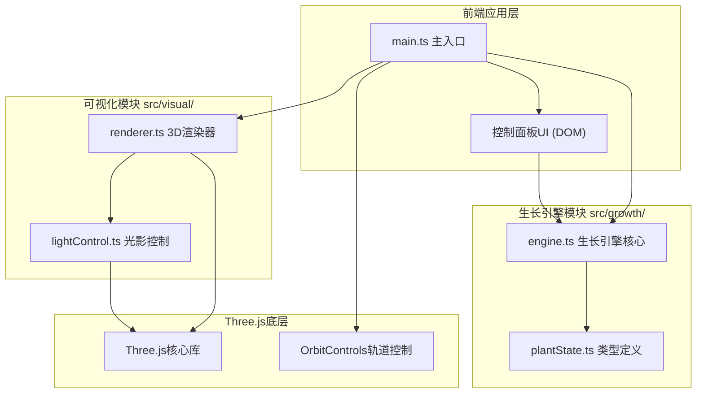
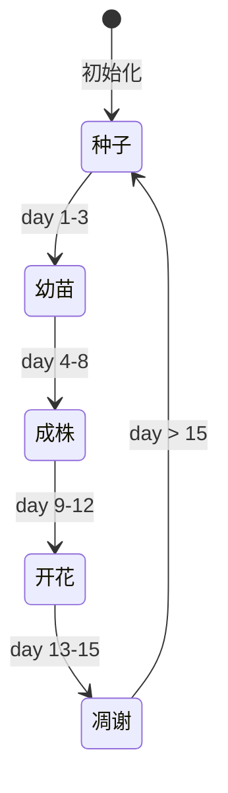

## 1. 架构设计



## 2. 技术说明

- **前端框架**：原生TypeScript + Three.js (无React/Vue，轻量高性能)
- **构建工具**：Vite 5.x（快速开发服务器、热更新、TypeScript支持）
- **核心3D库**：three@0.160+、@types/three
- **轨道控制**：three/examples/jsm/controls/OrbitControls
- **类型系统**：TypeScript 5.x 严格模式
- **样式方案**：内联CSS (index.html中style标签)，无需CSS预处理器
- **运行方式**：`npm install && npm run dev`

## 3. 目录结构

```
d:\Pro\tasks\auto149\
├── package.json
├── tsconfig.json
├── vite.config.js
├── index.html
├── .trae/
│   └── documents/
│       ├── PRD-植物生长模拟器.md
│       └── 技术架构-植物生长模拟器.md
└── src/
    ├── main.ts
    ├── growth/
    │   ├── plantState.ts
    │   └── engine.ts
    └── visual/
        ├── renderer.ts
        └── lightControl.ts
```

## 4. 模块职责与接口定义

### 4.1 生长引擎模块 src/growth/

#### plantState.ts - 类型定义
```typescript
// 植物状态接口
export interface IPlantState {
    stemHeight: number;      // 茎高 0.5-3.5
    leafCount: number;       // 叶片数量 0-12
    budState: number;        // 花苞状态 0-3 (0未开 1半开 2全开 3凋谢)
    growthDay: number;       // 生长天数 0-15
    isWilting: boolean;      // 是否枯萎(水>95)
    leafYellowing: boolean;  // 叶片是否发黄
}

// 环境参数
export interface IEnvironmentParams {
    lightIntensity: number;  // 光照强度 0-100
    lightColor: string;      // 光照颜色 (HEX)
    waterAmount: number;     // 浇水频率 0-100
}

// 生长阶段枚举
export enum GrowthStage {
    SEED = '种子',
    SEEDLING = '幼苗',
    ADULT = '成株',
    FLOWERING = '开花',
    WITHERING = '凋谢'
}
```

#### engine.ts - 生长引擎核心
```typescript
export class GrowthEngine {
    state: IPlantState;
    constructor();
    update(deltaTime: number, lightIntensity: number, waterAmount: number): void;
    reset(): void;
    getGrowthStage(): GrowthStage;
    getLeafStatus(): '健康' | '缺光' | '水涝';
}
```

### 4.2 可视化模块 src/visual/

#### lightControl.ts - 光影控制
```typescript
export class LightControl {
    constructor(scene: THREE.Scene, renderer: THREE.WebGLRenderer);
    setSunAngle(horizontalDeg: number, verticalDeg: number): void;
    setLightIntensity(intensity: number): void;
    setLightColor(color: string): void;
}
```

#### renderer.ts - 3D渲染器
```typescript
export class PlantRenderer {
    plantGroup: THREE.Group;
    constructor(scene: THREE.Scene);
    updatePlant(state: IPlantState): void;
    handleHover(intersects: THREE.Intersection[]): void;
    handleClick(intersects: THREE.Intersection[], callback: () => void): void;
    dispose(): void;
}
```

### 4.3 main.ts - 主入口
负责场景初始化、DOM控制面板创建、事件绑定、动画循环、Raycaster交互检测。

## 5. 数据模型

### 5.1 植物生命周期状态流转


### 5.2 生长算法逻辑
- **基础生长速度**：`baseRate = 0.1 * deltaTime`
- **光照修正**：lightIntensity < 20 → rate *= 0.5
- **水分修正**：waterAmount > 80 → 花苞开放加速30%；waterAmount > 95 → 茎叶发黄标志
- **茎高映射**：day 0→0.5, day 8→3.0, day 15→3.5
- **叶片数量映射**：day 0→0, day 3→2, day 8→8, day 12→12
- **花苞状态映射**：day 9→0, day 10→1, day 11→2, day 13→3

## 6. 性能优化策略

| 优化点 | 方案 |
|--------|------|
| 几何体复用 | 叶片/花瓣使用BufferGeometry.clone()共享顶点数据 |
| 材质复用 | 相同颜色/属性的Mesh共享Material实例 |
| 更新节流 | 滑块调整后0.3秒debounce再调用引擎update |
| 阴影优化 | 阴影贴图1024px，仅植物对象castShadow，仅地面receiveShadow |
| 多边形控制 | 圆柱8段、平面2×2、球体8×8，总三角形≤2000 |
| GPU提交 | 每帧仅更新变化的矩阵/ uniforms，避免全量重建 |

## 7. 依赖版本锁定

```json
{
  "three": "^0.160.0",
  "@types/three": "^0.160.0",
  "vite": "^5.0.0",
  "typescript": "^5.3.0",
  "@types/node": "^20.10.0"
}
```
