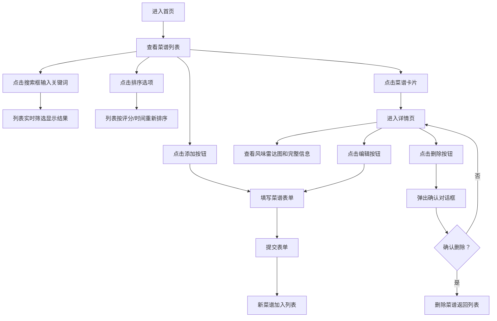

## 1. 产品概述

创意食谱管理与评分应用，专为美食博主设计，用于记录、评比和分享创意菜品。通过可视化的风味雷达图和营养分析，帮助博主复盘菜品效果，提升创作水平。

- 核心用户：美食博主、美食爱好者
- 核心价值：系统化记录创意菜品，可视化风味与营养分析，便捷的分享与复盘体验

## 2. 核心功能

### 2.1 功能模块

1. **首页（菜谱列表）**：搜索筛选、排序功能、菜谱卡片展示、添加菜谱入口
2. **菜谱详情页**：完整信息展示、风味雷达图、星级评分、食材列表、编辑/删除操作
3. **菜谱添加/编辑表单**：菜名、食材、烹饪时间、风味标签、整体评分录入

### 2.2 页面详情

| 页面名称 | 模块名称 | 功能描述 |
|-----------|-------------|---------------------|
| 首页 | 顶部导航栏 | 应用标题、添加菜谱按钮、毛玻璃效果固定定位 |
| 首页 | 搜索排序区 | 关键词搜索框、评分/时间排序选择器 |
| 首页 | 菜谱卡片列表 | 响应式网格布局、卡片悬停动画、淡入淡出筛选动画 |
| 菜谱详情页 | 标题区 | 大号菜名、可点击星级评分 |
| 菜谱详情页 | 风味雷达图 | 五维风味（酸/甜/苦/辣/咸）可视化展示，可编辑评分 |
| 菜谱详情页 | 信息区 | 食材列表、烹饪时间展示 |
| 菜谱详情页 | 操作区 | 编辑按钮、删除按钮（带确认对话框） |
| 表单弹窗 | 菜谱表单 | 菜名输入、食材输入（逗号分隔）、烹饪时间、风味标签多选、星级评分 |

## 3. 核心流程

## 4. 用户界面设计

### 4.1 设计风格

- **极简日式风格**：主色调米白（#F5F0EB）搭配深灰（#3A3A3A）
- **圆角统一**：卡片和按钮圆角12px
- **毛玻璃导航**：顶部导航栏背景模糊8px，半透明白色
- **动画过渡**：按钮悬停0.2s渐变，评分星级0.15s弹跳缩放，卡片筛选0.2s淡入淡出
- **图标风格**：使用 Lucide React 图标库，线性简洁风格

### 4.2 色彩系统

| 用途 | 颜色值 | 说明 |
|------|--------|------|
| 背景主色 | #F5F0EB | 米白色 |
| 文字主色 | #3A3A3A | 深灰色 |
| 卡片背景 | #FFFFFF | 白色 |
| 悬停状态 | #EDE8E3 | 浅灰色 |
| 辣风味 | #E74C3C | 红色 |
| 甜风味 | #FF6B9D | 粉色 |
| 酸风味 | #F39C12 | 橙色 |
| 苦风味 | #8B6914 | 棕色 |
| 咸风味 | #3498DB | 蓝色 |
| 星级评分 | #F1C40F | 金黄色 |

### 4.3 页面设计概览

| 页面名称 | 模块名称 | UI 元素 |
|-----------|-------------|-------------|
| 首页 | 顶部导航 | 毛玻璃效果、左对齐标题、右对齐添加按钮 |
| 首页 | 搜索排序区 | 搜索框带图标、下拉选择器、水平布局 |
| 首页 | 菜谱卡片网格 | 响应式2列/1列、首字母圆形图标、星级、烹饪时间 |
| 详情页 | 标题区 | 大号菜名字体、星级评分组件、右上角操作按钮 |
| 详情页 | 雷达图区 | 居中展示、五维风味标签、交互式编辑 |
| 详情页 | 信息区 | 食材标签列表、烹饪时间图标展示 |
| 表单弹窗 | 表单区 | 分组输入框、多选风味标签、星级评分、淡入蒙版背景 |

### 4.4 响应式设计

- **桌面端/平板（≥768px）**：卡片两列网格布局，间距24px
- **手机端（<768px）**：卡片单列布局，间距16px
- **导航栏**：始终固定顶部，自适应宽度
- **雷达图**：根据容器宽度自动调整尺寸
