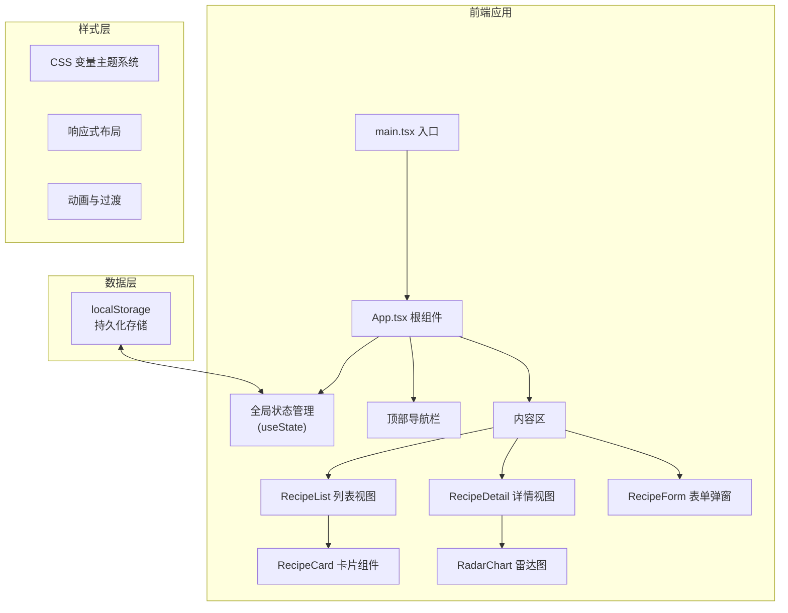

## 1. 架构设计



## 2. 技术选型说明

- **前端框架**：React 18 + TypeScript（严格模式）
- **构建工具**：Vite 5 + @vitejs/plugin-react
- **图表库**：Recharts（雷达图可视化）
- **样式方案**：原生 CSS（CSS 变量、Flexbox、Grid、动画）
- **状态管理**：React useState（轻量场景，无需额外状态库）
- **数据持久化**：localStorage（本地存储菜谱数据）
- **图标库**：Lucide React（符合极简风格的线性图标）

## 3. 组件层级与数据流

| 组件 | 职责 | Props 输入 | 数据输出 |
|------|------|------------|----------|
| App.tsx | 主布局、全局状态、路由切换 | - | recipes, selectedId, view, setRecipes, setSelectedId, setView |
| RecipeForm.tsx | 添加/编辑菜谱表单 | addRecipe / updateRecipe, editingRecipe, onClose | 提交新菜谱数据回调 |
| RecipeCard.tsx | 菜谱卡片展示 | recipe, onSelect, onDelete | 选中事件、删除事件 |
| RecipeDetail.tsx | 菜谱详情页 | recipeId, recipes, onBack, onEdit, onDelete | - |

## 4. 数据模型定义

```typescript
type FlavorType = 'sour' | 'sweet' | 'bitter' | 'spicy' | 'salty';

interface FlavorScores {
  sour: number;   // 0-10
  sweet: number;  // 0-10
  bitter: number; // 0-10
  spicy: number;  // 0-10
  salty: number;  // 0-10
}

interface Recipe {
  id: string;
  name: string;
  ingredients: string[];
  cookingTime: number; // 分钟
  flavors: FlavorType[];
  flavorScores: FlavorScores;
  rating: number; // 1-5
  createdAt: number;
  description?: string;
}

type SortOption = 'rating-desc' | 'rating-asc' | 'time-desc' | 'time-asc';
type ViewType = 'list' | 'detail';
```

## 5. 性能优化策略

### 5.1 列表渲染性能
- 使用 `React.memo` 包裹 RecipeCard 组件，避免不必要重渲染
- 搜索筛选使用 `useMemo` 缓存计算结果
- 最多渲染100张卡片，满足初始渲染 <200ms 要求

### 5.2 搜索响应优化
- 输入防抖（100ms）处理频繁输入
- 筛选算法时间复杂度 O(n)，确保 <100ms 响应

### 5.3 动画性能
- 使用 CSS transform 和 opacity 实现动画
- 避免重排重绘，使用 will-change 提示浏览器优化

## 6. 文件结构

```
auto15/
├── package.json
├── vite.config.ts
├── tsconfig.json
├── index.html
├── src/
│   ├── main.tsx           # 应用入口
│   ├── App.tsx            # 主布局组件
│   ├── types.ts           # TypeScript 类型定义
│   ├── components/
│   │   ├── RecipeForm.tsx    # 菜谱添加/编辑表单
│   │   ├── RecipeCard.tsx    # 菜谱卡片
│   │   ├── RecipeDetail.tsx  # 菜谱详情页
│   │   ├── StarRating.tsx    # 星级评分组件（抽取复用）
│   │   └── ConfirmDialog.tsx # 确认对话框组件
│   └── styles.css         # 全局样式
```
