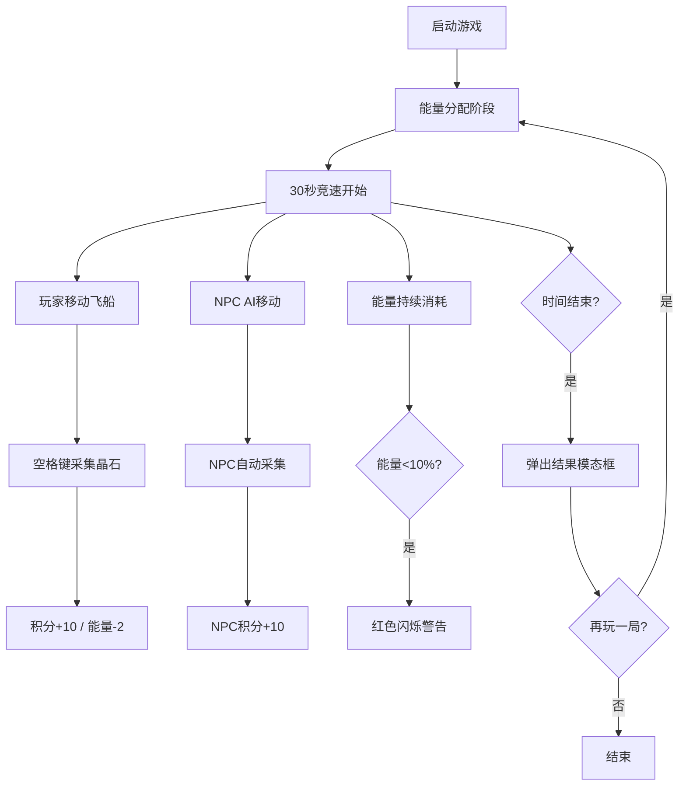

## 1. 产品概述
太空船能量调配与星尘采集博弈应用，玩家需在30秒内通过合理分配引擎与护盾能量，与NPC飞船竞速采集星尘晶石。
- 核心玩法：能量策略管理 + 反应速度采集
- 目标用户：休闲游戏玩家

## 2. 核心功能

### 2.1 功能模块
1. **能源管理模块**：能量分配滑块、引擎/护盾能量条、能量过载警告
2. **采集竞速模块**：飞船动画、晶石生成、NPC AI竞速、采集判定
3. **状态面板模块**：实时积分显示、能量状态、倒计时、游戏结果模态框

### 2.2 页面详情
| 页面名称 | 模块名称 | 功能描述 |
|-----------|-------------|---------------------|
| 主游戏界面 | 能源管理面板 | 双滑块能量分配（引擎/护盾），能量条实时显示，低能量闪烁警告 |
| 主游戏界面 | 采集竞速主界面 | 玩家/NPC飞船水平移动动画，随机晶石生成，空格键采集，晶石采集特效 |
| 主游戏界面 | 底部状态面板 | 积分显示、双能量进度条、30秒倒计时、游戏结束模态框 |

## 3. 核心流程
玩家启动游戏 → 分配引擎/护盾能量比例 → 30秒倒计时开始 → 玩家与NPC飞船竞速采集晶石 → 实时消耗能量并更新积分 → 时间结束弹出结果模态框（胜负/积分对比/能量利用率）→ 可选择再玩一局

## 4. 用户界面设计

### 4.1 设计风格
- **主色调**：赛博朋克深色渐变 #0A0A23 → #1A0A2E
- **强调色**：青色#00FFFF（玩家飞船）、橙色#FF4500（NPC飞船）、金色#FFD700→#FF8C00（晶石）、霓虹紫#8A2BE2（模态框边框）、红色#FF0000（警告）
- **面板样式**：毛玻璃效果 backdrop-filter: blur(10px)，背景色 rgba(13,17,23,0.8)，半透明边框 rgba(255,255,255,0.1)
- **滑块**：轨道6px高/圆角3px，填充渐变#00FFFF→#FF00FF，滑块16px直径白色带阴影
- **字体**：数字使用等宽字体，正文使用现代无衬线字体

### 4.2 页面设计概览
| 页面名称 | 模块名称 | UI元素 |
|-----------|-------------|-------------|
| 主游戏界面 | 采集竞速区 | 星空点阵背景、水平发光轨道线、玩家三角形飞船、NPC三角形飞船、圆形晶石、采集扩散圆环、粒子爆炸 |
| 主游戏界面 | 能源管理面板 | 标题、引擎能量分配滑块、护盾能量分配滑块、引擎能量条(200x20px)、护盾能量条(200x20px)、低能量红色闪烁边框 |
| 主游戏界面 | 底部状态面板 | 左对齐积分、居中控双能量进度条+百分比、右对齐倒计时、毛玻璃背景 |
| 主游戏界面 | 结果模态框 | 毛玻璃卡片、霓虹紫发光边框、0.5秒淡入动画、胜负结果文字、积分对比、能量利用率、「再玩一局」按钮 |

### 4.3 响应式
- **桌面端(≥768px)**：左右分栏布局，左侧65%采集区，右侧35%能源面板，状态面板固定底部
- **移动端(<768px)**：上下结构，顶部采集区，底部能源面板，状态面板固定最底部
- **触摸优化**：按钮最小点击区域44x44px，字体最小12px

### 4.4 动画与交互
- 可点击元素 hover：scale 1.05，0.2秒过渡
- 能量条数值变化：0.3秒缓动动画
- 玩家采集成功：扩散圆环（0→30px，1→0透明度，0.4秒）+ Web Audio合成音（440Hz→880Hz，0.2秒）
- NPC采集成功：8粒子随机方向飞散，橙色#FF4500，0.3秒
- 低能量警告：面板边框#FF0000闪烁，0.3秒周期
- 模态框出现：0.5秒淡入动画
